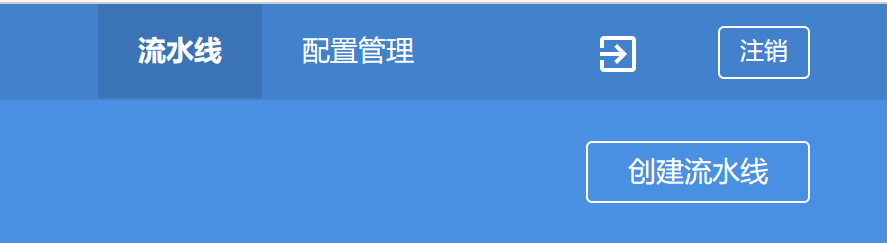
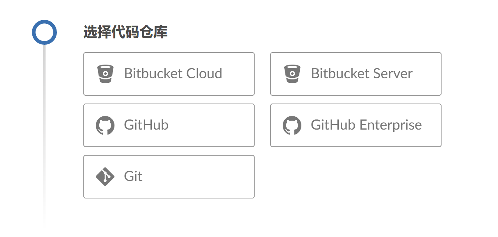
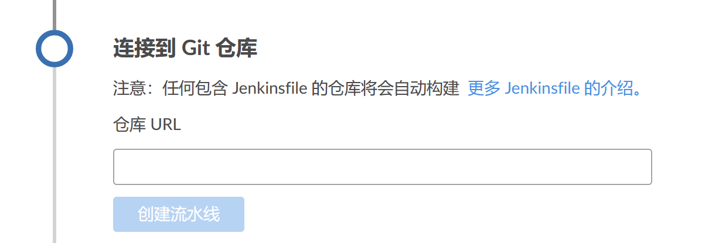

# 创建流水线

**Creating a Pipeline**

Blue Ocean 可让咱们轻松地在 Jenkins 中，创建流水线项目。

咱们可以从源代码控制系统 SCM 中，现有的 `Jenkinsfile` 生成流水线，也可以使用 Blue Ocean 的 [流水线编辑器](./pipeline_editor.md)，将流水线创建为一个提交到源代码控制系统的 `Jenkinsfile`。

{{#include ../blue_ocean.md:25:29}}

## 建立咱们的流水线项目

要开始在 Blue Ocean 中建立流水线项目，请选择 [Blue Ocean 控制面板](./dashboard.md) 右上方的 **创建流水线** 按钮。

如果咱们的 Jenkins 实例是全新的，或者没有配置流水线项目或其他项目，Blue Ocean 会显示一条 **欢迎使用 Jenkins** 的消息，允许咱们选择 **创建新的流水线** 选项，开始设置流水线项目。

咱们现在就可以选择从以下项目中，创建新的流水线项目：

- [标准 Git 仓库](#)；

- [GitHub 上的代码仓库]() 或 GitHub Enterprise；

- [Bitbucket 云代码仓库]() 或 Bitbucket 服务器。

### Git 代码仓库

要为 Git 代码仓库创建咱们的 Pipeline 项目，请点击 **选择代码仓库** 下的 **Git** 按钮。

在 **连接到 Git 仓库** 部分，于 **仓库 URL** 字段中输入 Git 仓库的 URL。

现在，咱们必须指定一个 [本地](#本地代码仓库) 或 [远端](#远端代码仓库) 的代码仓库，以便从中构建 Pipeline 项目。

#### 本地代码仓库

（End）

