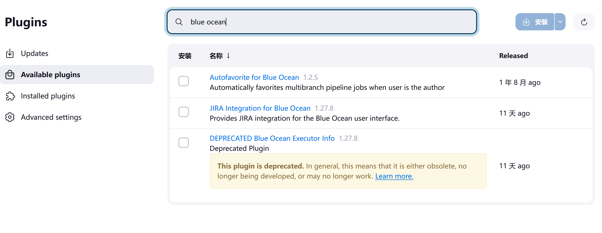

# Blue Ocean 入门

**Getting started with Blue Ocean**

本节介绍如何 Jenkins 中 Blue Ocean 的入门。其中包括在 Jenkins 实例上 [设置 Blue Ocean]()、如何 [访问 Blue Ocean UI]() 以及 [返回 Jenkins 经典 UI]() 的说明。

{{#include ./pipeline/get_started.md:56:58}}

## 安装 Blue Ocean

咱们可以使用以下方法，安装 Blue Ocean：

- 作为 [现有 Jenkins 实例]() 上的一套插件；

- 作为 [Docker 中 Jenkins]() 的一部分。

### 在现有的 Jenkins 实例上

在大多数平台上安装 Jenkins 时，默认情况下不会安装 [Blue Ocean](https://plugins.jenkins.io/blueocean) 插件，以及用于编译 Blue Ocean 插件套件的全部依赖插件。

任何拥有 **管理员** 权限的 Jenkins 用户，都可以在 Jenkins 实例上安装插件。这是通过 **基于矩阵的安全性** 设置的。拥有此权限的 Jenkins 用户还可在其系统上，配置其他用户的权限。更多信息，请参阅 [安全性管理](../security/managing.md) 中的 [授权](../security/managing.md#授权) 小节。

在 Jenkins 实例中安装 Blue Ocean 套装插件：

1. 确保咱们是以具有 **管理员** 权限的用户身份登录的 Jenkins；

2. 在 Jenkins 主页，选择左侧的 **系统管理**，然后选择 **插件管理**；

3. 选择 **Available plugins** 选项卡，然后在 **Filter** 文本框中，输入 `blue ocean`。这会根据名称和描述，过滤插件清单。

4. 选择 **Blue Ocean** 插件左侧的方框，然后选择右上角的 **安装** 或 **Install after restart** 选项；

> - 无需选择此列表中的其他插件。Blue Ocean 主插件会自动选择并安装所有依赖插件，从而组成 Blue Ocean 插件套件；
> - 如果仅选择了 **安装** 选项，则必须重启 Jenkins 才能获得 Blue Ocean 的全部功能。

