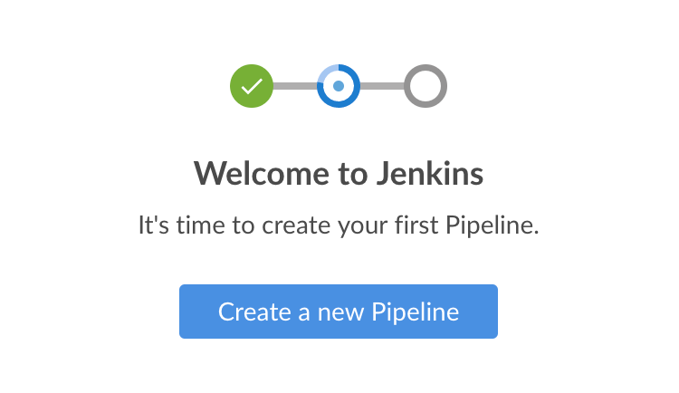

# Blue Ocean 入门

**Getting started with Blue Ocean**

本节介绍如何 Jenkins 中 Blue Ocean 的入门。其中包括在 Jenkins 实例上 [设置 Blue Ocean]()、如何 [访问 Blue Ocean UI]() 以及 [返回 Jenkins 经典 UI]() 的说明。

{{#include ../pipeline/get_started.md:56:58}}

## 安装 Blue Ocean

咱们可以使用以下方法，安装 Blue Ocean：

- 作为 [现有 Jenkins 实例](#在现有的-jenkins-实例上) 上的一套插件；

- 作为 [Docker 中 Jenkins]() 的一部分。

### 在现有的 Jenkins 实例上

在大多数平台上安装 Jenkins 时，默认情况下不会安装 [Blue Ocean](https://plugins.jenkins.io/blueocean) 插件，以及用于编译 Blue Ocean 插件套件的全部依赖插件。

任何拥有 **管理员** 权限的 Jenkins 用户，都可以在 Jenkins 实例上安装插件。这是通过 **基于矩阵的安全性** 设置的。拥有此权限的 Jenkins 用户还可在其系统上，配置其他用户的权限。更多信息，请参阅 [安全性管理](../security/managing.md) 中的 [授权](../security/managing.md#授权) 小节。

在 Jenkins 实例中安装 Blue Ocean 套装插件：

1. 确保咱们是以具有 **管理员** 权限的用户身份登录的 Jenkins；

2. 在 Jenkins 主页，选择左侧的 **系统管理**，然后选择 **插件管理**；

3. 选择 **Available plugins** 选项卡，然后在 **Filter** 文本框中，输入 `blue ocean`。这会根据名称和描述，过滤插件清单。

4. 选择 **Blue Ocean** 插件左侧的方框，然后选择右上角的 **安装** 或 **Install after restart** 选项；

> - 无需选择此列表中的其他插件。Blue Ocean 主插件会自动选择并安装所有依赖插件，从而组成 Blue Ocean 插件套件；
> - 如果仅选择了 **安装** 选项，则必须重启 Jenkins 才能获得 Blue Ocean 的全部功能。

更多信息，请参阅 [插件管理](../managing/plugins.md) 页面。Blue Ocean 安装后无需额外配置。现有流水线及项目将照常运行。

> 在 Blue Ocean 中首次为特定 Git 服务器创建流水线时，Blue Ocean 会提示咱们提供 Git 凭据，以便在仓库中创建流水线。这是必须的，因为 Blue Ocean 才可以将 `Jenkinsfile`，添加到咱们的代码仓库中。

### 作为 Docker 中的 Jenkins 的一部分

Blue Ocean 插件套件并未与可从 [Docker Hub 仓库](https://hub.docker.com/) 中，获取的 Jenkins 官方 Docker 映像 [jenkins/jenkins](https://hub.docker.com/r/jenkins/jenkins/) 捆绑。

有关在 Docker 内运行 Jenkins 以及 Blue Ocean 的更多信息，请参阅安装 Jenkins 页面的 [Docker](../installation/docker.md) 小节。

## 访问 Blue Ocean

一旦 Jenkins 环境安装了 Blue Ocean，并登入了 Jenkins 经典用户界面，就可以通过选择屏幕左侧的 **打开 Blue Ocean**，访问到 Blue Ocean 的用户界面。

咱们也可以在 Jenkins 服务器的 URL 末尾，添加 `/blue` 直接访问 Blue Ocean。例如 `https://jenkins-server-url/blue`。

若咱们的 Jenkins 实例：

- 已有流水线或其他项目，则会显示 [Blue Ocean 控制面板](./dashboard.md)；

- 如果 Jenkins 实例是全新的，或尚未配置一些项目或其他条目，那么 Blue Ocean 会显示一个带有 **创建新流水线** 按钮的 **欢迎使用 Jenkins** 窗格。咱们可以选择这个按钮，来开始创建一个新的流水线项目。有关在 Blue Ocean 中创建流水线项目的更多信息，请参阅 [创建流水线](./creating_a_pipeline.md) 页面。

## 导航栏

**Navigation bar**

Blue Ocean UI 界面的顶部，有一个导航栏，可让咱们访问不同的视图和功能。

导航栏分为两个部分：

- 位于大多数 Blue Ocean 视图顶部的常用部分；

- 下面是一个上下文相关部分。

上下文部分特定于咱们正在浏览的当前 Blue Ocean 页面。

导航栏的常用部分包括下面这些按钮：

- **Jenkins**：点击这个 Jenkins 图标，可进入 [控制面板](./dashboard.md)，或如果已在查看，则可重新加载控制面板；

- **流水线**：这也会将咱们带到控制面板。如果咱们已经在控制面板，此选项则会重新加载该页面。在查看 [流水线运行详情](./pipeline_run_details.md) 页面时，该按钮有不同的作用；

- **配置管理，Administration**：这会将咱们带到 Jenkins 经典用户界面的 **系统管理** 页面。如果没有 **管理员** 权限，此按钮会不可用。更多信息，请参阅 安全性管理 页面的 [授权](../security/managing.md#授权) 小节；

- **前往经典界面** 图标：这会将咱们带回到 Jenkins 经典用户界面。更多信息，请参阅 [切换到经典用户界面](#切换到经典用户界面)；

- **登出**：这会注销当前的 Jenkins 用户，并返回 Jenkins 登录页面。

## 切换到经典用户界面

Blue Ocean 不支持 Jenkins 的某些传统或管理性功能，而这些功能对某些用户来说是必需的。

如果咱们需要访问这些功能，请选择 Blue Ocean [导航栏](#导航栏) 常用部分顶部的 **前往经典界面** 图标。

选择该按钮后，咱们将进入 Jenkins 经典用户界面中的相应页面，或与 Blue Ocean 中当前页面最相关的经典用户界面页面。
