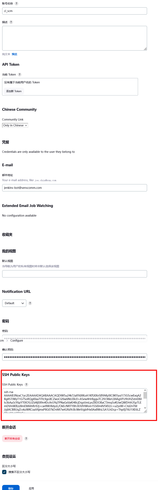

# Jenkins 命令行界面

**Jenkins CLI**


Jenkins 有个内置的命令行界面，允许用户及管理员从脚本或 shell 环境访问 Jenkins。对于常规任务、批量更新、故障排除等的脚本编写很方便。

可以通过 SSH 或使用 Jenkins CLI 客户端（随 Jenkins 分发的 `.jar` 文件）访问命令行界面。

> 此文档假设 Jenkins 2.54 或更新版本。旧版本的 CLI 客户端被认为是不安全的，不应使用。
>
> 当使用服务器和客户端 2.217 或更新版本时，可支持 WebSocket。


## 通过 SSH 使用命令行界面

**Using the CLI over SSH**


在新的 Jenkins 安装中，SSH 服务默认是禁用的。管理员可以选择设置一个特定的端口或要求 Jenkins 在 [全局安全配置](../security/managing_security.md#tcp-端口) 页面中选择某个随机端口。为了确定出随机分配的 SSH 端口，就要检查 Jenkins URL 上返回的头文件，例如：


```bash
$ curl -Lv https://ci.xfoss.com/login 2>&1 | grep -i 'x-ssh-endpoint'
< X-SSH-Endpoint: ci.xfoss.com:32222
```

有了 SSH 端口（本例中为 `32222`），并配置了 [认证](#认证)，任何现代的 SSH 客户端都可以安全地执行 CLI 命令。


### 认证

**Authentication**

无论哪个用户用于与 Jenkins 控制器的认证，都必须有 `全部/读取，Overall/Read` 权限，以便访问 CLI。该用户可能需要额外的权限，这取决于所执行的命令。

SSH 模式下的认证依赖基于 SSH 的公钥/私钥认证。为了给适当的用户添加一个 SSH 公钥，请导航至 `JENKINS_URL/me/configure` 并将 SSH 公钥粘贴到适当的文本区域。





> **注**：Jenkins 目前不支持 `ssh-ecdsa` 与 `ssh-ed25519` 类型的密钥，支持 `ssh-rsa` 的密钥。


### 常用命令

**Common Commands**


Jenkins 有一些可在每个 Jenkins 环境中找到的内置 CLI 命令，如 `build` 或 `list-job`。插件也可以提供 CLI 命令；为了确定出特定 Jenkins 环境中可用的全部命令列表，请执行 CLI 的 `help` 命令：


```console
$ alias jenkins-cli='ssh -l ci_cd_scm -p 32222 ci.xfoss.com'
$ jenkins-cli help
```

> `help` 命令的输出如下：

```console
{{#include ./jenkins-cli-help:}}
```

下面的命令列表并不全面，但他是 Jenkins CLI 用法的一个有用的起点。


#### `build`

最常见和最有用的 CLI 命令之一便是 `build`，他允许用户触发他们有权限的任何作业或流水线。


最基本的调用将简单地触发作业或流水线并退出，但通过附加选项，用户也可以传递参数、轮询 SCM，甚至跟踪被触发的构建或流水线运行的控制台输出。


```console
$ jenkins-cli help build
java -jar jenkins-cli.jar build JOB [-c] [-f] [-p] [-r N] [-s] [-v] [-w]
Starts a build, and optionally waits for a completion.
Aside from general scripting use, this command can be
used to invoke another job from within a build of one job.
With the -s option, this command changes the exit code based on
the outcome of the build (exit code 0 indicates a success)
and interrupting the command will interrupt the job.
With the -f option, this command changes the exit code based on
the outcome of the build (exit code 0 indicates a success)
however, unlike -s, interrupting the command will not interrupt
the job (exit code 125 indicates the command was interrupted).
With the -c option, a build will only run if there has been
an SCM change.
 JOB : Name of the job to build
 -c  : Check for SCM changes before starting the build, and if there's no
       change, exit without doing a build (default: false)
 -f  : Follow the build progress. Like -s only interrupts are not passed
       through to the build. (default: false)
 -p  : Specify the build parameters in the key=value format. (default: {})
 -s  : Wait until the completion/abortion of the command. Interrupts are passed
       through to the build. (default: false)
 -v  : Prints out the console output of the build. Use with -s (default: false)
 -w  : Wait until the start of the command (default: false)
$ jenkins-cli build foobar -f -v
Started foobar #1
Started from command line by ci_cd_scm
Running as SYSTEM
Building remotely on agent-on-linux-01 in workspace /home/jenkins/workspace/foobar
[foobar] $ /bin/sh -xe /tmp/jenkins15758294526917720365.sh
+ echo Building...
Building...
Finished: SUCCESS
Completed foobar #1 : SUCCESS
```

#### `console`

同样有用的是 `console` 命令，他会检索指定构建或流水线运行的控制台输出。如果没有提供构建编号，`console` 命令将输出最后完成的构建的控制台输出。


```console
$ jenkins-cli help console
java -jar jenkins-cli.jar console JOB [BUILD] [-f] [-n N]
Produces the console output of a specific build to stdout, as if you are doing 'cat build.log'
 JOB   : Name of the job
 BUILD : Build number or permalink to point to the build. Defaults to the last
         build (default: lastBuild)
 -f    : If the build is in progress, stay around and append console output as
         it comes, like 'tail -f' (default: false)
 -n N  : Display the last N lines (default: -1)
$ jenkins-cli console foobar
Started from command line by ci_cd_scm
Running as SYSTEM
Building remotely on agent-on-linux-01 in workspace /home/jenkins/workspace/foobar
[foobar] $ /bin/sh -xe /tmp/jenkins15758294526917720365.sh
+ echo Building...
Building...
Finished: SUCCESS
```

#### `who-am-i`

`who-am-i` 命令有助于列出当前用户的凭据和用户可用的权限。在调试由于缺乏某些权限而没有 CLI 命令的情况时，这可能很有用。


```console
$ jenkins-cli help who-am-i
java -jar jenkins-cli.jar who-am-i
Reports your credential and permissions.
$ jenkins-cli who-am-i
Authenticated as: ci_cd_scm
Authorities:
  authenticated
```


## 使用命令行界面客户端

**Using the CLI client**


虽然基于 SSH 的 CLI 速度很快，而且能满足大多数需求，但在某些情况下，随 Jenkins 分发的 CLI 客户端可能更适合。例如，CLI 客户端的默认传输是 HTTP，这意味着不需要在防火墙中为其使用打开额外的端口。


### SSH 与 CLI 客户端的比较

**Comparing SSH and CLI client**

SSH 和 `jenkins-cli.jar` 都提供了对一套命令的访问，使咱们可以从命令行与 Jenkins 进行交互，但他们有一些区别：

- Jenkins SSH 在客户端不需要任何定制的 `.jar` 文件，使其更容易从各种来源访问 Jenkins；

- SSH 客户端是为成为一个通用的工具，为多种目的服务而构建的。他没有提供简单方法来做 Jenkins 环境中常见和特定的基本事情。而使用 `jenkins-cli.jar` 而不是 SSH 客户端则可能会提高生产力并改善开发体验。


### 下载客户端

CLI 客户端可以直接从 Jenkins 控制器的 URL `/jnlpJars/jenkins-cli.jar` 下载，实际上就是 `JENKINS_URL/jnlpJars/jenkins-cli.jar`。

虽然 CLI 的 `.jar` 可以针对不同版本的 Jenkins 使用，但如果在使用过程中出现任何兼容性问题，请从 Jenkins 控制器重新下载最新的 `.jar` 文件。


### 使用客户端


调用客户端的一般语法如下：


```console
java -jar jenkins-cli.jar -s JENKINS_URL [global options...] command [command options...] [arguments...]
```

`JENKINS_URL` 可以通过环境变量 `$JENKINS_URL` 来指定。其他一般选项的摘要可以通过在运行客户端时完全不带参数来显示。


### 客户端连接模式

**Client connection modes**

有三种基本模式可供客户端使用，可通过全局选项选择：`-http`、`-webSocket` 和 `-ssh`。


#### HTTP 连接模式

这是默认模式，但为了清楚起见，咱们可以显式传递 `-http` 选项。


身份验证最好使用 `-auth` 选项，该选项采用 `username:apitoken` 参数。请从 `/me/configure` 获取 API 令牌：


```console
java -jar jenkins-cli.jar [-s JENKINS_URL] -auth kohsuke:abc1234ffe4a command ...
```

（也接受实际密码，但不鼓励这样做。）


咱们也可以在参数前加上 `@`，而从文件中加载相同的内容：


```console
$ java -jar ./jenkins-cli.jar -s https://ci.xfoss.com -auth @/home/lenny.peng/.jenkins-cli-auth help
```

> 出于安全考虑，使用文件加载认证凭据是推荐的认证方式。

另一种认证方法是以类似于 `$JENKINS_URL` 的方式来配置环境变量。`username` 可以通过环境变量 `$JENKINS_USER_ID` 指定，而 `apitoken` 可以通过变量 `$JENKINS_API_TOKEN` 指定。这两个变量必须同时设置。


```bash
export JENKINS_USER_ID=kohsuke
export JENKINS_API_TOKEN=abc1234ffe4a
java -jar jenkins-cli.jar [-s JENKINS_URL] command ...
```

如果配置了这些环境变量，咱们仍然可以用 `-auth` 选项，以不同凭据覆盖认证方法，这个选项优先于所设置的环境变量。

一般来说，不需要做特殊的系统配置来启用基于 HTTP 的 CLI 连接。如果咱们在某个 HTTP(S) 反向代理后面运行 Jenkins，请确保其不会缓存请求或响应体。


> 众所周知，在使用某些反向代理时，这种模式不能可靠地工作或根本不能工作。请优先选择 WebSocket 模式。


#### WebSocket 连接模式


在 Jenkins 2.217 及以上版本中，`-webSocket` 模式可以作为 `-http` 的替代品。其优点是使用了一个更标准的传输，避免了许多反向代理的问题或需要特殊的代理配置。


```console
java -jar .\jenkins-cli.jar -webSocket -auth kohsuke:abc1234ffe4a who-am-i
```


#### SSH 连接模式


认证是通过 SSH 密钥对进行的。咱们必须同时选择 Jenkins 的用户 ID：


```console
java -jar jenkins-cli.jar [-s JENKINS_URL] -ssh -user kohsuke command ...
```

在这种模式下，客户端的行为基本上就像原生的 `ssh` 命令。


默认情况下，客户端将尝试连接到与 `JENKINS_URL` 中使用的同一主机上的某个 SSH 端口。如果 Jenkins 是在在某个 HTTP 反向代理后面，这通常不会起作用，所以运行 Jenkins 时要使用系统属性 `-Dorg.jenkinsci.main.modules.sshd.SSHD.hostName=ACTUALHOST` 来为 SSH 端点定义一个主机名或 IP 地址。


### CLI 客户端的常见问题

**Common Problems with the CLI client**


在运行 CLI 客户端时，可能会遇到一些常见问题。


#### 服务器密钥无效

**Server key did not validate**


咱们可能会得到下面的错误，并在那个关于 `mismatched keys` 下面找到一个日志条目：

```console
org.apache.sshd.common.SshException: Server key did not validate
    at org.apache.sshd.client.session.AbstractClientSession.checkKeys(AbstractClientSession.java:523)
    at org.apache.sshd.common.session.helpers.AbstractSession.handleKexMessage(AbstractSession.java:616)
    ...
```

这意味着咱们的 SSH 配置无法识别服务器所提供的公钥。当咱们在开发模式下运行 Jenkins 并且应用程序的多个实例随着时间推移在同一 SSH 端口下运行时，通常会出现这种情况。


在开发环境中，请访问咱们的 `~/.ssh/known_hosts`（或者 Windows 的 `C:/Users/<your_name>/.ssh/known_hosts` 中），并删除与咱们当前 SSH 端口（例如 `[localhost]:3485`）对应的行。在生产环境中，请向 Jenkins 管理员确认服务器的公钥最近是否有变化。如果是的话，请管理员完成上述步骤。


#### `UsernameNotFoundException`

如果咱们的客户端显示如下所示的堆栈跟踪：


```console
org.acegisecurity.userdetails.UsernameNotFoundException: <name_you_used>
    ...
```

这意味着咱们的 SSH 密钥被识别并与已存储用户进行了验证，但用户名对咱们应用程序目前正在使用的安全域，the security realm，无效。这可能发生在咱们最初使用 Jenkins 数据库时，配置了咱们的用户，然后切换到另一个安全域（如 LDAP，等等），其中已定义的用户还不存在。


为了解决这个问题，请确保咱们的用户存在于所配置的安全域中。


### 用于故障排除的日志

**Troubleshooting logs**


为获得更多关于认证过程的信息：


1. 前往 **系统管理** > **System log** > **Add recorder**；

2. 输入咱们想要的任何名字，然后点击 **Create**。

3. 点击 **新增**；

4. 输入 `org.jenkinsci.main.modules.sshd.PublicKeyAuthenticatorImpl`（或者输入 `PublicKeyAuth`，然后选择全名）；

5. 将级别设置为 **ALL**；

6. 对 `hudson.model.User` 重复前面三个步骤；

7. 点击 **保存**。

当咱们尝试认证时，咱们就可以刷新页面，看看内部发生了什么。


（End）


