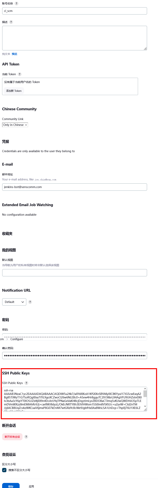

# Jenkins 命令行界面

**Jenkins CLI**


Jenkins 有个内置的命令行界面，允许用户及管理员从脚本或 shell 环境访问 Jenkins。对于常规任务、批量更新、故障排除等的脚本编写很方便。

可以通过 SSH 或使用 Jenkins CLI 客户端（随 Jenkins 分发的 `.jar` 文件）访问命令行界面。

> 此文档假设 Jenkins 2.54 或更新版本。旧版本的 CLI 客户端被认为是不安全的，不应使用。
>
> 当使用服务器和客户端 2.217 或更新版本时，可支持 WebSocket。


## 通过 SSH 使用命令行界面

**Using the CLI over SSH**


在新的 Jenkins 安装中，SSH 服务默认是禁用的。管理员可以选择设置一个特定的端口或要求 Jenkins 在 [全局安全配置](../security/managing_security.md#tcp-端口) 页面中选择某个随机端口。为了确定出随机分配的 SSH 端口，就要检查 Jenkins URL 上返回的头文件，例如：


```bash
$ curl -Lv https://ci.senscomm.com/login 2>&1 | grep -i 'x-ssh-endpoint'
< X-SSH-Endpoint: ci.senscomm.com:32222
```

有了 SSH 端口（本例中为 `32222`），并配置了 [认证](#认证)，任何现代的 SSH 客户端都可以安全地执行 CLI 命令。


### 认证

**Authentication**

无论哪个用户用于与 Jenkins 控制器的认证，都必须有 `全部/读取，Overall/Read` 权限，以便访问 CLI。该用户可能需要额外的权限，这取决于所执行的命令。

SSH 模式下的认证依赖基于 SSH 的公钥/私钥认证。为了给适当的用户添加一个 SSH 公钥，请导航至 `JENKINS_URL/me/configure` 并将 SSH 公钥粘贴到适当的文本区域。





> **注**：Jenkins 目前不支持 `ssh-ecdsa` 与 `ssh-ed25519` 类型的密钥，支持 `ssh-rsa` 的密钥。


### 常用命令

**Common Commands**


Jenkins 有一些可在每个 Jenkins 环境中找到的内置 CLI 命令，如 `build` 或 `list-job`。插件也可以提供 CLI 命令；为了确定出特定 Jenkins 环境中可用的全部命令列表，请执行 CLI 的 `help` 命令：


```console
$ alias jenkins-cli='ssh -l ci_cd_scm -p 32222 ci.senscomm.com'
$ jenkins-cli help
```

```console
{{#include ./jenkins-cli-help:}}
```

下面的命令列表并不全面，但他是 Jenkins CLI 用法的一个有用的起点。


#### `build`

