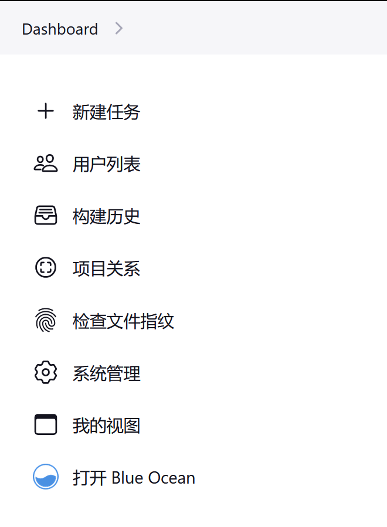
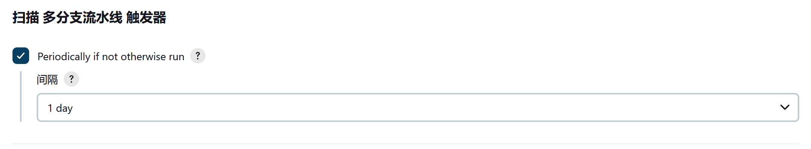

# 分支与拉取请求

**Branches and Pull Requests**

在 [前面小节](./jenkinsfile.md) 中，我们实现了一个可以检查到源码控制的 Jenkinsfile。本节介绍了 **多分支，Multibranch** 流水线的概念，其建立在 Jenkinsfile 的基础上，提供了 Jenkins 中更多的动态和自动功能。

*在 Jenkins 中创建多分支流水线*

视频内容总结：

1. 刚开始使用 Jenkins 时，咱们通常会使用自由风格作业，或者是流水线作业；

2. 在使用流水线作业时，通常是构建一个分支；

3. 在应用开发团队需要咱们构建 git 代码仓库的多个分支时，若对每个分支建立一个 Jenkinsfile，就会浪费时间；

4. 创建构建项目时，选择 “多分支流水线，Multibranch Pipeline”；然后在 “分支源，Branch Sources” 字段，选择 “Git”；

5. 针对公开代码仓库，选择 `https` URI，并无需凭据。在保存多分支构建项目时，Jenkins 会立即扫描代码仓库；

6. 在没有发现 Jenkinsfile 时，会显示 `Does not meet criteria`，“This folder is empty”；

7. Jenkinsfile 是建立多分支构建项目的必要条件；

8. 通过 Web 钩子，可以从 GitHub 推送变更到 Jenkins 控制器（Web 钩子在多个场景都扮演重要角色）；

9. 多分支构建项目配置中，有 “扫描 多分支流水线 触发器” 选项；

10. 只能配置多分支构建项目，而无法配置其下的各个分支构建；

11. Jenkins 控制器会检出所有分支；

12. 在 “分支源” 下的 “行为” 字段，可以配置 “发现分支”，配置一些过滤条件，比如 “根据名称过滤（支持正则表达式）”、“根据名称过滤（支持通配符）” 等，过滤时在 “包含” 与 “排除” 字段，可以将包含或排除的分支，用空格分开列出；

13. 在设置了分支过滤后，Jenkins 会执行 “计算孤儿项目”，从而删除被过滤掉的分支；

14. `when` 指令可以为多分支构建项目的 `steps` 设置运行条件，在满足条件时运行 `steps` 代码块；

15. 在有分支被删除后，Jenkins 同样会执行 “计算孤儿项目”，删除已被删除的分支。

## 创建多分支流水线

**Creating a Multibranch Pipeline**

**多分支流水线** 项目类型使咱们能够为同一项目的不同分支实施不同的 `Jenkinsfile`。在多分支流水线项目中，Jenkins 会自动发现、管理和执行对在源代码控制系统中包含 `Jenkinsfile` 分支的流水线。

这消除了手动创建和管理流水线的需要。

要创建一个多分支流水线：

- 点击 Jenkins 主页（经典 UI）上的 **新建任务，New Item**；

- 为咱们的流水线输入一个名称，选择 **多分支流水线**，然后点击 **确定**；

> Jenkins 会使用流水线名称来创建磁盘上的目录。包含空格的流水线名称可能会引起那些不期望路径保护空格脚本中的错误。

- 添加一个 **分支源，Branch Source** （比如，Git）并输入代码仓库的地址；

- **保存，Save** 这个多分支流水线项目。

**保存** 时，Jenkins 会自动扫描指定的代码仓库，并为代码仓库中包含 `Jenkinsfile` 的每个分支创建适当的项目。

默认情况下，Jenkins 不会为分支的添加或删除自动重新索引（除非使用 [组织文件夹](#使用组织文件夹)），所以在多分支流水线项目的配置中配置多分支流水线定期重新索引通常是有用的：

### 额外环境变量

**Additional Environment Variables**

多分支流水线会通过 `env` 全局变量暴露关于正在构建分支的一些额外信息，例如：

#### `BRANCH_NAME`

该流水线正在执行分支的名称，例如 `master`。

#### `CHANGE_ID`

与某种变更请求相对应的标识符，如拉取请求编号。

其他环境变量列在 [全局变量参考](./get_started.md#全局变量参考) 中。

### 拉取请求的支持

**Supporting Pull Requests**

多分支流水线可以通过适当的插件来验证拉取/更改请求。该功能由以下插件提供：

- [GitHub 分支源](https://plugins.jenkins.io/github-branch-source)

- [Bitbucket 分支源](https://plugins.jenkins.io/cloudbees-bitbucket-branch-source)

- [GitLab 分支源](https://plugins.jenkins.io/gitlab-branch-source)

- [Gitea](https://plugins.jenkins.io/gitea)

- [Tuleap Git 分支源](https://plugins.jenkins.io/tuleap-git-branch-source)

- [AWS CodeCommit 作业](https://plugins.jenkins.io/aws-codecommit-jobs)

- [DAGsHub 分支源](https://plugins.jenkins.io/dagshub-branch-source)

关于如何使用这些插件的进一步信息，请查阅其文档。

## 使用组织文件夹

**Using Organization Folders**

组织文件夹类型的构建项目，使 Jenkins 能够监控整个 GitHub 组织、Bitbucket 团队/项目、GitLab 组织或 Gitea 组织，并为包含 `Jenkinsfile` 的分支和拉取请求的代码仓库自动创建新的多分支流水线。

组织文件夹的实施是为了：

- [GitHub 分支源](https://plugins.jenkins.io/github-branch-source) 插件中的 GitHub；

- [Bitbucket 分支源](https://plugins.jenkins.io/cloudbees-bitbucket-branch-source) 插件中的 Bitbucket；

- [GitLab 分支源](https://plugins.jenkins.io/gitlab-branch-source) 插件中的 GitLab；

- [Gitea](https://plugins.jenkins.io/gitea) 插件中的 Gitea。

（End）

