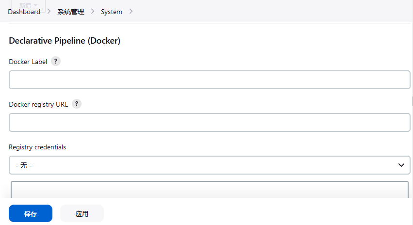

# 在流水线中使用 Docker

**Using Dokcer with Pipeline**


> **注**：对于构建代理节点都是由 Docker 容器构成的 Jenkins 环境，在流水线中使用 `Dockerfile` 需要解决在容器中运行容器（DinD）的问题，这在 [Docker 安装方式](../installation/docker.md#在-macos-和-linux-上) 小节中曾讨论到。


许多组织都使用 [Docker](https://www.docker.com/) 来统一其跨机器的构建和测试环境，并为部署应用程序提供一种有效的机制。从 Pipeline 2.5 及以上版本开始，Pipeline 内建了对从 `Jenkinsfile` 中与 Docker 进行交互的支持。

本节将介绍在 `Jenkinsfile` 中使用 Docker 的基本知识，但不包括 Docker 的基本原理，那可以在 [Docker入门指南](https://docs.docker.com/get-started/) 中阅读。


## 执行环境的定制

**Customizing the execution environment**


Pipeline 旨在轻松地使用 [Docker](https://docs.docker.com/) 镜像作为单个 [阶段](../glossary.md#阶段) 或整个 Pipeline 的执行环境。这意味着用户可以为他们流水线定义所需的工具，而不必手动配置代理。实际上，任何可以 [打包在 Docker 容器中的工具](https://hub.docker.com/)，只需对 `Jenkinsfile` 进行小的编辑，就可以轻松使用。


```groovy
// Jenkinsfile (声明式 Pipeline)
pipeline {
    agent {
        docker { image 'node:18.16.0-alpine' }
    }
    stages {
        stage('Test') {
            steps {
                sh 'node --version'
            }
        }
    }
}
```


<details>
<summary>切换至脚本化 Pipeline</summary>

```groovy
// Jenkinsfile (脚本化 Pipeline)
node {
    /* Requires the Docker Pipeline plugin to be installed */
    docker.image('node:18.16.0-alpine').inside {
        stage('Test') {
            sh 'node --version'
        }
    }
}
```
</details>


当这个流水线执行时，Jenkins 将自动启动指定的容器并在其中执行所定义的步骤：


```console
[Pipeline] stage
[Pipeline] { (Test)
[Pipeline] sh
[guided-tour] Running shell script
+ node --version
v16.13.1
[Pipeline] }
[Pipeline] // stage
[Pipeline] }
```


### 工作区同步

**Workspace synchronization**


简而言之：如果保持工作区与其他阶段的同步是很重要的，那么请使用 `reuseNode true`。否则，docker 化的阶段则可以在任何其他代理或同一代理上运行，不过是在临时工作区。


默认情况下，对于容器化阶段，Jenkins 会这样做：


- 挑选出任何一个代理；

- 创建新的空工作区；

- 克隆流水线代码到其中；

- 将这个新的工作区挂载到容器中。


如果咱们有多个 Jenkins 代理，那么咱们的容器化阶段可在其中任何一个上启动。

当 `reuseNode` 被设置为 `true` 时：将不会创建新的工作区，而当前代理的当前工作区将被挂载到容器中，并且容器将在同一节点启动，因此整个数据将被同步。


```groovy
// Jenkinsfile (声明式 Pipeline)
pipeline {
    agent any
    stages {
        stage('Build') {
            agent {
                docker {
                    image 'gradle:6.7-jdk11'
                    // Run the container on the node specified at the
                    // top-level of the Pipeline, in the same workspace,
                    // rather than on a new node entirely:
                    reuseNode true
                }
            }
            steps {
                sh 'gradle --version'
            }
        }
    }
}
```


<details>
<summary>切换至脚本化 Pipeline</summary>

```groovy
// Jenkinsfile (脚本化 Pipeline)
// 选项 “reuseNode true” 目前在脚本化流水线中不支持。
```
</details>


### 缓存容器的数据

**Caching data for containers**


许多构建工具都会下载外部依赖项，并将其缓存在本地，以便将来重新使用。由于容器一开始是以 “干净” 的文件系统创建的，这可能会导致流水线速度变慢，因为他们可能不会在随后的流水线运行之间利用磁盘缓存。

Pipeline 支持添加传递给 Docker 的自定义参数，从而允许用户指定要挂载的自定义 Docker 卷，这可用于在流水线历次运行之间在代理上缓存数据。下面的例子将利用 `maven` 容器在流水线各次运行之间缓存 `~/.m2`，从而避免在流水线的后续运行中重新下载依赖。


```groovy
// Jenkinsfile (声明式 Pipeline)
pipeline {
    agent {
        docker {
            image 'maven:3.9.0-eclipse-temurin-11'
            args '-v $HOME/.m2:/root/.m2'
        }
    }

    stages {
        stage('Build') {
            steps {
                sh 'mvn -B'
            }
        }
    }
}
```


<details>
<summary>切换至脚本化 Pipeline</summary>

```groovy
// Jenkinsfile (脚本化 Pipeline)

node {
    /* Requires the Docker Pipeline plugin to be installed */
    docker.image('maven:3.9.0-eclipse-temurin-11').inside('-v $HOME/.m2:/root/.m2') {
        stage('Build') {
            sh 'mvn -B'
        }
    }
}
```
</details>


### 使用多个容器

**Using multiple containers**

代码库依赖多种不同技术已经变得越来越普遍。例如，某个代码仓库可能同时拥有基于 Java 的后端 API 实现 *和* 基于 JavaScript 的前端实现。结合 Docker 和 Pipeline，就允许某个 `Jenkinsfile` 通过结合 `agent {}` 指令，而对不同阶段使用 **多种** 类型的技术。


```groovy
// Jenkinsfile (声明式 Pipeline)
pipeline {
    agent none

    stages {
        stage('Back-end') {
            agent {
                docker { image 'maven:3.9.0-eclipse-temurin-11' }
            }

            steps {
                sh 'mvn --version'
            }
        }

        stage('Front-end') {
            agent {
                docker { image 'node:18.16.0-alpine' }
            }

            steps {
                sh 'node --version'
            }
        }
    }
}
```


<details>
<summary>切换至脚本化 Pipeline</summary>

```groovy
// Jenkinsfile (脚本化 Pipeline)

node {
    /* Requires the Docker Pipeline plugin to be installed */

    stage('Back-end') {
        docker.image('maven:3.9.0-eclipse-temurin-11').inside {
            sh 'mvn --version'
        }
    }

    stage('Front-end') {
        docker.image('node:18.16.0-alpine').inside {
            sh 'node --version'
        }
    }
}
```
</details>


### 使用 `Dockerfile`

**Using a `Dockerfile`**


对于需要更多定制执行环境的项目，Pipeline 还支持从源代码仓库中的 `Dockerfile` 构建和运行一个容器。与使用 “现成，off-the-shelf” 容器的 [早先方法](#执行环境的定制) 相比，使用 `agent { dockerfile true }` 语法将从 `Dockerfile` 中构建一个新的镜像，而不是从 [Docker Hub](https://hub.docker.com/) 中拉取一个。


以一个定制程度更高的 `Dockerfile` 重用上面的示例：


```
// Dockerfile
FROM node:18.16.0-alpine

RUN apk add -U subversion
```


通过将其提交到源代码仓库的根目录，`Jenkinsfile` 就可以被修改为基于这个 `Dockerfile` 构建一个容器，然后使用该容器运行所定义的步骤：


```groovy
// Jenkinsfile (声明式 Pipeline)
pipeline {
    agent { dockerfile true }

    stages {
        stage('Test') {
            steps {
                sh 'node --version'
                sh 'svn --version'
            }
        }
    }
}
```


`agent { dockerfile true }` 语法支持一些其他选项，这些选项在 [管道语法](./syntax.md#agent) 小节有更详细的描述。


*在 Jenkins 流水线中使用 `Dockerfile`*


[](https://www.youtube.com/watch?v=Pi2kJ2RJS50)


### 指定 Docker 标签

**Specifying a Docker Label**


默认情况下，Pipeline 会假设任何已配置的 [代理](../glossary.md#agent) 都能够运行基于 Docker 的流水线。而对于有着不能运行 Docker 守护程序的 macOS、Windows 或其他代理的 Jenkins 环境，这种默认的设置就可能会出现问题。Pipeline 在 **系统管理，Manage Jenkins** 页面和 [文件夹，Folder](./glossary.md#folder) 级别上提供了一个全局选项，用于指定哪些代理（按照 [标签，Label](./glossary.md#label)）用于运行基于 Docker 的流水线。





### macOS 用户的路径设置

**Path setup for macOS users**

（暂略过）


## 脚本化流水线的高级用法

**Advanced Usage with Scripted Pipeline**


### 运行 “挎斗，sidecar” 容器

**Running "sidecar" containers**

在流水线中使用 Docker 可以成为运行其上可能依赖的构建或一组测试的服务的有效方式。类似于 [sidecar 模式](https://docs.microsoft.com/en-us/azure/architecture/patterns/sidecar)，Docker 的流水线可以 “在后台” 运行一个容器，同时在另一个容器中执行工作。利用这种挎斗方式，流水线可以为每次流水线运行提供一个 “干净” 的容器。

请设想一个假想的集成测试套件，其依赖于本地 MySQL 数据库的运行。使用 [Docker Pipeline 插件](https://plugins.jenkins.io/docker-workflow) 对脚本化流水线支持中所实现的 `withRun` 方法，`Jenkinsfile` 就可以将 MySQL 作为一个挎斗运行：


```groovy
node {
    checkout scm
    /*
     * In order to communicate with the MySQL server, this Pipeline explicitly
     * maps the port (`3306`) to a known port on the host machine.
     */
    docker.image('mysql:8-oracle').withRun('-e "MYSQL_ROOT_PASSWORD=my-secret-pw"' +
                                           ' -p 3306:3306') { c ->
        /* Wait until mysql service is up */
        sh 'while ! mysqladmin ping -h0.0.0.0 --silent; do sleep 1; done'
        /* Run some tests which require MySQL */
        sh 'make check'
    }
}
```

这个示例可以更进一步，同时利用两个容器。一个 “挎斗” 运行 MySQL，另一个通过使用 Docker 的 [容器链接](https://docs.docker.com/engine/userguide/networking/default_network/dockerlinks/) 特性提供 [执行环境](#执行环境的定制)。


```groovy
node {
    checkout scm
    docker.image('mysql:8-oracle').withRun('-e "MYSQL_ROOT_PASSWORD=my-secret-pw"') { c ->
        docker.image('mysql:8-oracle').inside("--link ${c.id}:db") {
            /* Wait until mysql service is up */
            sh 'while ! mysqladmin ping -hdb --silent; do sleep 1; done'
        }

        docker.image('oraclelinux:9').inside("--link ${c.id}:db") {
            /*
             * Run some tests which require MySQL, and assume that it is
             * available on the host name `db`
             */
            sh 'make check'
        }
    }
}
```


上面的示例使用了 `withRun` 所暴露的对象，其有着运行中容器的 ID，可以通过 `id` 属性获得。使用容器的 ID，流水线就可以通过向 `inside()` 方法传递自定义的 Docker 参数来创建一个链接。

对于在流水线退出前检查运行中的 Docker 容器的日志，这个 `id` 属性也很有用：

```groovy
sh "docker logs ${c.id}"
```


### 构建容器

**Building containers**


为了创建 Docker 镜像，[Docker Pipeline 插件](https://plugins.jenkins.io/docker-workflow) 还提供了一个 `build()` 方法，用于在 Pipeline 运行期间从代码仓库中的 `Dockerfile` 创建新的镜像。


使用 `docker.build("my-image-name")` 语法的主要好处是，脚本化流水线可以将返回值用于后续的 Docker 流水线调用，比如说：


```groovy
node {
    checkout scm

    def customImage = docker.build("my-image:${env.BUILD_ID}")

    customImage.inside {
        sh 'make test'
    }
}
```

该返回值也可以用来将 Docker 镜像通过 `push()` 方法发布到 [Docker Hub](https://hub.docker.com/) 或 [自定义的注册中心](#使用定制注册中心)，例如：


```groovy
node {
    checkout scm

    def customImage = docker.build("my-image:${env.BUILD_ID}")
    customImage.push()
}
```

Docker 镜像的 “标签，tags” 的一个常见用法是为 Docker 镜像的最新验证版本指定 `latest` 标签。`push()` 方法接受一个可选的 `tag` 参数，允许流水线推送有着不同标签的 `customImage`，例如：


```groovy
node {
    checkout scm

    def customImage = docker.build("my-image:${env.BUILD_ID}")
    customImage.push()

    customImage.push('latest')
}
```


`build()` 方法默认会构建在当前目录下的 `Dockerfile`。可以通过提供一个包含着 `Dockerfile` 的目录路径作为 `build()` 方法的第二个参数来覆盖这一默认行为，例如：


```groovy
node {
    checkout scm

    def testImage = docker.build("test-image", "./dockerfiles/test") // 1
    testImage.inside {
        sh 'make test'
    }
}
```

1. 从 `./dockerfiles/test/Dockerfile` 处找到的 `Dockerfile` 构建 `test-image`。


通过在 `build()` 方法的第二个参数中添加其他参数来传递给 [docker build](https://docs.docker.com/engine/reference/commandline/build/) 是可行的。当以这种方式传递参数时，该字符串的最后一个值必须是 `Dockerfile` 的路径，并且应该以要用作构建环境的文件夹结尾。


下面这个示例通过传递 `-f` 命令行标志，覆盖了默认的 `Dockerfile`：


```groovy
node {
    checkout scm

    def dockerfile = 'Dockerfile.test'
    def customImage = docker.build("my-image:${env.BUILD_ID}",
                                   "-f ${dockerfile} ./dockerfiles") // 1
}
```

1. 从位于 `./dockerfiles/Dockerfile.test` 处找到的 `Dockerfile`  构建 `my-image：${env.BUILD_ID}`。


### 使用远程 Docker 服务器


**Using a remote Docker server**


默认情况下，[Docker Pipeline 插件](https://plugins.jenkins.io/docker-workflow) 将与本地的 Docker 守护进程通信，通常通过 `/var/run/docker.sock` 访问。

而要选择非默认的 Docker 服务器，比如 [Docker Swarm](https://docs.docker.com/swarm/)，就应使用 `withServer()` 方法。


通过传递一个 URI，及可选地 Jenkins 中预先配置的 **Docker 服务器证书认证** 的凭据 ID，到这个方法中：


```groovy
node {
    checkout scm

    docker.withServer('tcp://swarm.example.com:2376', 'swarm-certs') {
        docker.image('mysql:8-oracle').withRun('-p 3306:3306') {
            /* do things */
        }
    }
}
```


> `inside()` 和 `build()` 将无法在开箱即用的 Docker Swarm 服务器上正常工作。
>
> 为了让 `inside()` 工作，Docker 服务器和 Jenkins 代理必须使用同一文件系统，以便工作区可以被挂载。
>
> 目前，这个 Jenkins 插件和 Docker CLI 都不会自动检测到服务器正远程运行的情况；一个典型的症状是来自嵌套 `sh` 命令的报错，比如：

```console
cannot create /…@tmp/durable-…/pid: Directory nonexistent
```
> 当 Jenkins 检测到代理本身运行在 Docker 容器内时，他会自动将 `--volumes-from` 参数传递给这个 `inside` 容器，确保其能与代理共用一个工作空间。
>
> 此外，某些版本的 Docker Swarm 不支持自定义注册表，custom Registries。


### 使用定制注册中心

默认情况下，[Docker Pipeline](https://plugins.jenkins.io/docker-workflow) 的集成假定了默认的 [Docker Hub](https://hub.docker.com/) 的 Docker 注册中心。


为了使用自定义的 Docker 注册中心，脚本化 Pipeline 用户可以用传入了定制注册中心 URL 的 `withRegistry()` 方法来包装步骤，例如：


```groovy
node {
    checkout scm

    docker.withRegistry('https://registry.example.com') {
        docker.image('my-custom-image').inside {
            sh 'make test'
        }
    }
}
```

对于需要身份验证的 Docker 注册中心，请从 Jenkins 主页添加 “用户名/密码” 凭据项，并使用凭据 ID 作为 `withRegistry()` 的第二个参数：


```groovy
node {
    checkout scm

    docker.withRegistry('https://registry.example.com', 'credentials-id') {

        def customImage = docker.build("my-image:${env.BUILD_ID}")

        /* Push the container to the custom Registry */
        customImage.push()
    }
}
```
