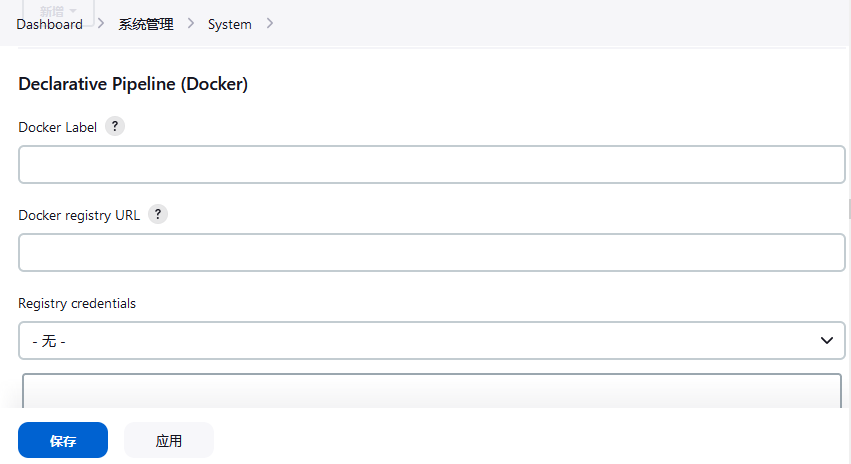

# 在流水线中使用 Docker

**Using Dokcer with Pipeline**


许多组织都使用 [Docker](https://www.docker.com/) 来统一其跨机器的构建和测试环境，并为部署应用程序提供一种有效的机制。从 Pipeline 2.5 及以上版本开始，Pipeline 内建了对从 `Jenkinsfile` 中与 Docker 进行交互的支持。

本节将介绍在 `Jenkinsfile` 中使用 Docker 的基本知识，但不包括 Docker 的基本原理，那可以在 [Docker入门指南](https://docs.docker.com/get-started/) 中阅读。


## 执行环境的定制

**Customizing the execution environment**


Pipeline 旨在轻松地使用 [Docker](https://docs.docker.com/) 镜像作为单个 [阶段](../glossary.md#阶段) 或整个 Pipeline 的执行环境。这意味着用户可以为他们流水线定义所需的工具，而不必手动配置代理。实际上，任何可以 [打包在 Docker 容器中的工具](https://hub.docker.com/)，只需对 `Jenkinsfile` 进行小的编辑，就可以轻松使用。


```groovy
// Jenkinsfile (声明式 Pipeline)
pipeline {
    agent {
        docker { image 'node:18.16.0-alpine' }
    }
    stages {
        stage('Test') {
            steps {
                sh 'node --version'
            }
        }
    }
}
```


<details>
<summary>切换至脚本化 Pipeline</summary>

```groovy
// Jenkinsfile (脚本化 Pipeline)
node {
    /* Requires the Docker Pipeline plugin to be installed */
    docker.image('node:18.16.0-alpine').inside {
        stage('Test') {
            sh 'node --version'
        }
    }
}
```
</details>


当这个流水线执行时，Jenkins 将自动启动指定的容器并在其中执行所定义的步骤：


```console
[Pipeline] stage
[Pipeline] { (Test)
[Pipeline] sh
[guided-tour] Running shell script
+ node --version
v16.13.1
[Pipeline] }
[Pipeline] // stage
[Pipeline] }
```


### 工作区同步

**Workspace synchronization**


简而言之：如果保持工作区与其他阶段的同步是很重要的，那么请使用 `reuseNode true`。否则，docker 化的阶段则可以在任何其他代理或同一代理上运行，不过是在临时工作区。


默认情况下，对于容器化阶段，Jenkins 会这样做：


- 挑选出任何一个代理；

- 创建新的空工作区；

- 克隆流水线代码到其中；

- 将这个新的工作区挂载到容器中。


如果咱们有多个 Jenkins 代理，那么咱们的容器化阶段可在其中任何一个上启动。

当 `reuseNode` 被设置为 `true` 时：将不会创建新的工作区，而当前代理的当前工作区将被挂载到容器中，并且容器将在同一节点启动，因此整个数据将被同步。


```groovy
// Jenkinsfile (声明式 Pipeline)
pipeline {
    agent any
    stages {
        stage('Build') {
            agent {
                docker {
                    image 'gradle:6.7-jdk11'
                    // Run the container on the node specified at the
                    // top-level of the Pipeline, in the same workspace,
                    // rather than on a new node entirely:
                    reuseNode true
                }
            }
            steps {
                sh 'gradle --version'
            }
        }
    }
}
```


<details>
<summary>切换至脚本化 Pipeline</summary>

```groovy
// Jenkinsfile (脚本化 Pipeline)
// 选项 “reuseNode true” 目前在脚本化流水线中不支持。
```
</details>


### 缓存容器的数据

**Caching data for containers**


许多构建工具都会下载外部依赖项，并将其缓存在本地，以便将来重新使用。由于容器一开始是以 “干净” 的文件系统创建的，这可能会导致流水线速度变慢，因为他们可能不会在随后的流水线运行之间利用磁盘缓存。

Pipeline 支持添加传递给 Docker 的自定义参数，从而允许用户指定要挂载的自定义 Docker 卷，这可用于在流水线历次运行之间在代理上缓存数据。下面的例子将利用 `maven` 容器在流水线各次运行之间缓存 `~/.m2`，从而避免在流水线的后续运行中重新下载依赖。


```groovy
// Jenkinsfile (声明式 Pipeline)
pipeline {
    agent {
        docker {
            image 'maven:3.9.0-eclipse-temurin-11'
            args '-v $HOME/.m2:/root/.m2'
        }
    }

    stages {
        stage('Build') {
            steps {
                sh 'mvn -B'
            }
        }
    }
}
```


<details>
<summary>切换至脚本化 Pipeline</summary>

```groovy
// Jenkinsfile (脚本化 Pipeline)

node {
    /* Requires the Docker Pipeline plugin to be installed */
    docker.image('maven:3.9.0-eclipse-temurin-11').inside('-v $HOME/.m2:/root/.m2') {
        stage('Build') {
            sh 'mvn -B'
        }
    }
}
```
</details>


### 使用多个容器

**Using multiple containers**

代码库依赖多种不同技术已经变得越来越普遍。例如，某个代码仓库可能同时拥有基于 Java 的后端 API 实现 *和* 基于 JavaScript 的前端实现。结合 Docker 和 Pipeline，就允许某个 `Jenkinsfile` 通过结合 `agent {}` 指令，而对不同阶段使用 **多种** 类型的技术。


```groovy
// Jenkinsfile (声明式 Pipeline)
pipeline {
    agent none

    stages {
        stage('Back-end') {
            agent {
                docker { image 'maven:3.9.0-eclipse-temurin-11' }
            }

            steps {
                sh 'mvn --version'
            }
        }

        stage('Front-end') {
            agent {
                docker { image 'node:18.16.0-alpine' }
            }

            steps {
                sh 'node --version'
            }
        }
    }
}
```


<details>
<summary>切换至脚本化 Pipeline</summary>

```groovy
// Jenkinsfile (脚本化 Pipeline)

node {
    /* Requires the Docker Pipeline plugin to be installed */

    stage('Back-end') {
        docker.image('maven:3.9.0-eclipse-temurin-11').inside {
            sh 'mvn --version'
        }
    }

    stage('Front-end') {
        docker.image('node:18.16.0-alpine').inside {
            sh 'node --version'
        }
    }
}
```
</details>


### 使用 `Dockerfile`

**Using a `Dockerfile`**


对于需要更多定制执行环境的项目，Pipeline 还支持从源代码仓库中的 `Dockerfile` 构建和运行一个容器。与使用 “现成，off-the-shelf” 容器的 [早先方法](#执行环境的定制) 相比，使用 `agent { dockerfile true }` 语法将从 `Dockerfile` 中构建一个新的镜像，而不是从 [Docker Hub](https://hub.docker.com/) 中拉取一个。


以一个定制程度更高的 `Dockerfile` 重用上面的示例：


```
// Dockerfile
FROM node:18.16.0-alpine

RUN apk add -U subversion
```


通过将其提交到源代码仓库的根目录，`Jenkinsfile` 就可以被修改为基于这个 `Dockerfile` 构建一个容器，然后使用该容器运行所定义的步骤：


```groovy
// Jenkinsfile (声明式 Pipeline)
pipeline {
    agent { dockerfile true }

    stages {
        stage('Test') {
            steps {
                sh 'node --version'
                sh 'svn --version'
            }
        }
    }
}
```


`agent { dockerfile true }` 语法支持一些其他选项，这些选项在 [管道语法](./syntax.md#agent) 小节有更详细的描述。


*在 Jenkins 流水线中使用 `Dockerfile`*


[](https://www.youtube.com/watch?v=Pi2kJ2RJS50)


### 指定 Docker 标签

**Specifying a Docker Label**


默认情况下，Pipeline 会假设任何已配置的 [代理](../glossary.md#agent) 都能够运行基于 Docker 的流水线。而对于有着不能运行 Docker 守护程序的 macOS、Windows 或其他代理的 Jenkins 环境，这种默认的设置就可能会出现问题。Pipeline 在 **系统管理，Manage Jenkins** 页面和 [文件夹，Folder](./glossary.md#folder) 级别上提供了一个全局选项，用于指定哪些代理（按照 [标签，Label](./glossary.md#label)）用于运行基于 Docker 的流水线。





### macOS 用户的路径设置

**Path setup for macOS users**


