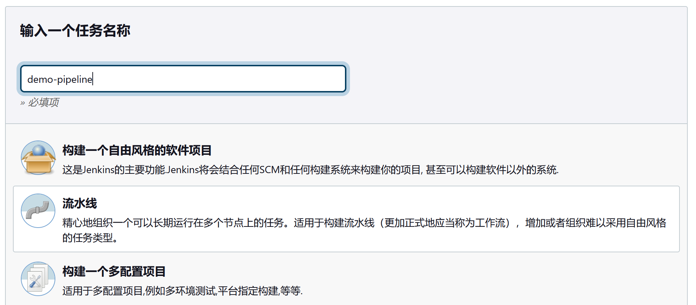
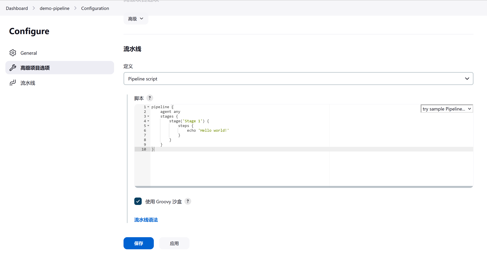
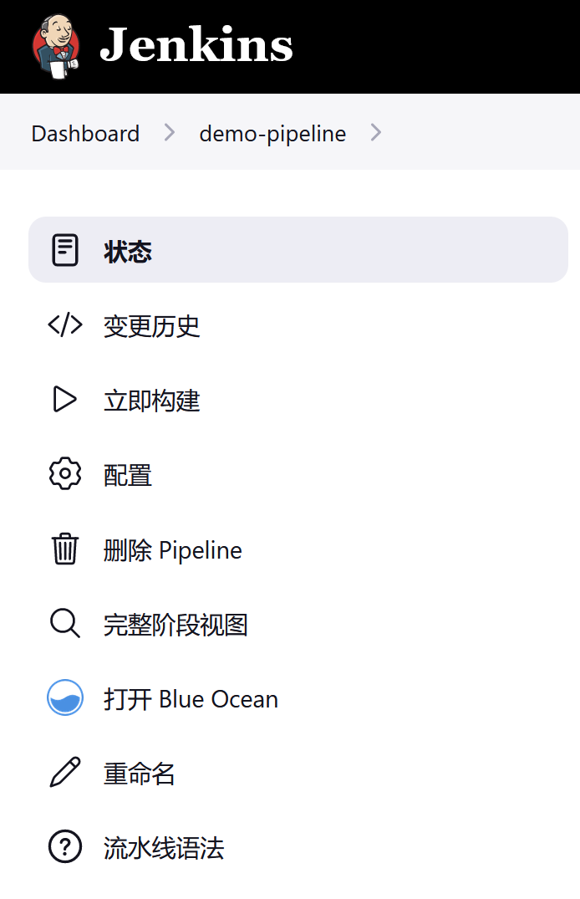

# 管道入门

**Getting started with Pipeline**

[如前](../pipeline.md) 所述，Jenkins Pipeline 是一套插件，支持在 Jenkins 中实现和集成持续交付管道。Pipeline 提供了一套可扩展的工具，通过 Pipeline DSL 将简单到复杂的交付管道 “作为代码” 建模。

本节描述了如何开始在 Jenkins 中创建咱们的管道项目，并介绍了创建和存储 `Jenkinsfile` 的各种方式。


## 前提条件

要使用 Jenkins 管道，咱们将需要：

- Jenkins 2.x 或更新版本；（1.642.3 之后的旧版本可以工作，但不建议使用。）

- 管道插件，其作为 “建议的插件” 的一部分被安装（在 [安装 Jenkins](../Ch01_Installing_Jenkins.md) 后通过运行 [安装后设置向导](../installation/docker.md#安装后设置向导) 时指定）。

请在在 [管理插件](../managing/plugins.md) 中阅读有关如何安装和管理插件的更多信息。


## 定义管道

[声明式和脚本化管道](../pipeline.md#声明式与脚本式的管道语法) 均属于领域特定语言，用于描述咱们软件交付管道的那些部分。脚本化管道则是以 [Groovy 语法](groovy-lang.org/semantics.html) 的有限形式编写的。

Groovy 语法的相关组件将在本文档中根据需要进行介绍，因此虽然了解 Groovy 是有帮助的，但其并不是使用 Pipeline 所必需的。

可以通过以下方式之一创建管道：

- [通过 Blue Ocean](#经由-blue-ocean) -- 在 Blue Ocean 中设置管道项目后，Blue Ocean UI 可帮助咱们编写管道的 Jenkinsfile 并将其提交到源代码管理；

- [通过经典 UI](#经由经典-UI) —— 咱们可通过经典 UI 直接在 Jenkins 中进入一个基本的 Pipeline；

- [在 SCM 中](#在-SCM-中) -- 咱们可以手动编写 `Jenkinsfile`，可将其提交到咱们项目的源代码控制仓库中。


以这两种方法定义管道的语法是相同的，不过尽管 Jenkins 支持直接在经典用户界面中输入管道，一般认为最好的做法是在 `Jenkinsfile` 中定义管道，然后 Jenkins 将直接从源代码控制系统中加载。

下面这个视频提供了关于如何编写声明式和脚本式管道的基本说明。

*在 Jenkins 中编写管道脚本*


[](https://www.youtube.com/watch?v=TiTrcFEsj7A)


### 经由 Blue Ocean


如果你是 Jenkins Pipeline 的新手，Blue Ocean UI 会帮助咱们 [设置咱们的 Pipeline 项目](../blue_ocean/creating_pipelines.md)，并通过图形化的 Pipeline 编辑器自动为咱们创建和编写咱们的 Pipeline（即 `Jenkinsfile`）。

作为在 Blue Ocean 中设置 Pipeline 项目的一部分，Jenkins 会配置一个安全且经过适当的认证的连接到咱们项目的源代码控制库。因此，咱们通过 Blue Ocean 的 Pipeline 编辑器对 `Jenkinsfile` 所做的任何修改都会自动保存并提交到源代码控制系统。

请在 [Blue Ocean](../blue_ocean.md) 章节和 [Getting started with Blue Ocean](../blue_ocean/getting_started.md) 页面中阅读更多关于 Blue Ocean 的信息。

> *Blue Ocean 的现状*
>
> Blue Ocean 将不再接收更多的功能更新。Blue Ocean 将继续提供易于使用的管道可视化，但他不会得到进一步增强。他只会在重大安全问题或功能缺陷方面得到选择性的更新。
>
> [Pipeline 语法片段生成器](#Pipeline-语法片段生成器) 会在用户以参数定义 Pipeline 步骤时为他们提供帮助。他是创建 Jenkins 管道的首选工具，因为他为咱们 Jenkins 控制器中的流水线步骤提供在线帮助。他会使用安装在咱们 Jenkins 控制器上的插件来生成 Pipeline 语法。关于所有可用的 Pipeline 步骤的信息，请参考 [Pipeline 步骤参考页](./steps.md)。


### 经由经典 UI


使用经典用户界面创建的 `Jenkinsfile` 由 Jenkins 本身存储（在 Jenkins 的主目录内）。

通过 Jenkins 经典用户界面创建一个基本 Pipeline：

1. 如果需要，请确保咱们已经登录到 Jenkins；

2. 在 Jenkins 主页（即 Jenkins 经典用户界面的仪表板），点击左上方的 “新建任务”；


3. 在 **输入一个任务名称** 表单字段，为咱们新管道项目指定名称；

    **注意**：Jenkins 会使用这个项目名称在磁盘上创建目录。建议避免在项目名称中使用空格，因为这样做可能会暴露出脚本中不能正确处理目录路径中空格的错误。

4. 向下滚动并点击 **流水线**，然后在页面末尾点击 **确定**，打开管道配置页面（其 **General** 标签页会被选中）；



5. 点击页面左侧的 **流水线** 分页标签，以滚动到 **流水线** 部分；

    **注意**：如果咱们是在源码控制系统中定义咱们的 `Jenkinsfile`，请按照下面 [在 SCM 中](#在-SCM-中) 的说明。

6. 在 **流水线** 小节，请确保 **定义** 字段表明是 **Pipeline script** 选项；

7. 将咱们的 Pipeline 代码输入到那个 **脚本** 文本区表单字段；

例如，请复制下面的声明式示例 Pipeline 代码（*`Jenkinsfile（...）`* 标题以下的）或其脚本化版本的等价代码，并将其粘贴到 **脚本** 文本区表单字段。(下面的声明式示例在本程序的其余部分都会用到）。

```groovy
// Jenkinsfile (声明式 Pipeline)
pipeline {
    agent any // 1
    stages {
        stage('Stage 1') {
            steps {
                echo 'Hello world!' // 2
            }
        }
    }
}
```

<details>
    <summary>切换脚本化 Pipeline</summary>

```groovy
// Jenkinsfile （脚本化 Pipeline）
node { // 3
    stage('Stage 1') {
        echo 'Hello World' // 2
    }
}
```
</details>

1). `agent` 指示 Jenkins 为整个管道分配一个执行器（在 Jenkins 环境中任何可用的代理/节点上）和工作空间；

2). `echo` 在控制台输出中写下简单的字符串；

3). `node` 有效地完成与 `agent` 同样的事情（上文）。



**注意**：咱们也可以从 **脚本** 文本区右上方的 **try sample Pipeline** 选项中选择预制的 **脚本化** 流水线实例。请注意，这个字段中没有预制的声明式 Pipeline 的示例。

8. 点击 **保存** 打开这个 Pipeline 的项目/条目视图页面；

9. 在此页面上，点击左侧的 **立即构建** 运行这个 Pipeline。



10. 在左边的 **Build History** 下，点击 **#1** 来访问这个特定 Pipeline 运行的细节；

11. 点击 **Console Output**，查看这个 Pipeline 运行的全部输出。下面的输出显示咱们管道的成功运行。


**注意**：

- 咱们也可以通过点击构建号（如 **#1**）的上下文菜单，直接从仪表板上访问控制台输出；

- 通过经典用户界面定义 Pipeline，对于测试 Pipeline 代码片段，或处理简单的 Pipeline 或不需要从代码仓库检出/克隆源代码的 Pipeline 来说是很方便的。如上所述，与咱们通过 Blue Ocean（ [上文](#经由-blue-ocean) ）或在源代码控制系统（ [下文](#在-SCM-中) ）中定义的 `Jenkinsfile` 不同，输入到 Pipeline 项目 **脚本** 文本区的 `Jenkinsfile` 由 Jenkins 本身在 Jenkins 主目录内存储。因此，为了对咱们 Pipeline 有更大的控制力和灵活性，特别是对于在源代码控制系统中可能会越来越复杂的项目，建议咱们使用 [Blue Ocean](#经由-blue-ocean) 或 [源代码控制系统](#在-SCM-中) 来定义咱们的 `Jenkinsfile`。


### 在 SCM 中

复杂的流水线很难在流水线配置页面的 [经典 UI](#经由经典-ui)  **脚本** 文本区字段内编写和维护。

为了令到复杂流水线的编写更简单，咱们 Pipeline 的 `Jenkinsfile` 可以用文本编辑器或集成开发环境（IDE）编写，并提交到源代码控制系统[（可选择地与 Jenkins 将构建的应用程序代码一起）。然后，作为咱们项目的构建过程的一部分，Jenkins 便可从源代码控制系统中检出咱们的 `Jenkinsfile`，然后继续执行咱们的 Pipeline。

要配置咱们的 Pipeline 项目使用来自源代码控制系统的 `Jenkinsfile`：

1. 按照上面的程序，[通过经典用户界面](#经由经典-ui) 定义咱们的管道，直到咱们到达第五步（访问流水线配置页面上的 **流水线** 部分）；

2. 在 **定义** 字段，请选择 **Pipeline script from SCM** 选项；

3. 在 **SCM** 字段，选择包含咱们 `Jenkinsfile` 的代码仓库的源代码控制系统的类型；

4. 完成特定于咱们存储库源代码控制系统的字段;

**提示**：如果咱们不确定要为某个给定字段指定什么值，请点击其右侧的 **？** 图标以获得更多信息。


5. 在 **脚本路径** 字段，指定你的 `Jenkinsfile` 的位置（及名称）。这个位置是 Jenkins 检出/克隆包含咱们的 `Jenkinsfile` 的版本库位置，他应该与版本库的文件结构一致。这个字段的默认值假定咱们的 `Jenkinsfile` 被命名为 “Jenkinsfile” 并位于版本库的根部。


只要 Pipeline 被配置了 SCM 轮询触发器，那么当咱们更新指定的存储库时，就会触发新的构建。

> 由于流水线代码（特别是脚本化流水线）是用类似 Groovy 的语法编写的，如果咱们的 IDE 没有正确地语法突出显示咱们的 `Jenkinsfile`，请尝试在 `Jenkinsfile` 的顶部插入行 `#!/usr/bin/env groovy`，footnotegroovy_shebang:[[Shebang line (Groovy syntax)](http://groovy-lang.org/syntax.html#_shebang_line)] 就会纠正这个问题。

> 在使用 `gnu4cn/jenkins_book_zh` 做测试 Pipeline 时，发现要设置 “仪表板” > “系统管理” > “全局安全配置” > “Git Host Key Verification Configuration” > “Host Key Verification Strategy” 为 “No verification”，然后在配置 Pipeline 时，选择之前添加的全局密钥 `xfoss-com` 既可。


## 内建文档

Pipeline 具有内建文档特性，使得创建各种不同复杂程度的 Pipeline 更加容易。这种内建文档是根据 Jenkins 实例中安装的插件自动生成和更新的。

内建文档可以全局性地在 `${YOUR_JENKINS_URL}/pipeline-syntax` 中找到。同样的文档也在任何配置好的 Pipeline 项目边栏中作为 **流水线语法** 而被链接出来。


### 代码片段生成器

**Snippet Generator**

内建的 “代码片段生成器” 实用工具有助于为单个步骤创建少量的代码，发现那些由插件所提供的新步骤，或为特定步骤试验不同的参数。

代码片段生成器是由 Jenkins 实例可用步骤列表动态产生出的。可用步骤的数量取决于所安装的插件，这些插件会显式暴露在 Pipeline 中使用的步骤。

要用代码片段生成器生成一个步骤片段：

1. 从某个已配置好的 Pipeline 导航至 **流水线语法** 链接，或在 `${YOUR_JENKINS_URL}/pipeline-syntax` 处；

2. 在 **示例步骤** 下拉菜单中选择所需的步骤；

3. 使用 **示例步骤** 下拉菜单下面动态产生出的区域来配置所选步骤；

4. 点击 "生成流水线脚本"，创建一个 Pipeline 代码片段，可将其复制并粘贴到流水线中。


要访问有关所选步骤的其他信息和/或文档，请点击帮助图标（**？**）。

### 全局变量参考

**Global Variable Reference**

除了仅显示步骤的 Snippet Generator 之外，Pipeline 还提供了一个内建的 “ **全局变量参考，Global Variable Reference** ”。与代码片段生成器一样，他也由插件动态产生。然而，与代码片段生成器不同的是，全局变量参考仅包含由 Pipeline 或插件所提供变量的文档，这些变量可用于流水线。

全局变量在 Pipeline 中直接可用，而不是作为步骤。他们暴露了可在咱们 Pipeline 脚本中访问的方法与变量。

Pipeline 中默认提供的变量有：

#### `env`

暴露环境变量，例如： `env.PATH` 或 `env.BUILD_ID`。请参考 `${YOUR_JENKINS_URL}/pipeline-syntax/globals#env` 的内建全局变量参考，以获得 Pipeline 中可用的完整、最新环境变量列表。


#### `params`

将为管道定义的所有参数公开为只读 [映射，Map](http://groovy-lang.org/syntax.html#_maps)，例如：`params.MY_PARAM_NAME`。


#### `currentBuild`

可用于发现有关当前执行的 Pipeline 的信息，其属性包括 `currentBuild.result`、`currentBuild.displayName` 等。请参考 `${YOUR_JENKINS_URL}/pipeline-syntax/globals#currentBuild` 的内置全局变量参考，以获得 `currentBuild` 的完整和最新的属性列表。


#### `docker`

`docker` 变量提供了从 Pipeline 脚本方便地访问 Docker 相关功能的方法。详情请参考：`${YOUR_JENKINS_URL}/pipeline-syntax/globals#docker`。


#### `pipeline`

`pipeline` 步骤允许咱们以更有条理的方式定义咱们的管线。更多信息请见 [wiki](https://github.com/jenkinsci/pipeline-model-definition-plugin/wiki/Getting-Started)。


#### `scm`

在多分支项目构建中表示 SCM 的配置。使用 `checkout scm` 来检出与 Jenkinsfile 相匹配的那些源代码。

在用 *Pipeline script from SCM* 配置的独立项目中，咱们也可以使用这个变量，不过在这种情况下，签出的只是分支中的最新版本，可能比加载 Pipeline 的版本还要新。

下面这个视频讲了在 Jenkins Pipeline 中使用 `currentBuild` 变量。

[](https://www.youtube.com/watch?v=gcUORgHuna4)


视频内容总结：

- 可以通过 `echo "Build number is ${currentBuild.number}"` 在以 groovy 作为语法的 `Jenkinsfile` 中使用环境变量（其中 `${}` 属于 groovy 中与其他语言一样的字符串插值语法）；

- 可以通过 `currentBuild.result = 'FAILURE'` 这种方式，修改/设置 `currentBuild` 环境变量，并通过 `echo currentBuild.result` 访问到该环境变量；

- 通过 `@Library("shared-library")` 这样的 groory 导入库语法，编写更复杂的 Pipeline Jenkinsfile 时，可在库中使用 `currentBuild` 环境变量 `currentBuild.rawBuild`，使用该变量的 `addAction` 方法，编写咱们定制的方法 `addSidebarLink`，从而实现更复杂的构建流水线；

- 在第 3 步的基础上，通过 groovy 的 `def` 关键字定义出一些变量，并结合 `docker` 命令与 DockerHub 登录凭据登录 DH，并将 `docker build` 出的镜像 `push` 到 DH，然后返回一个 DH 上该镜像的链接

> 其中：
>
> 1. `sh` 步骤多行的情形，此时用 `"""` 把多行的 SH 脚本包围起来即可；
>
> 2. `sh` 不仅是个步骤，也可以作为函数使用，如 `sh(returnStdout: true, script:"docker push ${imageTag} | grep sha256 | awk -F':' '{print \$4}' | awk '{print \$1}'")`。


### 声明式指令生成器

**Declarative Directive Generator**


虽然 “代码片段生成器，Snippet Generator” 有助于为脚本化 Pipeline 或声明式 Pipeline 中的 `stage` 里的 `steps` 代码块生成步骤，但他并不包括用于定义声明式 Pipeline 的 [小节，sections](./syntax.md#声明式小节) 和 [指令，directives](./syntax.md#声明式指令)。“声明式指令生成器” 工具可以帮助解决这个问题。与 [Snippet Generator](#代码片段生成器) 类似，Directive Generator 允许咱们选择某个声明式指令，在一个表单中对其进行配置，并为该指令生成配置，然后咱们就可以在咱们的声明式 Pipeline 中使用。

使用声明式指令生成器来生成声明式指令：

1. 从某个配置好的管道中导航到 **流水线语法** 链接（前面已提到过），然后点击左侧边栏的 **Declarative Directive Generator**，或者直接进入 `${YOUR_JENKINS_URL}/directive-generator`；

2. 在下拉菜单中选择所需的指令；

3. 使用下拉菜单下面动态产生的区域来配置所选指令；

4. 单击 **Generate Declarative Directive** 来创建要复制到咱们 Pipeline 的该指令配置。

指令生成器可以为嵌套的指令生成配置，例如 `when` 指令中的条件，但他不能生成 Pipeline 的步骤。对于包含步骤的指令内容，如 `steps` 内的 `step` 或 `post` 内的条件（如 `always` 或 `failure`），指令生成器会添加一个占位符注释来代替。咱们仍需手工向咱们的 Pipeline 添加步骤。

```groovy
// Jenkinsfile（声明式 Pipeline）
stage('Stage 1') {
    steps {
        // One or more steps need to be included within the steps block.
    }
}
```

## 延伸阅读

这一节仅仅触及了用 Jenkins 流水线可以做什么的表面，但为了咱们开始试验一个测试 Jenkins 实例，应该提供足够的基础。

在下一小节 [Jenkinsfile](./jenkinsfile.md) 中，伴随实现成功的、真实世界的 Jenkins 流水线的一些模式，咱们将讨论到更多的 Pipeline 步骤。


### 额外资源

- [Pipeline 步骤参考](../pipeline_steps_ref.md)，包含 Jenkins 更新中心分发插件所提供的所有步骤；

- [Pipeline 示例集](../pipeline_examples.md)，一个由社区策划的可复制 Pipeline 示例的集合。


（End）


