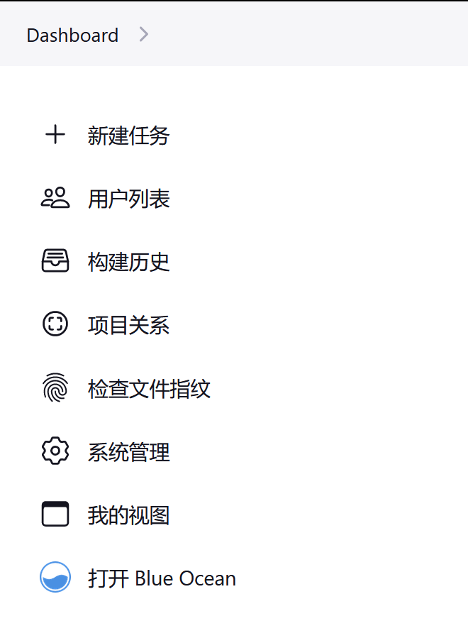

# 管道入门

**Getting started with Pipeline**

[如前](../pipeline.md) 所述，Jenkins Pipeline 是一套插件，支持在 Jenkins 中实现和集成持续交付管道。Pipeline 提供了一套可扩展的工具，通过 Pipeline DSL 将简单到复杂的交付管道 “作为代码” 建模。

本节描述了如何开始在 Jenkins 中创建咱们的管道项目，并介绍了创建和存储 `Jenkinsfile` 的各种方式。


## 前提条件

要使用 Jenkins 管道，咱们将需要：

- Jenkins 2.x 或更新版本；（1.642.3 之后的旧版本可以工作，但不建议使用。）

- 管道插件，其作为 “建议的插件” 的一部分被安装（在 [安装 Jenkins](../Ch01_Installing_Jenkins.md) 后通过运行 [安装后设置向导](../installation/docker.md#安装后设置向导) 时指定）。

请在在 [管理插件](../managing/plugins.md) 中阅读有关如何安装和管理插件的更多信息。


## 定义管道

[声明式和脚本化管道](../pipeline.md#声明式与脚本式的管道语法) 均属于领域特定语言，用于描述咱们软件交付管道的那些部分。脚本化管道则是以 [Groovy 语法](groovy-lang.org/semantics.html) 的有限形式编写的。

Groovy 语法的相关组件将在本文档中根据需要进行介绍，因此虽然了解 Groovy 是有帮助的，但其并不是使用 Pipeline 所必需的。

可以通过以下方式之一创建管道：

- [通过 Blue Ocean](#经由-blue-ocean) -- 在 Blue Ocean 中设置管道项目后，Blue Ocean UI 可帮助咱们编写管道的 Jenkinsfile 并将其提交到源代码管理；

- [通过经典 UI](#经由经典-UI) —— 咱们可通过经典 UI 直接在 Jenkins 中进入一个基本的 Pipeline；

- [在 SCM 中](#在-SCM-中) -- 咱们可以手动编写 `Jenkinsfile`，可将其提交到咱们项目的源代码控制仓库中。


以这两种方法定义管道的语法是相同的，不过尽管 Jenkins 支持直接在经典用户界面中输入管道，一般认为最好的做法是在 `Jenkinsfile` 中定义管道，然后 Jenkins 将直接从源代码控制系统中加载。

下面这个视频提供了关于如何编写声明式和脚本式管道的基本说明。

*在 Jenkins 中编写管道脚本*

（只提供该视频的中文字幕。）


```
在今天的视频中，我们将

讨论如何

在 Jenkins

[音乐] 中编写管道脚本，

如果您是新来的，欢迎您，

如果您是新来的，您不知道我是谁，


我的名字是 Darin Pope，我是

cloudbees 的开发者倡导者，

大约在 2014 年 12 月，Jenkins

项目

引入了脚本化语法管道，

并且在 2017 年 2 月左右，声明式

管道进入了

现在为什么要

使用

管道你有两种不同的语法，

你可以选择使用声明性的，

或者你可以 在

声明性出来之前选择在 2015 年使用脚本，

你所有的东西都是脚本化的，但是一旦

声明式

在 2017 年 2 月左右成为一般可用 GA，

这给了你一个更好的方法

来构建你的大部分

管道

现在我们今天要看的是什么


如果您从未创建过管道

脚本，那么这是一种非常基本的方法，在

我将向您展示一种

在 Jenkins 本身中执行此操作的快速简便的方法

现在您可能会问什么是 Jenkins

管道，

那么 Jenkins 管道是一套插件


使得在一个文件中创建出作业定义可行


如果您过去使用过 Jenkins，则

可能熟悉

freestyle 作业或 maven 作业，

或者有许多作业类型，但

管道

是唯一可以实现

的 能够将

您的作业定义保存到


诸如 git 之类的 SCM 中，这样您就可以将


作业定义作为代码进行管理让我们谈谈

我们今天用来做演示的东西


我有一个运行 2.277.2 的 Jenkins 控制器


当它被安装时，它是

使用安装建议的插件安装的，

并且我们已经

附加了一个代理到这个控制器

所以让我们继续并直接进入它

我们今天要做的是我们

将创建

两个示例作业 我要说的是

创建一个作业，我要说的是

脚本化的管道，这样你就可以看到

怎么做了 将


作业添加到

SCM

我们今天不会这样做

如果您

刚刚开始使用它会更高级一些 我希望您

了解

如何快速创建管道

作业

并且您可以查看其他视频以

了解如何 保存它并将其拉

回到

作业中供以后使用，所以让我们

继续并向下滚动到

称为管道脚本的部分


，实际上在右侧这里有一个小帮手，

它说

尝试一个示例 管道

让我们继续并单击脚本化

管道，

您将在这里看到这是一个

非常

先进的类型管道让我们

继续并简化它

所以让我们继续并首先将

节点代码块留在顶部然后

我们' 我们将留下一个

原料类型作业发生的阶段，

所以将原料想作，因为咱们很快会看到，


在这里我们想要做的而不是

结果我只是想打个

招呼，

我也会说 echo Hello World

我会把它们改成 singles doubles

对于这个用例来说并不重要 让我们

今天选择 singles 好的

现在我们有

节点 阶段 echo hello world 让我们

点击保存

然后点击构建 现在

你会 在这里看到它运行了，你

可以看到它说在

agent1 上运行，这是我们已经

连接到我们的控制器的代理

，然后它回显出 hello world 所以让我们

再看一次

我们大约有五行 给我们

一个 hello world

节点说确保它在代理上运行


我的阶段是

这个工作中发生的事情然后这是

在这种情况下发生的实际事情

这是一个 echo

现在让我们创建一个声明式作业

所以我们将点击 在仪表板上的新项目，

我们将调用此

声明式管道我们将单击

管道

并再次单击确定我们将向下滚动

到我们的管道脚本

部分我们将尝试一个 hello world

，这个 hello world 正是 与

我们刚刚对

我们的脚本化语法管道所做的相同

现在脚本语法是五行

这一段

大致有额外的空间 11

行

所以让我们继续并保存它只是为了

证明

当它运行时它做的

事情与 我们的脚本语法

让我们继续，现在单击构建，

当我们查看输出时，我们可以

看到它在 agent1 上运行

并且它也回显了 hello world 这


与我们在脚本语法管道中看到的输出完全相同 这


是一个简短的视频，只是为了给

你

一些信息，如果你在


看到我们有两种

不同的语法

可以使用之前从未见过什么是 Jenkins 管道，我们有脚本化语法

，那时我们有声明式语法

在脚本化语法和

声明式语法之间

显然，我们必须使用的只是

脚本化语法，

但是一旦声明式语法出现，这就为

我们提供了构建管道的其他选择，

因为

声明式管道的发布是

基本建议，


当您开始时从声明式语法开始 遇到


声明式语法的一些问题，

无论

我们已经在其他视频中介绍过，

然后您将添加到共享库中，请

查看描述中列出的共享库视频，


或者它可能在我这里


如果声明式库

和共享库的组合开始分崩离析，那么


您也已经将它带到了边缘，


然后才应该

使用脚本化语法完全构建管道，

这是脚本化语法可能

更复杂的原因是的

与我们在声明式中看到的相比，它有点短


一个警告词 有时人们会将


脚本化语法视为一种通用

编程语言，

它不是脚本化语法，

而且声明式语法

仅适用于 ci 目的，

如果你 需要与其他系统集成


使用真正的编程语言 go

java 你的选择无关紧要


在真正的编程语言中编写任何功能，

你可以进行

真正的测试，然后一旦你


编写了它是否是一个简单的脚本

也许你 正在编写一个 bash 脚本

或者一个 powershell 脚本或者


作为一个完整的客户端可能更复杂的东西

现在你可以从命令行调用一些东西


一旦你能够从命令行测试所有这些


然后它是 如果您

使用的是


Linux 或 bat

调用或 powershell 调用（如果您使用的是

Windows）来

调用

您编写的工具（

如果您有任何工具）


如果该视频对

您有帮助，

请在

cloudbeesdevs 上与我们联系


铃铛

，您会


在 cloudbees 电视上有新内容时随时收到通知，感谢收看，

我们将

在下一个视频中见到

您

```

### 经由 Blue Ocean


如果你是 Jenkins Pipeline 的新手，Blue Ocean UI 会帮助咱们 [设置咱们的 Pipeline 项目](../blue_ocean/creating_pipelines.md)，并通过图形化的 Pipeline 编辑器自动为咱们创建和编写咱们的 Pipeline（即 `Jenkinsfile`）。

作为在 Blue Ocean 中设置 Pipeline 项目的一部分，Jenkins 会配置一个安全且经过适当的认证的连接到咱们项目的源代码控制库。因此，咱们通过 Blue Ocean 的 Pipeline 编辑器对 `Jenkinsfile` 所做的任何修改都会自动保存并提交到源代码控制系统。

请在 [Blue Ocean](../blue_ocean.md) 章节和 [Getting started with Blue Ocean](../blue_ocean/getting_started.md) 页面中阅读更多关于 Blue Ocean 的信息。

> *Blue Ocean 的现状*
>
> Blue Ocean 将不再接收更多的功能更新。Blue Ocean 将继续提供易于使用的管道可视化，但他不会得到进一步增强。他只会在重大安全问题或功能缺陷方面得到选择性的更新。
>
> [Pipeline 语法片段生成器](#Pipeline-语法片段生成器) 会在用户以参数定义 Pipeline 步骤时为他们提供帮助。他是创建 Jenkins 管道的首选工具，因为他为咱们 Jenkins 控制器中的管道步骤提供在线帮助。他会使用安装在咱们 Jenkins 控制器上的插件来生成 Pipeline 语法。关于所有可用的 Pipeline 步骤的信息，请参考 [Pipeline 步骤参考页](./steps.md)。


### 经由经典 UI


使用经典用户界面创建的 `Jenkinsfile` 由 Jenkins 本身存储（在 Jenkins 的主目录内）。

通过 Jenkins 经典用户界面创建一个基本 Pipeline：

1. 如果需要，请确保咱们已经登录到 Jenkins；

2. 在 Jenkins 主页（即 Jenkins 经典用户界面的仪表板），点击左上方的 “新建任务”；




