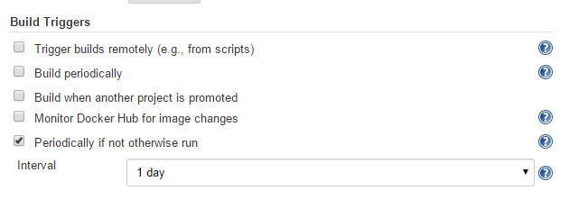
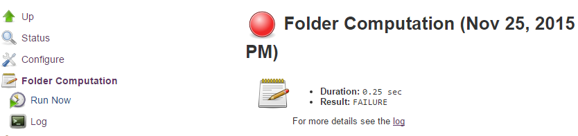
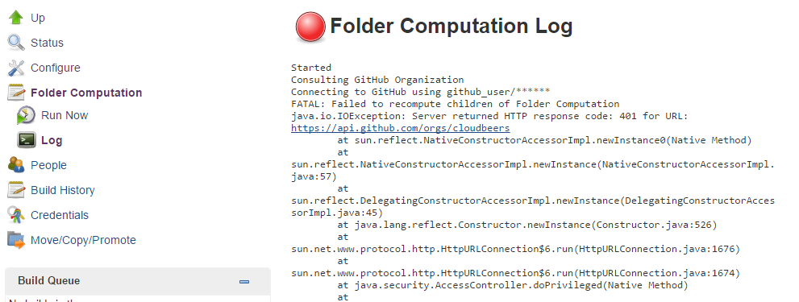
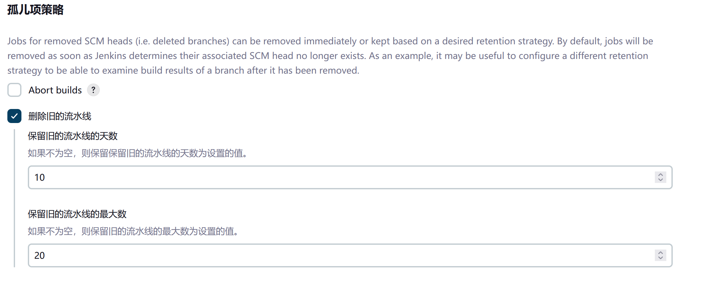
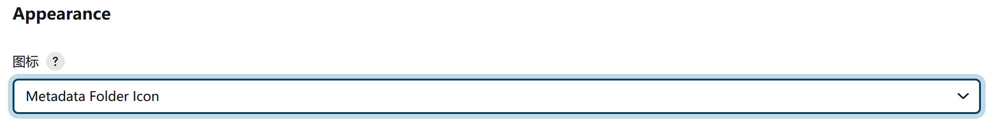
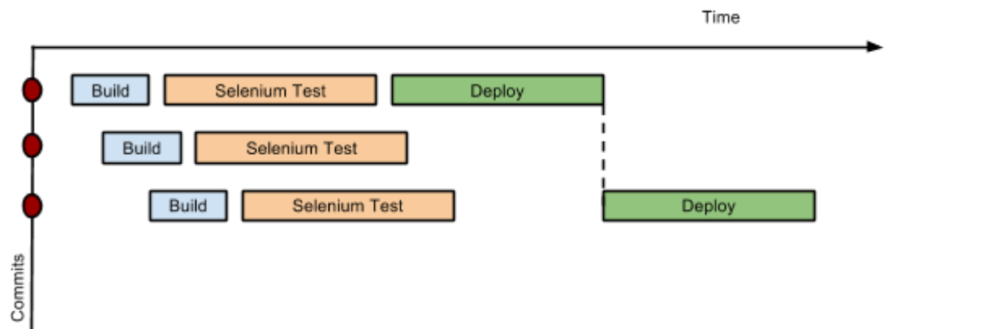
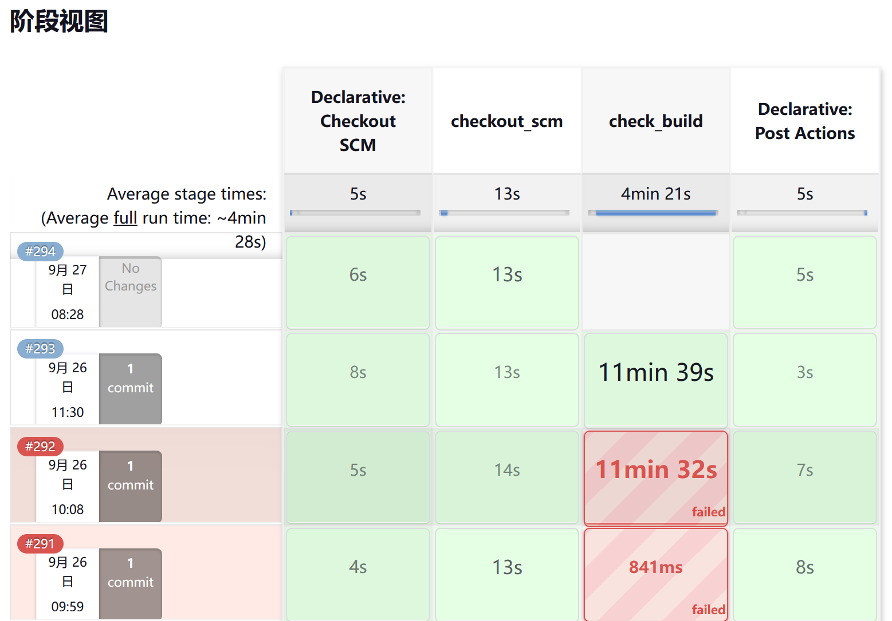
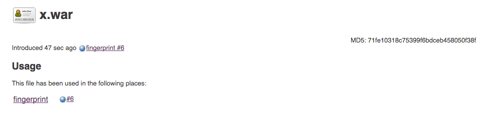

# 流水线即代码

**Pipeline as Code**

*流水线即代码，Pipeline as Code* 这一小节，描述了允许 Jenkins 用户使用源码仓库中存储和版本化的代码，定义流水线式作业流程的一组功能。这些功能允许 Jenkins 发现、管理并运行多个源码仓库与多个分支的作业，从而消除手动创建和管理作业的需要。

要用上 *流水线即代码* 特性，项目必须在仓库根目录下，包含一个名为 `Jenkinsfile` 的文件，其中包含一个 “流水线脚本，Pipeline script”。


此外，还需要在 Jenkins 中配置以下的一个启用作业：


- *多分支流水线，Multibranch Pipeline*：自动构建 *单一* 代码仓库的多个分支；

- *组织文件夹，Organization Folders*：扫描 **GitHub 组织** 或 **Bitbucket 团队**，以发现组织的某个代码仓库，自动为组织/团队创建出受管理的 *多分支流水线* 作业；

- *流水线，Pipeline*： 常规流水线作业在指定流水线时，有一个 "使用 SCM "选项。

从根本上说，组织的代码仓库，可以被视为一个层次结构，其中每个代码仓库都可能有分支和拉取请求等子元素。


```sh
代码仓库结构示例

+--- GitHub Organization
    +--- Project 1
        +--- master
        +--- feature-branch-a
        +--- feature-branch-b
    +--- Project 2
        +--- master
        +--- pull-request-1
        +--- etc...
```


在 _Multibranch Pipeline_ 作业和 _Organization Folders_ 之前，插件：[cloudbees-folder](https://plugins.jenkins.io/cloudbees-folder/) 可用于在 Jenkins 中创建出此层次结构，方法是把代码仓库组织到包含了各个单独分支作业的文件夹中。

*多分支管道* 和 *组织文件夹* 可分别检测到分支和代码仓库，并自动在 Jenkins 中创建出包含作业的适当文件夹，从而消除了手动流程。


## `Jenkinsfile`

如果 `Jenkinsfile` 位于代码仓库的根目录，Jenkins 就能根据代码仓库的分支，自动管理和执行作业。


`Jenkinsfile` 应包含一个指定了执行作业的步骤的流水线脚本。该脚本具有有着流水线的所有可用功能，从简单的调用 Maven 构建器，到一系列相互依存的步骤，这些步骤与部署和验证阶段一起协调并行执行。


开始使用流水线的一个简单方法，便是使用 Jenkins 流水线作业配置屏幕中的 *片段生成器*。使用 *片段生成器*，咱们就可以通过如同其他 Jenkins 作业中的下拉菜单那样，创建出流水线脚本来。


## 文件夹的计算

**Folder Computation**


通过引入 “计算，computed” 文件夹，*多分支流水线* 与 *组织文件夹* 扩展了现有的文件夹功能。计算文件夹会自动运行一个进程，来管理文件夹内容。在 *多分支流水线* 项目中，这种计算会为子文件夹中每个符合条件的分支创建子项目。而对于 *组织文件夹*，计算则会以单独的 *多分支管道*，产生出那些代码仓库的子项目。


文件夹计算可能会在创建或删除分支与代码仓库时，通过 webhook 回调自动进行。计算也可由配置中定义的 *构建触发器，Build Trigger* 触发，该触发器会在一段时间不活动后，自动运行计算任务（默认为一天后运行）。




有关文件夹计算上次执行的信息，可在 **文件夹计算** 小节中找到。




这个页面提供了上次尝试计算文件夹的日志。如果文件夹计算结果与预期的代码仓库集合不符，日志中可能就会有诊断问题的有用信息。





## 配置

*多分支流水线* 项目和 *组织文件夹* 都有可以精确选择代码仓库的配置选项。这些功能还允许在连接远端系统时，选择两种类型的凭据：


- *扫描* 凭据，用于访问 GitHub 或 Bitbucket API；

- 从远端系统克隆代码仓库时，用到的 *检出，checkout* 凭据；对于选择 SSH 密钥或 `- anonymous-`，使用为操作系统用户配置的默认凭据，这可能有用。


> 如果咱们使用的是 *GitHub 组织*，则应创建一个 [GitHub 访问令牌](https://github.com/settings/tokens/new?scopes=repo,public_repo,admin:repo_hook,admin:org_hook&description=Jenkins+Access)，以避免在 Jenkins 中存储密码，并防止在使用 GitHub API 时出现任何问题。使用 GitHub 访问令牌时，必须使用标准的 *用户名加密码凭据*，其中用户名与 GitHub 用户名相同，密码则为访问令牌。


### 多分支流水线项目


*多分支流水线项目* 是 Pipeline as Code 的基本功能之一。构建或部署过程的变更，可随项目需求而变化，而作业始终会反映项目的当前状态。其还允许咱们为同一项目的不同分支，配置不同的作业，或在适当情况下放弃某个作业。某个分支或某次拉取请求下，根目录中的 `Jenkinsfile`，可识别出多分支项目。


> *多分支流水线项目* 会使用 `BRANCH_NAME` 环境变量，暴露出正在构建的分支名称，并会提供一个特殊的 `checkout scm` 流水线命令，该命令可确保检出 `Jenkinsfile` 源自的特定提交。如果 `Jenkinsfile` 出于某种原因，而需要检出代码仓库，则请务必使用 `checkout scm`，因为他还会考虑到替代的源仓库，以处理拉取请求等问题。


要创建 *多分支流水线*，请前往： *新建任务* → *多分支流水线*。根据情况配置 SCM 源。有多种不同类型的代码仓库和服务可供选择，包括 Git、Mercurial、Bitbucket 和 GitHub。例如，如果使用 GitHub，请单击 **添加源**，选择 GitHub 并配置适当的所有者、扫描凭据及代码仓库。


*多分支流水线项目* 的其他选项包括：

- **API 端点** - 使用自托管 GitHub 企业版的替代 API 端点；

- **代码检出凭据** - 检出代码（克隆）时使用的备用凭据；

- **包含分支** - 用于指定要包含分支的正则表达式；

- **排除分支** - 用于指定要排除分支的正则表达式；请注意，这将优先于包含；

- **属性策略** - 如有必要，为各个分支定义自定义属性。


配置这些项目并保存配置后，Jenkins 就会自动扫描代码仓库，并导入适当的分支。


### 组织文件夹

**Organization Folders**

组织文件夹提供了允许 Jenkins 自动管理哪些代码仓库，会自动包含在 Jenkins 中的便利方式。特别是，如果咱们的组织使用了 *GitHub Organizations* 或 *Bitbucket Teams* 时，任何时候只要开发人员创建了带有 `Jenkinsfile` 的新仓库，Jenkins 就会自动检测到他，并为其创建一个 *多分支流水线项目*。这就减少了管理员或开发人员，为这些新仓库手动创建项目的需要。

要在 Jenkins 中创建 *组织文件夹*，请前往 **新建项目** → **组织文件夹**，然后按照各个条目的配置步骤进行操作，确保为 GitHub Organizations 或 Bitbucket Team 名称，分别指定适当的 *扫描凭据* 与专门的 *所有者*。

其他一些选项包括：

- **代码仓库名字模式** - 用于指定 **包含** 哪些代码仓库的正则表达式；

- **API 端点** - 使用自托管 GitHub Enterprise 的备用 API 端点；

- **检出凭证** - 检出代码（克隆）时使用的备用凭据。


对这些项目进行配置并保存配置后，Jenkins 会自动扫描组织，并导入适当的代码仓库及由此产生的分支。


### 孤儿条目策略

**Orphaned Item Strategy**


计算文件夹可以根据所需的保留策略，立即删除或保留项目。默认情况下，一旦文件夹计算确定了项目不再存在，这些项目就会被立即删除。如果咱们组织要求这些项目保留更长时间，只需适当配置 “孤儿条目策略” 即可。例如，在某个分支被移除后，为了检查该分支的构建结果，保留一些条目就可能会有用。




### 图标与视图策略

**Icon and View Strategy**

咱们还可以为文件夹的显示，配置一个图标。例如，显示子构建的总体健康状况可能很有用。或者，咱们也可以引用 GitHub 组织账户中，所使用的图标。

(**注意**：新版本的 Jenkins 中已不支持此特性。)




## 示例

(略)


## 使用流水线进行持续交付

**Continuous Delivery with Pipeline**

持续交付使企业能够以较低的风险交付软件。要实现持续交付，首先要对企业内部用到的软件交付流水线进行建模，然后重点关注其自动化。与传统交付方法相比，通过流水线自动化实现的早期定向反馈，能更快地交付软件。

Jenkins 属于软件交付工具链中的瑞士军刀。开发人员和运维 (DevOps) 人员有着不同的思维方式，并使用不同工具来完成各自的工作。由于 Jenkins 集成了各种各样的工具集，因此他成为开发和运维团队之间的交叉点。


许多组织早已使用现有 Jenkins 插件，来编排流水线好几年了。随着他们的自动化复杂程度与 Jenkins 经验的增加，这些机构不可避免地会希望超越简单流水线，并创建专属其交付过程的复杂流程。

这些 Jenkins 用户需要一个能将复杂流水线，视为一流对象的功能，a feature that treats complex pipelines as a first-class object, 因此开发了 [流水线插件](https://plugins.jenkins.io/workflow-aggregator)。


### 先决条件

**Pre-requisites**

持续交付是个过程，而不是一种工具，他需要一种思想和文化，这种思想和文化必须在组织内自上而下地贯穿。一旦机构接受了这一理念，接下来最困难的部分，就是绘制出软件从开发到投入生产的流程图。


这样的流水线的根基，始终是 Jenkins 这种协调工具，但流水线这类整体，必须满足一些关键要求，才能承担起对于企业至关重要流程的任务：

- **零停机或低停机时间的灾难恢复，zero or low downtime disaster recovery**：提交就像神话中的英雄一样，在流水线上会遇到更难、更长的挑战。流水线执行持续数天的情况并不少见。在为期七天的流水线中，如果在第六天出现硬件或 Jenkins 故障，就会对产品的按时交付造成严重后果；

- **审计运行情况与调试能力, audit runs and debug ability**：构建经理希望看到流水线的确切执行流程，这样他们就能轻松调试问题。


为确保工具能够与组织一起扩展，并在不改变现有交付流水线的情况下，实现适当的自动化，工具还应支持：


- **复杂的流水线**：交付流水线通常比典型示例（线性流程：开发 → 测试 → 部署，每个阶段都有几项操作）更复杂。构建经理要的是，能帮助并行处理流程各部分、运行循环、完成重试等的架构。换句话说，构建经理需要对架构进行编程，来定义出流水线，build managers want constructs that help parallelize parts of the flow, run loops, perform retries and so forth. Stated differently, build managers want programming constructs to define pipelines；

- **手动干预，manual interventions**：跨越组织内部各部门边界的流水线，需要人工交接与干预。构建经理寻求包括暂停管道这类的能力，以便人工干预并做出人工决策。


流水线插件就允许用户通过名为 “流水线，Pipeline” 的新作业类型，创建出流水线。流程，the flow，定义通过 Groovy 脚本被捕获到，从而带来了循环、分叉和重试等控制流的能力。流水线允许带选项的阶段设置并发，以及防止同一流水线的多个构建，同时尝试访问同一资源。


### 一些概念


#### 流水线作业类型

**Pipeline Job Type**


捕获组织中整个软件交付流水线的作业只有一项。当然，如果咱们愿意，也可以将两种流水线作业类型连接在一起。流水线作业类型，使用基于 Groovy 的 DSL 进行作业定义。该 DSL 提供了以编程方式定义作业的优势：

```groovy
node('linux'){
  git url: 'https://github.com/jglick/simple-maven-project-with-tests.git'
  def mvnHome = tool 'M3'
  env.PATH = "${mvnHome}/bin:${env.PATH}"
  sh 'mvn -B clean verify'
}
```

#### 阶段


**Stages**


组织内（或概念上）的边界，是通过一种称为 “阶段” 的原语，a primitive called "stages"，来捕获到的。部署流水线由多个阶段构成，其中每个后续阶段，都建立在前一阶段的基础上。这样做的目的，是在流水线的早期阶段，花费尽可能少的资源来发现明显的问题，而不是花费大量的计算资源，来处理最终发现的问题。



*图 1，使用流水线的节流阶段并发，throttled stage concurrency with Pipeline*


请设想有着三个阶段的一个简单流水线。该流水线的简单实现，可以在每次代码提交时，顺序地触发每个阶段。因此，部署步骤就会在 Selenium 测试步骤完成后，立即触发。然而，这意味着提交二的部署，会覆盖提交一的最后一次部署。正确的做法是，对于提交二和提交三，要等待提交一的部署完成，合并了提交一之后所发生的全部更改，并触发部署。如果出现问题，开发人员就可以轻松找出，问题是在提交二还是提交三中引入的。


通过增强阶段原语，stage primitive，流水线提供了这一功能。例如，阶段可以定义一个并发级别，以表示在任何时候，都只有一个线程在该阶段运行。这就实现了以最快速度运行部署的理想状态。


```groovy
 stage name: 'Production', concurrency: 1
 node {
     unarchive mapping: ['target/x.war' : 'x.war']
     deploy 'target/x.war', 'production'
     echo 'Deployed to http://localhost:8888/production/'
 }
```

#### 门槛与审批

**Gates and Approvals**


持续交付是指二进制文件处于发布就绪状态，而持续部署，continuous deployment，则是指将二进制文件推送到生产环境 -- 或者说自动部署，automated depolyment。尽管持续部署是一个颇具魅力的术语，也是一种理想状态，但在现实中，企业仍然会希望在将二进制文件推送到生产环境之前，由人工进行最终审批。这可以通过流水线中的 “输入” 原语，the "input" primitive，来实现。输入步骤可以无限期等待人工干预。


```groovy
input message: "Does http://localhost:8888/staging/ look good?"
```

#### 到暂存/生产环境的构件部署

**Deployment of Artifacts to Staging/Production**

二进制文件的部署，是流水线的最后一英里。由于机构内部与市场上的服务器数量众多，因此很难采用统一的部署步骤。如今，第三方部署器产品可以解决这个问题，他们的工作，就是将特定的堆栈，部署到数据中心。团队也可以编写自己的扩展，与流水线作业类型挂钩，使部署工作更轻松。


同时，作业创建者也可以编写普通老式 Groovy 函数，来定义出任何可以在生产环境中部署（或取消部署）构件的自定义步骤。


```groovy
def deploy(war, id) {
    sh "cp ${war} /tmp/webapps/${id}.war"
}
```


#### 可重启流程

**Restartable flows**


所有流水线都是可恢复的，resumable, 因此，如果在流程运行时需要重启 Jenkins，他应在 Jenkins 重新启动后的同一点位恢复执行。同样，如果某个流程正在运行一个冗长的 `sh` 或 `bat` 步骤，而代理意外断开了连接，则在恢复连接后，进度不会丢失。


在一些情况下，流程的构建已经完成了大量的工作，而在进行到某一点时，会出现瞬间的错误：这种错误并不反映此次构建的输入，比如源代码更改方面的问题。例如，在完成漫长的软件组件构建和测试后，最终可能会因网络问题，而部署到服务器失败。


#### 流水线阶段视图

**Pipeline Stage View**

当咱们有着复杂的构建流水线时，查看到各个阶段的进度，以及流水线中发生构建失败的位置就非常有用。这可以帮助用户，调试哪些测试在哪个阶段失败，或者流水线中是否存在其他问题。许多机构还希望使他们的流水线，在无需开发自制的用户界面下，对非开发人员友好，因为开发自制的用户界面，可能是一项漫长而持续的开发工作。


流水线阶段视图特性，the Pipeline Stage View feature, 在流程项目的索引页面上，提供了流水线构建历史的扩展可视化。这种可视化还包括了一些有用的指标，比如按阶段和按构建的平均运行时间，以及与输入步骤交互的用户友好界面。



*图 2，流水线阶段视图插件*


使用该插件的唯一前提，便是流程中要有定义了阶段的流水线。阶段数量不限，可以是线性顺序的阶段，阶段名称将以列的形式，显示在 “阶段视图” 界面中。


#### 使用指纹实现构件可追溯

**Artifact traceability with fingerprints**


可追溯性对 DevOps 团队来说非常重要，因为他们需要能够追踪代码从提交到部署的整个过程。通过显示构件之间的关系，其实现了影响分析，并使构件从代码仓库，到最终在生产环境中部署的整个生命周期具有了可见性。

Jenkins 与流水线（Pipeline）功能，支持使用文件指纹的构件版本跟踪，这样用户就可以跟踪哪些下游构建，使用了任何的给定构件。要在 Pipeline 下进行指纹记录，只需在任何的构件归档步骤中，添加 `fingerprint: true` 参数即可。例如：


```groovy
archiveArtifacts artifacts: '**', fingerprint: true
```

就将把流水线中创建的任何 WAR 构件，进行归档，并对其进行指纹识别，以实现可追溯性。然后，Jenkins 的左侧菜单中，就会出现该构件的跟踪日志，以及构建过程中所有加了指纹的构件列表：



*图 3，某个 `.WAR` 文件的指纹*

请访问 [指纹文档](https://www.jenkins.io/doc/book/using/fingerprints/) 了解更多信息。
