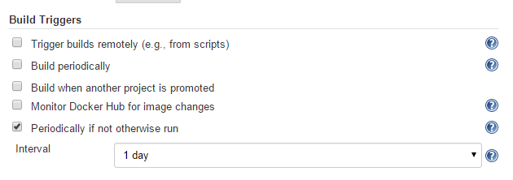
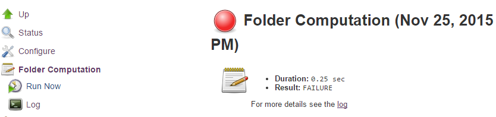
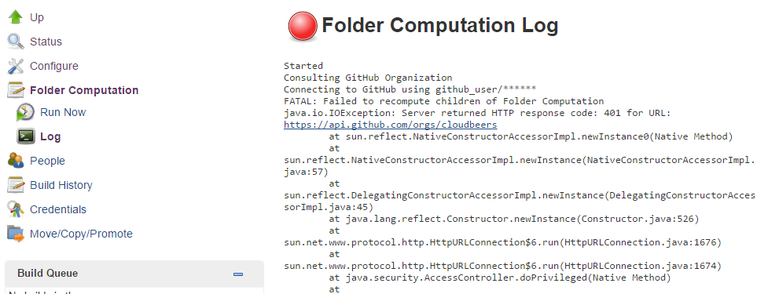

# 流水线即代码

**Pipeline as Code**

*流水线即代码，Pipeline as Code* 这一小节，描述了允许 Jenkins 用户使用源码仓库中存储和版本化的代码，定义流水线式作业流程的一组功能。这些功能允许 Jenkins 发现、管理并运行多个源码仓库与多个分支的作业，从而消除手动创建和管理作业的需要。

要用上 *流水线即代码* 特性，项目必须在仓库根目录下，包含一个名为 `Jenkinsfile` 的文件，其中包含一个 “流水线脚本，Pipeline script”。


此外，还需要在 Jenkins 中配置以下的一个启用作业：


- *多分支流水线，Multibranch Pipeline*：自动构建 *单一* 代码仓库的多个分支；

- *组织文件夹，Organization Folders*：扫描 **GitHub 组织** 或 **Bitbucket 团队**，以发现组织的某个代码仓库，自动为组织/团队创建出受管理的 *多分支流水线* 作业；

- *流水线，Pipeline*： 常规流水线作业在指定流水线时，有一个 "使用 SCM "选项。

从根本上说，组织的代码仓库，可以被视为一个层次结构，其中每个代码仓库都可能有分支和拉取请求等子元素。


```sh
代码仓库结构示例

+--- GitHub Organization
    +--- Project 1
        +--- master
        +--- feature-branch-a
        +--- feature-branch-b
    +--- Project 2
        +--- master
        +--- pull-request-1
        +--- etc...
```


在 _Multibranch Pipeline_ 作业和 _Organization Folders_ 之前，插件：[cloudbees-folder](https://plugins.jenkins.io/cloudbees-folder/) 可用于在 Jenkins 中创建出此层次结构，方法是把代码仓库组织到包含了各个单独分支作业的文件夹中。

*多分支管道* 和 *组织文件夹* 可分别检测到分支和代码仓库，并自动在 Jenkins 中创建出包含作业的适当文件夹，从而消除了手动流程。


## `Jenkinsfile`

如果 `Jenkinsfile` 位于代码仓库的根目录，Jenkins 就能根据代码仓库的分支，自动管理和执行作业。


`Jenkinsfile` 应包含一个指定了执行作业的步骤的流水线脚本。该脚本具有有着流水线的所有可用功能，从简单的调用 Maven 构建器，到一系列相互依存的步骤，这些步骤与部署和验证阶段一起协调并行执行。


开始使用流水线的一个简单方法，便是使用 Jenkins 流水线作业配置屏幕中的 *片段生成器*。使用 *片段生成器*，咱们就可以通过如同其他 Jenkins 作业中的下拉菜单那样，创建出流水线脚本来。


## 文件夹的计算

**Folder Computation**


通过引入 “计算，computed” 文件夹，*多分支流水线* 与 *组织文件夹* 扩展了现有的文件夹功能。计算文件夹会自动运行一个进程，来管理文件夹内容。在 *多分支流水线* 项目中，这种计算会为子文件夹中每个符合条件的分支创建子项目。而对于 *组织文件夹*，计算则会以单独的 *多分支管道*，产生出那些代码仓库的子项目。


文件夹计算可能会在创建或删除分支与代码仓库时，通过 webhook 回调自动进行。计算也可由配置中定义的 *构建触发器，Build Trigger* 触发，该触发器会在一段时间不活动后，自动运行计算任务（默认为一天后运行）。




有关文件夹计算上次执行的信息，可在 **文件夹计算** 小节中找到。




这个页面提供了上次尝试计算文件夹的日志。如果文件夹计算结果与预期的代码仓库集合不符，日志中可能就会有诊断问题的有用信息。





## 配置

*多分支流水线* 项目和 *组织文件夹* 都有可以精确选择代码仓库的配置选项。这些功能还允许在连接远端系统时，选择两种类型的凭据：


- *扫描* 凭据，用于访问 GitHub 或 Bitbucket API；

- 从远端系统克隆代码仓库时，用到的 *检出，checkout* 凭据；对于选择 SSH 密钥或 `- anonymous-`，使用为操作系统用户配置的默认凭据，这可能有用。


> 如果咱们使用的是 *GitHub 组织*，则应创建一个 [GitHub 访问令牌](https://github.com/settings/tokens/new?scopes=repo,public_repo,admin:repo_hook,admin:org_hook&description=Jenkins+Access)，以避免在 Jenkins 中存储密码，并防止在使用 GitHub API 时出现任何问题。使用 GitHub 访问令牌时，必须使用标准的 *用户名加密码凭据*，其中用户名与 GitHub 用户名相同，密码则为访问令牌。


### 多分支流水线项目


*多分支流水线项目* 是 Pipeline as Code 的基本功能之一。构建或部署过程的变更，可随项目需求而变化，而作业始终会反映项目的当前状态。其还允许咱们为同一项目的不同分支，配置不同的作业，或在适当情况下放弃某个作业。某个分支或某次拉取请求下，根目录中的 `Jenkinsfile`，可识别出多分支项目。


> *多分支流水线项目* 会使用 `BRANCH_NAME` 环境变量，暴露出正在构建的分支名称，并会提供一个特殊的 `checkout scm` 流水线命令，该命令可确保检出 `Jenkinsfile` 源自的特定提交。如果 `Jenkinsfile` 出于某种原因，而需要检出代码仓库，则请务必使用 `checkout scm`，因为他还会考虑到替代的源仓库，以处理拉取请求等问题。


要创建 *多分支流水线*，请前往： *新建任务* → *多分支流水线*。根据情况配置 SCM 源。有多种不同类型的代码仓库和服务可供选择，包括 Git、Mercurial、Bitbucket 和 GitHub。例如，如果使用 GitHub，请单击 **添加源**，选择 GitHub 并配置适当的所有者、扫描凭据及代码仓库。


*多分支流水线项目* 的其他选项包括：

- **API 端点** - 使用自托管 GitHub 企业版的替代 API 端点；

- **代码检出凭据** - 检出代码（克隆）时使用的备用凭据；

- ****
