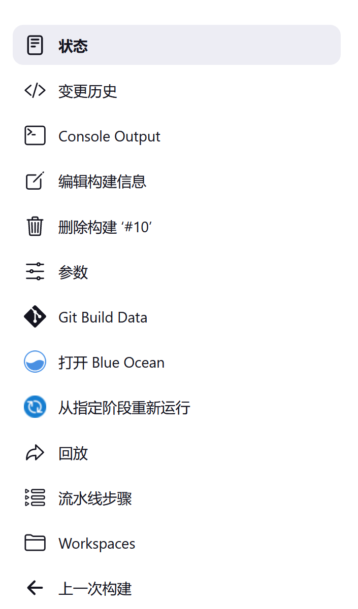
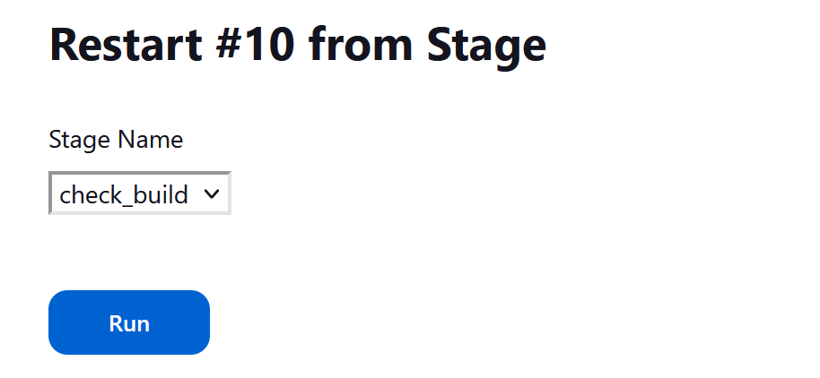
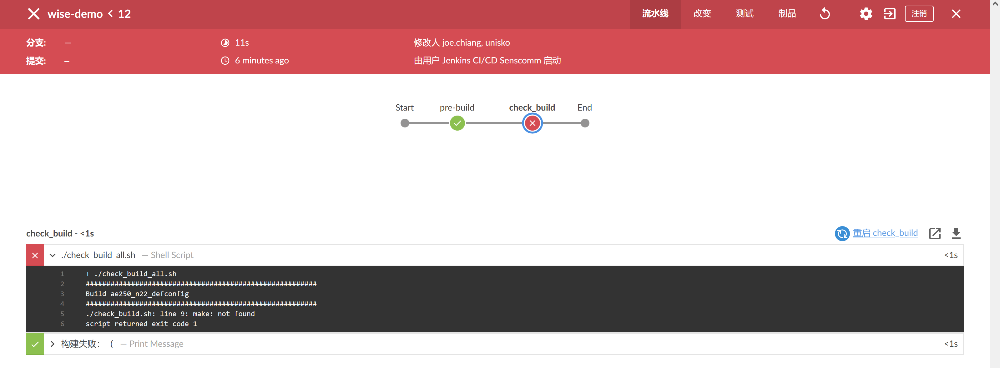

# 运行流水线

**Running Pipelines**

## 运行流水线

**Running a Pipeline**

### 关于多分支

**Multibranch**

请参阅 [多分支文档](./branches.md) 了解更多信息。

### 参数

**Parameters**

请参阅 [`Jenkinsfile` 文档](./jenkinsfile.md#处理参数) 了解更多信息。

## 重启或重新运行流水线

**Restarting or Rerunning a Pipeline**

有数种可以重新运行或重新启动一个已完成管道的方法。

### 重放

**Replay**

请参阅 [重放文档](./development_tools.md#修改后的重放流水线运行) 了解更多信息。

### 从某个阶段重启

**Restart from a Stage**

咱们可以从任何已完成流水线中运行的任何顶层阶段重新启动该流水线。比如，这允许咱们从某个由于瞬态或环境因素而失败的阶段重新运行流水线。该流水线的所有输入将是相同的。这包括 SCM 信息、构建参数，以及原始流水线中的任何 `stash` 步骤调用的内容（如有指定的话）。

#### 怎样使用

Jenkinsfile 中无需额外配置来允许咱们重新启动咱们的声明式流水线中的阶段。这是声明式流水线的固有特性，可以自动使用。

**从经典 UI 重启**

一旦咱们的管道完成，其不管是成功还是失败，咱们都可以前往经典用户界面中该次运行的侧面板，点击 “从指定阶段重新运行”。

咱们将被提示从原始运行中执行的顶层阶段列表中选择，以他们被执行的顺序。由于先前失败而被跳过的阶段将不能被重新启动，但由于 `when` 条件不满足而被跳过的阶段将可被选中。一组 `parallel` 阶段的父级阶段，或者一组顺序运行的嵌套 `stages` ，也将不可用 -- 这里只允许那些顶层阶段。

一旦咱们选择了要重启的阶段并点击提交，那么一个新的构建将被启动，并有新的构建编号。所选阶段之前的所有阶段将被跳过，管道将在所选阶段开始执行。从那时起，管道将正常地运行。

**从 Blue Ocean 用户界面重启**

阶段的重启也可以在 Blue Ocean 用户界面中完成。一旦咱们的流水线完成，不管是成功还是失败，咱们都可以点击代表该阶段的节点。然后咱们可以点击该阶段的重启链接。

{{#include ./get_started.md:56:59}}
> 流水线可视化的其他选择，如 [流水线：阶段视图](https://plugins.jenkins.io/pipeline-stage-view/) 和 [流水线图形视图](https://plugins.jenkins.io/pipeline-graph-view/) 插件都是可用的，并提供一些同样功能。虽然不能完全取代 Blue Ocean，但我们鼓励社区为这些插件的继续发展做出贡献。

#### 保留 “存储” 以供重新启动的阶段使用

**Preserving `stash`es for Use with Restarted Stages**
