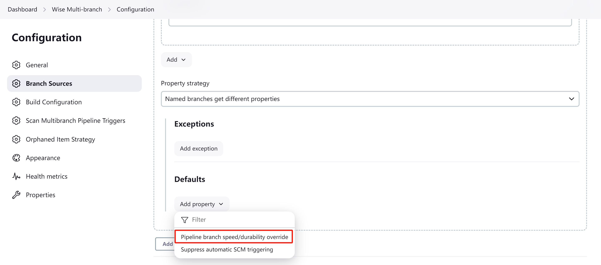

# 调整流水线

**Scaling Pipelines**

流水线主要瓶颈之一，便是他会 **频繁地** 将瞬态数据写入磁盘，以便运行中的流水线能够处理意外的 Jenkins 重启或系统崩溃。这种持久性对许多用户都很有用，但其性能代价可能是个问题。

如今，流水线包括了一些功能，让用户可以通过减少写入磁盘的数据量和频率来提高性能，尽管这会略微降低持久性。在一些特殊情况下，如果 Jenkins 突然关闭而没有机会写入数据，用户就可能无法恢复或可视化运行中的流水线。

由于这些设置涉及到速度与持久性之间的权衡，他们最初是选择性的。要启用性能优化模式，performance-optimized modes，用户需要明确地设置流水线的 *速度/持久性，Speed/Durability* 设置。如果没有明确选择，流水线的当前设置，将默认为 “最大持久性，maximum durability”，并且会像过去一样写入磁盘。在同一插件版本中，会有一些与 I/O 优化相关的优化，但其好处要小得多。

## 如何设置速度/持久性设置？

**How Do I Set Speed/Durability Settings?**

有 3 种配置持久性设置的方式：

1. **全局性地，globally**，咱们可以在 “系统管理” > “系统配置” 下，选择全局默认的持久性设置，其标签为 “Pipeline Speed / Durability”。咱们可以使用下面更具体的设置，来覆盖这些全局设置；

2. **每个流水线作业，per pipeline job**：在作业配置的顶部，其标签为 “Custom Pipeline Speed/Durability Level” - 这会覆盖全局设置。或者，使用一个 `properties` 步骤 - 设置将在执行该步骤后的下一次运行中应用（效果相同）;

3. **多分支项目的每个分支，per-branch for a multibranch project**: 配置自定义分支属性策略，Branch Property Strategy（在SCM下），并添加一个用于自定义流水线速度/持久性级别的属性。这会覆盖全局设置。咱们还可以使用 `properties` 步骤来覆盖设置，但请记住可能需要再次运行该步骤以撤消此操作。

持久性设置将在下一次适用的流水线运行中生效，而不会立即生效。设置将显示在日志中。

## 更高性能的耐久性设置有帮助吗？

**Will Higher-Performance Durability Settings Help Me**?

- 有，如果咱们的 Jenkins 实例用到了 NFS、磁盘存储、同时运行许多流水线或显示高 I/O 等待时间；

- 有，如果咱们正在运行包含许多步骤的流水线（为数过百）；

+ 有，如果咱们的流水线将大型文件或复杂数据，存储到脚本中的变量中，把该变量保留在作用域中以便将来使用，然后运行步骤。这听起来很奇怪，但发生的次数比咱们想象的要多。

    - 例如：有着大型 XML/JSON 文件的 `readFile` 步骤，或用到以某个实用工具步骤，One of the Utility Steps，解析此类文件而获得的配置信息；

    - 另一种常见模式便是 “摘要，summary” 对象，其中包含来自多个分支的数据（日志、结果或统计数据）。这通常是可见的，因为咱们会经常通过 `add/append` 或 `Map.put()` 操作，向其中添加数据；

    - 大型数据数组或配置信息的 `Map` 映射，是另一种此类情形的常见例子。

- 无，如果咱们的流水线几乎全部时间，都在等待一些 shell/批处理脚本完成，这并不是一个可以解决所有问题的魔法 “加速” 按钮！

- 无，如果流水线是在将大量数据写入日志（日志记录未更改）；

- 无，如果咱们没有使用流水线，或者咱们的系统受到其他因素的负载；

- 无，如果咱们没有启用流水线的较高性能模式。

## 在持久性设置的 “权衡” 中，我放弃了什么？

**What Am I Giving Up With This Durability Setting "Trade-Off?"**

**无论设置如何，Jenkins *本身* 的稳定性不会改变** - 持久性设置只适用于流水线。而流水线最坏的情况，便是恢复到类似自由式构建的行为 -- 运行中的流水线如果无法持久化瞬态数据，就可能无法恢复或显示在 Blue Ocean 或阶段视图等中，但会显示日志。这只对正在运行的流水线有影响，而且只在 Jenkins 在流水线完成前，突然而非优雅地关闭时才会发生。

所谓 **“优雅” 关机，a "graceful" shutdown**, 是指 Jenkins 经历一个完整的关机过程，例如访问 `https://[jenkins-server]/exit`，或使用正常的服务关机脚本（在 Jenkins 处于健康状态时）。向 Jenkins 发送 `SIGTERM/SIGINT` 会触发优雅关机。请注意，运行中的流水线无需完成（无需使用 `/safeExit` 关闭）。

而所谓 **“脏” 关机，a "dirty" shutdown**，是指 Jenkins 无法执行正常的关闭进程。如果进程被强行终止，就会出现这种情况。最常见的原因是使用 `SIGKILL` 终止 Jenkins 进程，或杀死运行 Jenkins 的容器/虚拟机。只要 Jenkins 进程能够恢复，简单地停止或暂停容器/虚拟机，就不会导致这种情况。由于操作系统发生灾难性故障，包括 Linux OOMKiller 攻击 Jenkins java 进程以释放内存，也可能导致脏关闭。

**原子写入，atomic writes**： 除 “最大耐久性” 外的所有设置，目前都会避免原子写入，这意味着如果运行 Jenkins 的操作系统发生故障，写入磁盘的缓冲数据就不会被刷新，而是会丢失。这种情况非常罕见，但也可能因容器或虚拟化操作，而导致操作系统停止运行或存储断开而发生。通常情况下，这些数据会很快刷新到磁盘，因此数据丢失的时间很短。在 Linux 上，可以通过运行 `sync` 命令来强制将数据刷新到磁盘。在极少数情况下，这也会导致构建无法加载。

## 使用持久性设置的各项要求

**Requirements To Use Durability Settings**

- Jenkins LTS 2.73 或更高版本（或每周构建的 2.62 或更高版本）；

+ 对于下面所列出的 **全部** 流水线插件，必须至少安装指定的最低版本：

    - Pipeline: API (`workflow-api`) v2.25；

    - Pipeline: Groovy (`workflow-cps`) v2.43；

    - Pipeline: 作业 (`workflow-job`) v2.17；

    - Pipeline: 支持性 APIs (`workflow-support`) v2.17；

    - Pipeline: 多分支 (`workflow-multibranch`) v2.17 - 可选的，只有在启用此设置以用于多分支流水线时才需要。

- 重新启动控制器，使用更新后的插件 -- 注意：需要全部插件才能使用。

## 持久性设置都是些什么？

**What Are The Durability Settings?**

- 性能优化模式，performance-optimized mode，（`PERFORMANCE_OPTIMIZED`）-- 大大减少磁盘 I/O。如果流水线没有完成，Jenkins 也没有优雅地关闭，那么他们就可能会丢失数据，并表现得像 Freestyle 项目一样 -- 详见上文；

- 最大持久性，maximum durability, （ `MAX_SURVIVABILITY` ） - 其行为与之前的流水线相同，速度最慢的选项。用于运行最关键的流水线；

- 持久性较低，速度稍快，less durable, a bit faster，（ `SURVIVABLE_NONATOMIC` ） -- 每一步都写入数据，但会避免原子写入。这比最大持久性模式更快，尤其在 NFS 上。但他会带来一点额外风险（详情见上文 [“我放弃了什么：原子写入”](#在持久性设置的-权衡-中我放弃了什么) ）。

## 建议的持久性设置最佳实践与技巧

**Suggested Best Practices And Tips for Durability Settings**

- 对于大多数流水线，特别是基本的构建-测试流水线，或任何在需要时可以重新运行的流水线，请使用 “性能优化，performance-optimized” 模式；

+ 如果需要保证流水线的执行记录（审计），则可使用 “最大持久性” 或 “较低持久性” 模式。这两种模式都会记录每一步的运行。例如，在以下情况下，请使用这两种模式之一：

    - 咱们有着修改关键基础设施状态的流水线时；

    - 进行生产部署时。

+ 将持久性设置的全局默认值（参见上文），设置为"性能优化"，然后根据需要，在特定流水线作业或多分支流水线的分支（ `master` 或发布分支）上，设置 “最大持久性”；

+ 通过暂停流水线，咱们可以强制使其持久化数据。

## 其他调整流水线的建议

**Other Scaling Suggestions**

+ 请使用 `@NonCPS` 注解的函数，来处理更复杂的工作。这意味着会涉及到更多的数据处理、业务逻辑和转换。这样，咱们就可以利用额外的 Groovy 与函数功能，编写出更强大、更简洁、更高效的代码。

    - 尽管这些函数仍然在控制器上运行，但要注意工作的复杂性。不过与原生 Pipeline 代码相比，他们要快得多，因为他们不提供持久性，并且使用了更快的执行模型。不过，请注意 CPU 开销，并在开销过高时，将工作转移到执行器（Jenkins 代理？）上；

    - `@NonCPS` 函数可以使用更广泛的 Groovy 语言子集，例如迭代器及函数式特性等，这使得他们更加简洁，编写速度更快；

    + `@NonCPS` 函数在其内部 **不应用到** 流水线的步骤，但可以将流水线步骤的结果，存储到变量中，并将其作为 `@NonCPS` 函数的输入；
        - **注意，gotcha**：不保证使用步骤就会产生错误（有个开放的 RFE，Request for Evidence，来实现这一点），但不应依赖这种行为。咱们可能会看到不当的异常处理。

    + 虽然正常流水线仅限于可序列化的局部变量，但 `@NonCPS` 函数则可以在其内部，使用更复杂、不可序列化的类型（例如 `regex` 匹配器等）。不过，其参数和返回类型，仍应是可序列化的。
        - **注意**: 在正常流水线中，不恰当的使用不一定会引发错误（某些优化可能会掩盖问题），但依赖这种行为是不安全的。

    - **一般注意事项**：运行 `@NonCPS` 函数时，实际错误有时会被流水线吞没，从而产生令人困惑的错误信息。要解决这个问题，可以使用 `try/catch` 代码块，并在 `catch` 中使用 `echo`，以纯文本方式打印错误信息。

- **尽量使用具有高速固态硬盘（SSD）支持，而非硬盘驱动器运行 Jenkins。这可以带来巨大的改善**。

+ 一般来说，要尽量使工具与作业相匹配。在使用构建代理运行复杂流程时，可考虑编写简短的 Shell/Batch/Groovy/Python 脚本。良好示例包括处理数据、与 REST API 进行交互式通信，以及解析/模板化较大的 XML 或 JSON 文件。`sh` 和 `bat` 步骤有助于调用这些脚本，尤其是使用 `returnStdout: true` 来返回脚本输出，并将其保存为变量（对于脚本化管道）。
    - Pipeline DSL 并不是为任意的网络与计算任务而设计 - 其旨在用于 CI/CD 脚本编写。

- 如适用，请使用Pipeline插件和脚本安全性的最新版本，他们包括了定期的性能改进；

- 要尝试通过减少运行步骤数量，来简化流水线代码，并为脚本化流水线使用更简单的 Groovy 代码；

- 如果可以的话，要合并同一类型的连续步骤，例如使用一个 Shell 步骤来调用辅助脚本，而不是运行多个步骤；

- 要尽量限制流水线写入日志的数据量。如果要写入几个 MB 的日志数据，例如来自构建工具的数据，则可以考虑将其写入外部文件，压缩后作为构建产物存档；

- 当用到堆容量超过 6 GB 的 Jenkins 时，请使用 [建议的垃圾收集调整选项](https://www.jenkins.io/blog/2016/11/21/gc-tuning/)，以尽量减少垃圾收集的暂停时间和开销。

（End）

