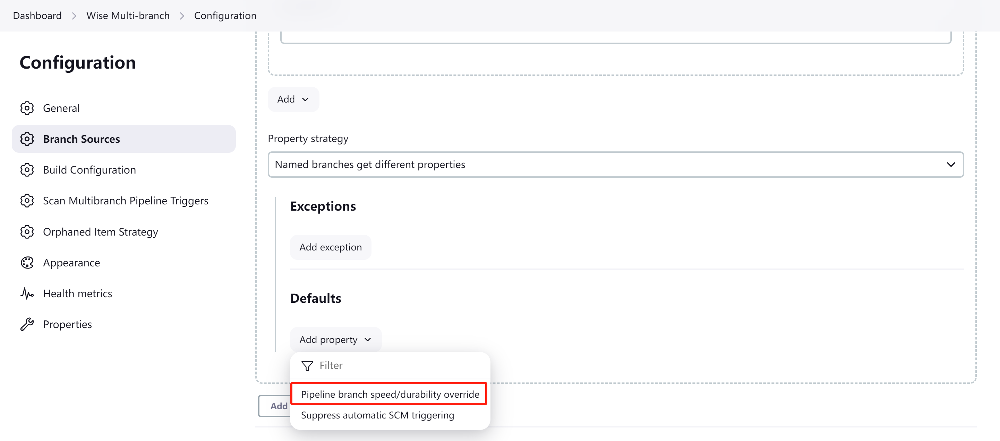

# 扩大流水线规模

**Scaling Pipelines**

流水线主要瓶颈之一，便是他会 **频繁地** 将瞬态数据写入磁盘，以便运行中的流水线能够处理意外的 Jenkins 重启或系统崩溃。这种持久性对许多用户都很有用，但其性能代价可能是个问题。

如今，流水线包括了一些功能，让用户可以通过减少写入磁盘的数据量和频率来提高性能，尽管这会略微降低持久性。在一些特殊情况下，如果 Jenkins 突然关闭而没有机会写入数据，用户就可能无法恢复或可视化运行中的流水线。

由于这些设置涉及到速度与持久性之间的权衡，他们最初是选择性的。要启用性能优化模式，performance-optimized modes，用户需要明确地设置流水线的 *速度/持久性，Speed/Durability* 设置。如果没有明确选择，流水线的当前设置，将默认为 “最大持久性，maximum durability”，并且会像过去一样写入磁盘。在同一插件版本中，会有一些与 I/O 优化相关的优化，但其好处要小得多。

## 如何设置速度/持久性设置？

**How Do I Set Speed/Durability Settings?**

有 3 种配置持久性设置的方式：

1. **全局性地，globally**，咱们可以在 “系统管理” > “系统配置” 下，选择全局默认的持久性设置，其标签为 “Pipeline Speed / Durability”。咱们可以使用下面更具体的设置，来覆盖这些全局设置；

2. **每个流水线作业，per pipeline job**：在作业配置的顶部，其标签为 “Custom Pipeline Speed/Durability Level” - 这会覆盖全局设置。或者，使用一个 `properties` 步骤 - 设置将在执行该步骤后的下一次运行中应用（效果相同）;

3. **多分支项目的每个分支，per-branch for a multibranch project**: 配置自定义分支属性策略，Branch Property Strategy（在SCM下），并添加一个用于自定义流水线速度/持久性级别的属性。这会覆盖全局设置。咱们还可以使用 `properties` 步骤来覆盖设置，但请记住可能需要再次运行该步骤以撤消此操作。

持久性设置将在下一次适用的流水线运行中生效，而不会立即生效。设置将显示在日志中。

## 更高性能的耐久性设置有帮助吗？

**Will Higher-Performance Durability Settings Help Me**?

- 有，如果咱们的 Jenkins 实例用到了 NFS、磁盘存储、同时运行许多流水线或显示高 I/O 等待时间；

- 有，如果咱们正在运行包含许多步骤的流水线（为数过百）；

+ 有，如果咱们的流水线将大型文件或复杂数据，存储到脚本中的变量中，把该变量保留在作用域中以便将来使用，然后运行步骤。这听起来很奇怪，但发生的次数比咱们想象的要多。

    - 例如：有着大型 XML/JSON 文件的 `readFile` 步骤，或用到以某个实用工具步骤，One of the Utility Steps，解析此类文件而获得的配置信息；

    - 另一种常见模式便是 “摘要，summary” 对象，其中包含来自多个分支的数据（日志、结果或统计数据）。这通常是可见的，因为咱们会经常通过 `add/append` 或 `Map.put()` 操作，向其中添加数据；

    - 大型数据数组或配置信息的 `Map` 映射，是另一种此类情形的常见例子。

- 无，
