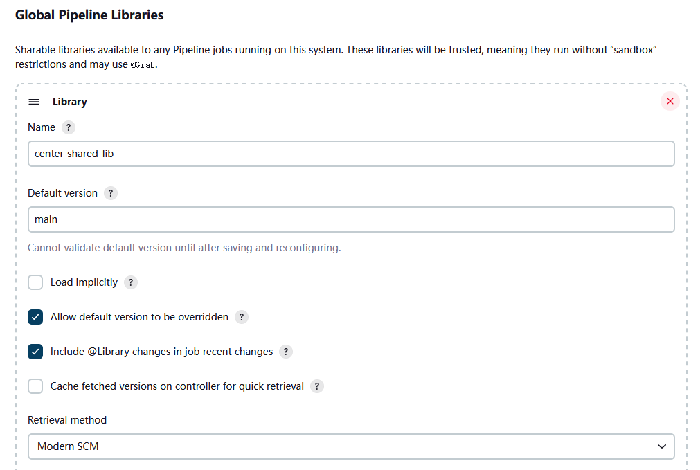

# 使用共享库扩展 Pipeline

**Extending with Shared Libraries**


随着组织中越来越多的项目采用流水线，可能会出现一些常见的模式，common patterns。通常情况下，在不同的项目之间共用管道的一些部分，来减少冗余并保持代码的 “DRY” 会很有用。


> 什么是 DRY，Don't Repeat Yourself, 参见：[Wikipedia: Don't repeat yourself](https://en.wikipedia.org/wiki/Don't_repeat_yourself)。


Pipeline 支持创建可以在外部源代码控制仓库中定义并加载到现有的 Pipeline 中的 “共享库，Shared Libraries”。


*Jenkins 中共享库入门*


[](https://www.youtube.com/watch?v=Wj-weFEsTb0)


## 定义共享库

**Defining Shared Libraries**


共享库由名称、源代码检索方法（例如通过 SCM）以及可选的默认版本来定义。名称应是一个简短的标识符，因为他将在脚本中使用。

版本可以是该 SCM 所理解的任何东西；例如，分支、标签与提交哈希值都适用于 Git。咱们还可以声明脚本是否需要明确地请求该库（详见下文），或者他是否默认存在。此外，如果咱们在 Jenkins 的配置中指定了某个版本，咱们可以阻止脚本选择某个 *不同* 版本。

指定SCM的最好方法是使用某种 SCM 插件，该插件已经被特别更新以支持新的 API，用于检出任意命名的版本（ *现代 SCM* 选项）。截至目前，最新版本的 Git 和 Subversion 插件均支持这种模式；其他插件应该也会支持。

如果咱们的 SCM 插件没有被集成，那么咱们可以选择 *Legacy SCM*，并选择所提供的任何选项。在这种情况下，咱们需要在 SCM 配置中的某处包含 `${library.yourLibName.version}`，这样在检出代码的时候，插件就会展开这个变量来选择需要的版本。例如，对于 Subversion，咱们可以将 *代码仓库 URL* 设置为 `svnserver/project/${library.yourLibName.version}`，然后使用诸如 `trunk` 或 `branches/dev` 或 `tags/1.0` 等版本。


### 目录结构

**Directory structure**

共享库代码仓库的目录结构如下所示：


```console
(root)
+- src                     # Groovy source files
|   +- org
|       +- foo
|           +- Bar.groovy  # for org.foo.Bar class
+- vars
|   +- foo.groovy          # for global 'foo' variable
|   +- foo.txt             # help for 'foo' variable
+- resources               # resource files (external libraries only)
|   +- org
|       +- foo
|           +- bar.json    # static helper data for org.foo.Bar
```


`src` 目录应类似于标准的 Java 源代码目录结构。执行 Pipelines 时，该目录会被添加到类路径中。


`vars` 目录存放着在流水线中作为变量而暴露的脚本文件。文件的名称就是流水线中变量的名称。因此，如果咱们有一个名为 `vars/log.groovy` 的文件，其中有一个类似 `def info(message)...` 的函数，咱们就可以在流水线中访问这个函数，如 `log.info "hello world"`。咱们可以在这个文件里放上喜欢的任何函数。请继续阅读以下内容，了解更多的示例和选项。


每个 `.groovy` 文件的基本名称应该是一个 Groovy（即 Java）的标识符，通常是 `camelCased` 命名方式的。而所匹配的 `.txt`，如果存在的话，则可以包含文档，通过系统配置的 [markup 格式化程序](https://wiki.jenkins.io/display/JENKINS/Markup+formatting) 进行处理（所以实际上可以是 HTML、Markdown 等，尽管扩展名为 `.txt` 是必须的）。该文档仅在 [全局变量参考](./get_started.md#全局变量参考) 页面上可见，该页面可从导入了共享库的流水线作业导航侧边栏中访问。此外，这些作业必须成功运行一次，才能生成共享库的文档。


这些目录中的 Groovy 源文件会得到与脚本管道中相同的 “CPS 变换”。


> 注：CPS 变换，continuation-passing style transformation, 连续传递式变换，参见：[Continuation-passing style--CPS变换漫谈](https://misakatang.cn/2018/10/04/Continuation-passing-style-CPS%E5%8F%98%E6%8D%A2%E6%BC%AB%E8%B0%88/)。

`resources` 目录允许从外部库中使用 `libraryResource` 步骤来加载相关的非 Groovy 文件。目前这个特性不支持内部库。

根目录下的其他目录被保留给未来的增强功能。


### 全局共享库

**Global Shared Libraries**


根据用例，可以在多个位置定义共享库。*系统管理* » *System* » *Global Pipeline Libraries* 可以根据需要配置尽可能多的库。


由于这些库将是全局可用的，系统中的任何流水线都可以利用这些库中实现的功能。


这些库被认为是 “可信的”：他们可以运行 Java、Groovy、Jenkins 的内部 API、Jenkins 插件或第三方库中的任何方法。这允许咱们定义出将个别不安全的 API 封装在一个更高层次的包装中，可以从任何管道中安全使用的库。请注意， **任何能够向这个 SCM 仓库推送提交的人都可以获得对 Jenkins 的无限访问**。咱们需要 *Overall/RunScripts* 权限来配置这些库（通常这样的权限将被授予 Jenkins 管理员）。


### 文件夹级别的共享库

**Folder-level Shared Libraries**

所创建的任何文件夹构建项目都可以有与之相关的共享库。这种机制允许对文件夹或子文件夹构建项目内的所有流水线进行特定库的范围控制。


基于文件夹构建项目的库不被认为是 “可信的, trusted”：他们就像典型流水线一样在 Groovy 的沙盒中运行。


### 自动共享库

**Automatic Shared Libraries**


其他一些插件可能会带来一些临时定义库的方法。例如，[Pipeline： GitHub Groovy 库](https://plugins.jenkins.io/pipeline-github-lib) 插件就允许脚本使用一个名为 `github.com/someorg/somerepo` 的不受信任库，而无需任何额外的配置。在这种情况下，指定的 GitHub 仓库将从 `master` 分支，使用匿名签出而加载。


## 使用库

**Using libraries**


标记为 *Load implicity* 的共享库允许流水线立即使用由任何此类库所定义的类或全局变量。而要访问其他共享库，`Jenkinsfile` 就需要使用 `@Library` 注解，指定库的名称：





```groovy
@Library('my-shared-library') _
/* Using a version specifier, such as branch, tag, etc */
@Library('my-shared-library@1.0') _
/* Accessing multiple libraries with one statement */
@Library(['my-shared-library', 'otherlib@abc1234']) _
```

`@Library` 注解可以出现在脚本中 Groovy 允许注解的任何地方。当引用类库（使用 `src/` 目录）时，注解通常位于某个 `import` 语句之上：


```groovy
@Library('somelib')
import com.mycorp.pipeline.somelib.UsefulClass
```

> 对于只定义了全局变量（即 `vars/`）的共享库，或者只需要某个全局变量的 `Jenkinsfile`，注释模式 `@Library('my-shared-library') _` 会对保持代码简洁很有用。从本质上讲，与其注释某个不必要的 `import` 语句，不如注释符号 `_`。
>
> 咱们不建议 `import` 某个全局的变量/函数，因为这将迫使编译器将字段和方法解释为 `static`，即使他们原本是实例。在这种情况下，Groovy 编译器会产生混乱的错误信息。

在脚本开始执行之前的 *编译* 过程中，库被解析和加载。这使得 Groovy 编译器能够在静态类型检查中理解所用到的符号含义，并允许在脚本的类型声明中使用这些符号，例如：


```groovy
@Library('somelib')
import com.mycorp.pipeline.somelib.Helper

int useSomeLib(Helper helper) {
    helper.prepare()
    return helper.count()
}

echo useSomeLib(new Helper('some text'))
```

而全局变量则是在运行时被解析的。


下面这个视频讲到了使用共享库中的资源文件。在这个 [视频的描述](https://www.youtube.com/watch?v=eV7roTXrEqg) 中还提供了用到的示例资源库的链接。


[](https://www.youtube.com/watch?v=eV7roTXrEqg)

视频内容摘要：

1. 在库的 `vars` 目录下，可以定义很多函数，方式如下：

```groovy
def call(Map paras = [:]) {
    // 函数代码体，其中可以 paras.para_name 访问到传入的各个参数。
}
```

这些函数可在库本身及流水线脚本中使用；

2. 使用 `libraryResource "com/xfoss/scripts/linux/hello-world.sh"` 就可以访问到库的 `resources` 目录中的资源文件；

3. 此视频没有讲到库的 `src` 目录中 `.groovy` 文件的作用及使用方式。


> 库 `src` 目录中一个 `.groovy` 文件的示例：


```groovy
public class AddSidebarLinkAction implements hudson.model.Action,java.io.Serializable {
  private String displayName;
  private String iconFileName;
  private String urlName;
  private String iconClassName;

  public AddSidebarLinkAction(String displayName,String iconFileName,String urlName,String iconClassName) {
    this.displayName = displayName;
    this.iconFileName = iconFileName;
    this.urlName = urlName;
    this.iconClassName = iconClassName;
  }

  @Override
  public String getDisplayName() {
    return displayName;
  }

  @Override
  public String getIconFileName() {
    return iconFileName;
  }

  @Override
  public String getUrlName() {
    return urlName;
  }

  public String getIconClassName() {
    return iconClassName;
  }
}
```

摘自：[https://github.com/darinpope/github-api-global-lib/blob/main/src/AddSidebarLinkAction.groovy](https://github.com/darinpope/github-api-global-lib/blob/main/src/AddSidebarLinkAction.groovy)

> 可见，`src/` 目录下应放入一些供流水线使用的类文件。而这个 `AddSidebarLinkAction` 类，就曾在 [Jenkins 流水线入门](get_started.md#全局变量参考) 小节的那个视频中粗略提到其用法。以下便是那里用到的 `Jenkins-4` 流水线脚本文件（其中仍然只是使用了 `vars/` 目录下的 `.groovy` 变量，而尚未用到 `src/` 目录下的类文件）：

```groovy
def timeInMillis = currentBuild.timeInMillis
def imageTag = "darinpope/alpine:" + timeInMillis
@Library("shared-library") _
pipeline {
  agent any
  environment {
    DH_CREDS=credentials('dh-creds')
  }
  stages {
    stage('Hello') {
      steps {
        sh """
          echo "FROM alpine:latest" > Dockerfile
          docker build -t ${imageTag} .
        """
        sh '''
          echo $DH_CREDS_PSW | docker login --username=$DH_CREDS_USR --password-stdin
        '''
        script {
          def sha256 = sh(returnStdout: true, script:"docker push ${imageTag} | grep sha256 | awk -F':' '{print \$4}' | awk '{print \$1}'").trim()
          echo sha256
          def url = "https://hub.docker.com/layers/" + env.DH_CREDS_USR + "/alpine/" + timeInMillis + "/images/sha256-" + sha256 + "?context=explore"
          addSidebarLink(url:url,text:"Image on Docker Hub",icon:"star.gif")
        }
      }
      post {
        always {
          sh 'docker logout'
        }
      }
    }
  }
}
```

### 动态加载库

**Loading libraries dynamically**


从 *Pipeline: Shared Groovy Libraries* 插件的 2.7 版开始，便有了一个用于在脚本中加载（非隐式）库的新选项：在构建过程中随时 *动态* 加载库的 `library` 步骤。


若咱们只对使用全局变量/函数（来自 `vars/` 目录）感兴趣，那么这种语法就非常简单：


```groovy
library 'my-shared-library'
```

此后，该库中的任何全局变量都可以被脚本访问。


使用 `src/` 目录下的类也是可行的，但比较麻烦。虽然 `@Library` 注解会在编译前准备脚本的 “classpath”，但在遇到 `library` 步骤时，脚本就已经被编译了。因此咱们无法 `import` 或以其他方式 “静态地” 引用库中的类型。

然而，你可以动态地使用库中的类（但没有类型检查），通过 `library` 步骤返回值的完全合格名称来访问他们。那些 `static` 方法则可以使用类似 Java 的语法来调用：


```groovy
library('my-shared-library').com.mycorp.pipeline.Utils.someStaticMethod()
```

咱们还可以访问那些 `static` 字段，并调用构造函数，就像他们是一些名为 `new` 的 `static` 方法一样：


```groovy
def useSomeLib(helper) { // dynamic: cannot declare as Helper
    helper.prepare()
    return helper.count()
}

def lib = library('my-shared-library').com.mycorp.pipeline // preselect the package

echo useSomeLib(lib.Helper.new(lib.Constants.SOME_TEXT))
```


### 库的各个版本

**Library versions**


当勾选了 “Load implicity” 选项时，或者当流水线仅以名称引用库时，例如 `@Library('my-shared-library') _`，就会使用已配置共享库的 “Default version”。而如果没有定义 “Default version”，那么流水线就必须指定某个版本，例如 `@Library('my-shared-library@master') _`。


而若在共享库的配置中启用了 “Allow default version to be overridden” 选项，那么 `@Library` 注解就也可以覆盖为该库所定义的默认版本。这也会允许带有 “Load implicity” 选项的库在必要时从某个不同的版本加载。

当咱们使用 `library` 步骤时，也可以指定某个版本：

```groovy
library 'my-shared-library@master'
```


由于这是一个常规步骤，故该版本可被计算出来，而不是像注解那样的常量；例如：


```groovy
library "my-shared-library@$BRANCH_NAME"
```

就将将使用与这个多分支 `Jenkinsfile` 相同的 SCM 分支加载库。而作为另一个示例，咱们可以通过参数挑选出某个库：


```groovy
properties([parameters([string(name: 'LIB_VERSION', defaultValue: 'master')])])
library "my-shared-library@${params.LIB_VERSION}"
```

请注意，`library` 步骤不能用来覆盖隐式加载库的版本。在脚本启动时，他就已经被加载了，而且某个给定名称的库不可能被加载两次。


### 取得方式

**Retrieval Method**

指定 SCM 的最佳方式是使用已被专门更新以支持新 API 的 SCM 插件，用于签出任意命名的版本（即 **Modern SCM** 选项）。截至目前，最新版本的 Git 和 Subversion 插件均支持这种模式。


#### 遗留 SCM

**Legacy SCM**


那些尚未更新以支持共享库所需的较新特性的 SCM 插件，仍然可以通过 **Legacy SCM** 选项使用。在这种情况下，在可能为特定 SCM 插件，包含其中配置了 `branch/tag/ref` 的 `${library.yourlibrarynamehere.version}`。这样作可以确保在检出库的源代码时，SCM 插件就会展开这个变量来检出相应版本的库。


#### 动态获取

**Dynamic retrieval**


如果咱们在 `library` 步骤中只指定了某个库的名字（可选择在 `@` 后面加上版本），Jenkins 就将寻找一个预先配置好这个名字的库。(或者在 `github.com/owner/repo` 自动库的情况下，他将加载该库）。


不过咱们也可以动态地指定获取方式，在这种情况下，不需要在 Jenkins 中预先定义该库。下面是一个例子：


```groovy
library identifier: 'custom-lib@master', retriever: modernSCM(
  [$class: 'GitSCMSource',
   remote: 'git@git.mycorp.com:my-jenkins-utils.git',
   credentialsId: 'my-private-key'])
```

最好是参考 [流水线语法](https://www.jenkins.io/doc/pipeline/steps/pipeline-groovy-lib/#library-load-a-library-on-the-fly)，了解咱们 SCM 的准确语法。

请注意，在这些情况下必须指定库的版本。


## 编写流水线库

**Writing libraries**


在基础层面，任何有效的 Groovy 代码都可以使用。包括不同的数据结构、工具方法等，如：


```groovy
// src/org/foo/Point.groovy
package org.foo

// point in 3D space
class Point {
  float x,y,z
}
```


### 访问步骤

**Accessing steps**


流水线的库类不能直接调用 `sh` 或 `git` 之类的步骤。然而，他们可以在封闭类的作用域之外实现一些方法，由这些方法来调用流水线步骤，例如：


```groovy
// src/org/foo/Zot.groovy
package org.foo

def checkOutFrom(repo) {
  git url: "git@github.com:jenkinsci/${repo}"
}

return this
```

随后就可以在某个脚本化流水线中调用他：


```groovy
def z = new org.foo.Zot()
z.checkOutFrom(repo)
```


这种方法有其局限性；例如，他会阻止声明超类。

另外，在构造器中可以用 `this` 显式地把一组步骤，传递给某个库类，或者只是一个方法，alternately, a set of `steps` can be passed explicitly using `this` to a library class, in a constructor, or just one method：


```groovy
package org.foo
class Utilities implements Serializable {
  def steps

  Utilities(steps) {
    this.steps = steps
  }

  def mvn(args) {
    steps.sh "${steps.tool 'Maven'}/bin/mvn -o ${args}"
  }
}
```

当在类上保存状态时，比如上面这样，类 **必须** 实现 `Serializable` 接口。这可以确保使用该类的流水线，如下面的例子所示，可以在 Jenkins 中正确地暂停和恢复。


```groovy
@Library('utils') import org.foo.Utilities

def utils = new Utilities(this)

node {
  utils.mvn 'clean package'
}
```

如果库需要访问全局变量，例如 `env`，那么这些变量应该以类似方式显式传递到库的类或方法中。


无需将大量变量从脚本化流水线传递到库，


```groovy
package org.foo

class Utilities {
  static def mvn(script, args) {
    script.sh "${script.tool 'Maven'}/bin/mvn -s ${script.env.HOME}/jenkins.xml -o ${args}"
  }
}
```

上面的例子显示脚本被传递到了一个 `static` 方法，而从脚本化流水线中调用则如下所示：


```groovy
@Library('utils') import static org.foo.Utilities.*

node {
  mvn this, 'clean package'
}
```


### 定义全局变量

**Defining global variables**


在流水线库内部，`vars` 目录中的那些脚本是作为单例，singletons，而按需实例化的。这允许在一个 `.groovy` 文件中定义多个方法，以方便使用。比如说：


```groovy
// vars/log.groovy
def info(message) {
    echo "INFO: ${message}"
}

def warning(message) {
    echo "WARNING: ${message}"
}
```

```groovy
// Jenkinsfile

@Library('utils') _

log.info 'Starting'
log.warning 'Nothing to do!'
```


声明式流水线不允许对 `script` 代码块之外的对象进行方法调用。( [JENKINS-42360](https://issues.jenkins.io/browse/JENKINS-42360))。那么上面的方法调用就需要放在一个 `script` 指令里面：


```groovy
// Jenkinsfile
@Library('utils') _

pipeline {
    agent none

    stages {
        stage ('Example') {
            steps {
                // log.info 'Starting' // 1
                script { // 2
                    log.info 'Starting'
                    log.warning 'Nothing to do!'
                }
            }
        }
    }
}
```


1. 此方法调用将失败，因为他位于某个 `script` 指令之外；

2. 访问声明式流水线中全局变量所需的 `script` 指令。


> 在共享库中定义的变量只有在 Jenkins 加载并使用该库作为成功 Pipeline 运行的一部分后，才会显示在 [ *全局变量参考*（ *Pipeline 语法* 下）](./get_started.md#全局变量参考) 中。
>
> *请避免在全局变量中保留状态*。
> 在共享库中定义的所有全局变量都应是无状态的，也就是说，他们应该作为函数的集合。如果咱们的管道试图在全局变量中存储一些状态，那么在 Jenkins 控制器重启的情况下，这些状态会丢失。要使用静态类或实例化某个类的本地变量来代替。

尽管如上所述，不鼓励对全局变量使用字段，但定义字段并将其作为只读使用是可行的。为定义某个字段，咱们需要使用一个注解：


```groovy
@groovy.transform.Field
def yourField = "YourConstantValue"

def yourFunction....
```


### 定义定制步骤

**Defining custom steps**


共享库还可以定义出行为类似于内建步骤，例如 `sh` 或 `git` 等的一些全局变量。共享库中定义的全局变量必须以全小写或 “camelCased” （驼峰大小写）样式命名，以便流水线正确加载。


> 参见：[流水线共享库中全局变量无效大小写的示例](https://gist.github.com/rtyler/e5e57f075af381fce4ed3ae57aa1f0c2)


例如，为了定义 `sayHello`，应该创建 `vars/sayHello.groovy` 文件，并且应实现一个 `call` 方法。`call` 方法允许这个全局变量以类似于步骤的方式被调用：


```groovy
// vars/sayHello.groovy
def call(String name = 'human') {
    // Any valid steps can be called from this code, just like in other
    // Scripted Pipeline
    echo "Hello, ${name}."
}
```

然后，流水线将能够引用和调用这个变量：


```groovy
sayHello 'Joe'
sayHello() /* invoke with default arguments */
```


如果要以代码块来调用，那么这个 `call` 方法就将收到一个 `Closure`。应该明确地定义这种类型，以阐明该步骤的意图，例如：


```groovy
// vars/windows.groovy
def call(Closure body) {
    node('windows') {
        body()
    }
}
```

然后，流水线便可以像任何接受代码块的内建步骤一样使用这个变量：


```groovy
windows {
    bat "cmd /?"
}
```


### 定义更加结构化的 DSL

**Defining a more structured DSL**

如果咱们有很多大部分相似的 Pipeline，那么全局变量机制，the global variable mechanism，提供了一个方便的工具，可以构建出会捕获到相似性的更高级别 DSL。例如，所有的 Jenkins 插件都以同样方式构建和测试，所以咱们可以编写一个名为 `buildPlugin` 的步骤：


```groovy
// vars/buildPlugin.groovy
def call(Map config) {
    node {
        git url: "https://github.com/jenkinsci/${config.name}-plugin.git"
        sh 'mvn install'
        mail to: '...', subject: "${config.name} plugin build", body: '...'
    }
}
```

假设该脚本是作为 [全局共享库](#全局共享库) 或 [文件夹级共享库](#文件夹级别的共享库) 加载的，那么得到的 `Jenkinsfile` 将大大简化：


```groovy
buildPlugin name: 'git'
```

还有一个用到 Groovy `Closure.DELEGATE_FIRST` 的 “构建者模式，builder pattern” 技巧，他允许 `Jenkinsfile` 看起来稍微更像配置文件，而不是程序，但这更为复杂，更容易出错，不推荐使用。


### 使用第三方库

**Using third-party libraries**


> 虽然可行，但使用 `@Grab` 从受信任库中访问第三方库有各种问题，而因此不建议使用。相比于使用 `@Grab`，推荐方法是用咱们选择的编程语言（使用咱们自己想要的任何第三方库）创建独立的可执行文件，将其安装在咱们流水线使用到的 Jenkins 代理上，然后在咱们流水线中使用 `bat` 或 `sh` 步骤调用该可执行文件。

使用 `@Grab` 注解，咱们便可以 **从受信任的** 库代码中使用第三方 Java 库，通常在 [Maven 中心](https://search.maven.org/) 找到。详情请参考 [Grape 文档](https://docs.groovy-lang.org/latest/html/documentation/grape.html#_quick_start)，但简单地说：


```groovy
@Grab('org.apache.commons:commons-math3:3.4.1')
import org.apache.commons.math3.primes.Primes

void parallelize(int count) {
  if (!Primes.isPrime(count)) {
    error "${count} was not prime"
  }
  // …
}
```

第三方库默认会被缓存在 Jenkins 控制器上的 `~/.groovy/grapes/` 中。


### 加载资源

**Loading resources**


外部库可以使用 `libraryResource` 步骤从 `resources/` 目录中加载一些辅助文件。其参数是一个相对路径名，类似于 Java 的资源加载：


```groovy
def request = libraryResource 'com/mycorp/pipeline/somelib/request.json'
```

文件是作为字符串而被加载的，适合于传递给某些 API 或使用 `writeFile` 保存到工作区。


建议使用独特的包结构，这样咱们就不会意外地与别的库冲突。


### 预先测试库的变更

**Pretesting library changes**


如果咱们注意到在使用了不受信任库的构建中出现错误，就只需点击 *回访，Replay* 链接，尝试编辑该构建的一个或多个源文件，看看得到的构建是否与预期一致。一旦咱们对结果感到满意，就要从该构建的状态页上点击差异链接，the diff link, 并将差异应用到该库的代码仓库并提交。

(即使为该库所请求的版本是个分支，而不是像标签那样的固定版本，回放构建仍将使用与原始构建完全相同的版本：库的源代码不会被再次签出。)

目前不支持对受信任的库进行 *回放*。在 *回访* 过程中，目前也不支持修改资源文件。


### 定义声明式流水线

**Defining Declarative Pipelines**


从 2017 年 9 月底发布的 Declarative 1.2 开始，咱们也可以在共享库中定义 Declarative Pipeline。下面是个示例，他将根据构建号是奇数还是偶数来执行不同的 Declarative Pipeline：


```groovy
// vars/evenOrOdd.groovy
def call(int buildNumber) {
  if (buildNumber % 2 == 0) {
    pipeline {
      agent any

      stages {
        stage('Even Stage') {
          steps {
            echo "The build number is even"
          }
        }
      }
    }
  } else {
    pipeline {
      agent any

      stages {
        stage('Odd Stage') {
          steps {
            echo "The build number is odd"
          }
        }
      }
    }
  }
}
```


```groovy
// Jenkinsfile
@Library('my-shared-library') _

evenOrOdd(currentBuild.getNumber())
```


到目前为止，只有整个的 `pipeline` 可以在共享库中定义。这只能在 `vars/*.groovy` 中进行，而且只能在 `call` 方法中进行。在一次构建中只能执行一条声明式流水线，如果咱们试图执行第二条，咱们的构建将因此而失败。
