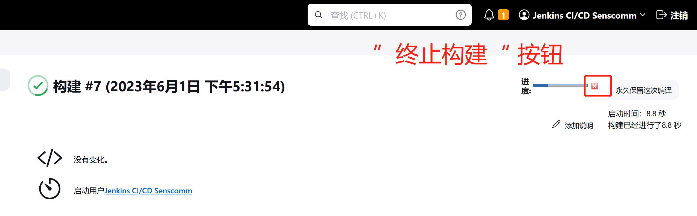

# 中止某个构建

当咱们点击用户界面中的那个 `[x]` 图标时，会发生以下事情：

- 浏览器向服务器发出一个请求；

- 服务器中断（通过 `Thread.interrupt()` ）负责执行构建的线程（又名执行器线程）；

- 服务器返回（中断结果的响应）。

此时，咱们的浏览器又回来了，但实际的中止过程是从这里异步发生的。

1. 线程得到中断信号。这种情况发生的速度取决于中断发生时执行器，the executor，正在做什么。具体来说，由于 Java 的设计，一个执行器线程只能在 “中断点” 被中断；

    - 等待某个子进程的完成（例如，也许构建正在运行 Ant）是一个中断点。这意味着如果执行器正在做这个，他就会被瞬间打断；

    - 等待某个代理的一次计算是一个中断点；

    - 等待文件或网络的 I/O 不是一个中断点。这往往会造成一个问题，即某个构建似乎是不可中止的。例如，签出 Subversion 库就属于这种情况；

    - 正常计算也不是一个中断点。

2. 线程执行器执行一次清理操作。这取决于他在注意到中断的时候正在做什么；

    - 如果他在等待某个子进程完成，Jenkins 将搜索所有的子进程并杀死他们。在 Unix 上，这是通过 `java.lang.UnixProcess.destroyProcess` 完成的，其在基于 Unix 的 JDK 实现上发送 `SIGTERM`。在 Windows 上，这将通过 `TerminateProcess` API 完成；

    - 如果他在等待某个代理，an agent, 中的计算完成，正在进行远程计算的线程就会被异步打断。该线程被打断的速度取决于该线程正在做什么。参见上文。

3. 线程执行器开始展开执行栈，unwinding the stack，并最终完成展开。此时，构建被标记为中止，执行器返回到空闲状态。

> 关于 Java 的栈展开，请参考：[栈展开(stack unwinding)](https://blog.csdn.net/hrbust_cxl/article/details/121122225)

可以通过向构建的 URL 端点发送 HTTP POST 请求来停止管道作业。

- `BUILD ID URL/stop` - 终止某个管道，a Pipeline；

- `BUILD ID URL/term` - 强行终止构建（只应在 `stop` 不起作用时使用）；

- `BUILD ID URL/kill` - 硬杀死管道。这是停止管道的最具破坏性的方法，只能作为最后的手段使用。

## 如果构建没有中止

请检查线程转储 `https://build.xfoss.com/threadDump`，寻找有问题的执行器线程 -- 他们是以代理和执行器编号命名的。这通常会告诉咱们线程的位置，并经常会揭示出他们为什么对中断没有反应。
