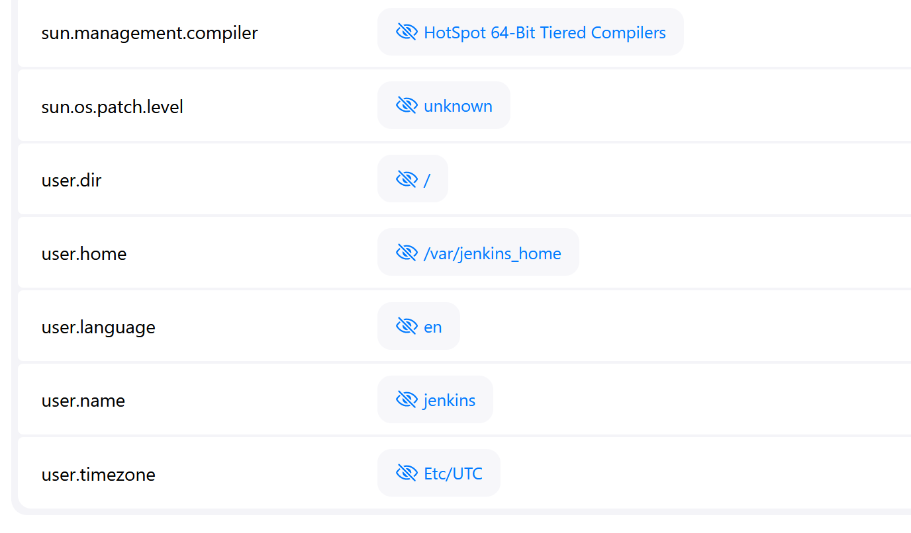
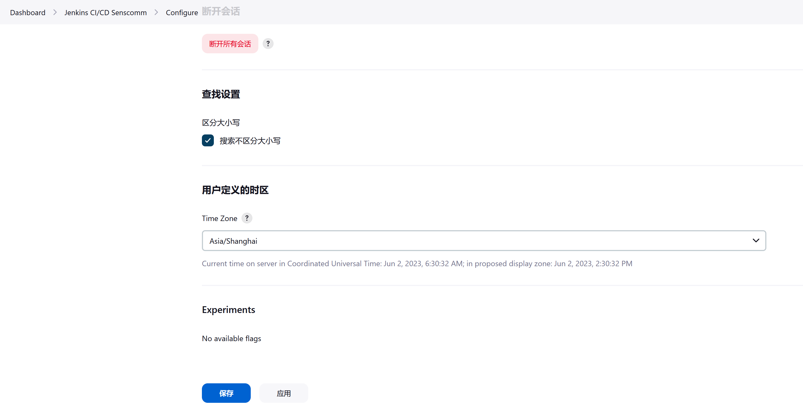

# 修改时区

如果咱们的 Jenkins 实例运行在与咱们不同的地方（例如：服务器在苏州，但你在台北），那么很可能会使用苏州时区。如果你需要比较构建日期，这可能会很烦人。

要查看当前设置的时区，请进入 `build.xfoss.com/systemInfo`，查看 `user.timezone` 系统属性。

咱们可能想改变显示的时区，以符合咱们自己的时区。通过进入用户配置页面，咱们可以设置 **用户定义的时区，User Defined Time Zone** 来匹配咱们自己的时区。

（End）

