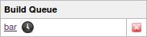

# 因执行器的饿死情况

**Executor Starvation**

如果咱们在构建队列中看到一个黑色的小时钟图标，如下图所示，这表明咱们的作业正不必要地呆在队列中。

时钟图标旁边的工作名称链接的提示框（鼠标移动到该链接上时会弹出）应该准确地告诉咱们为什么没有构建，但常见的症状如下：

1. **Jenkins 代理 agents 不在线**：咱们的构建需要在某个特定的代理上运行，但该代理是离线的。前往 `http://server/computer/AGENTNAME`，了解原因，并使其重新上线。或者更好的是，请使用标签，而不要把构建与特定的代理捆绑在一起，这样，单个离线代理就不会阻止咱们的构建被饿死；

2. **等待某个代理上的可用执行器，waiting for an available executor on an agent**：咱们的构建需要在某个特定的代理上运行，但该代理已经完全忙于构建其他东西，而咱们构建等待的时间相比于其用于执行的时间 “太长” -- 换句话说，当构建本身在 2 分钟内完成时，等待 5 分钟是没有意义的。请使用标签，使构建可以在任何满足系统要求的机器上运行，通过这种方式，咱们可以增加更多的代理来改进周转时间；

3. **等待位于某个标签上的可用执行器，waiting for an available executor on a label**：所有具有给定标签的代理都在忙于做其他事情。是时候添加更多代理了。

（End）

