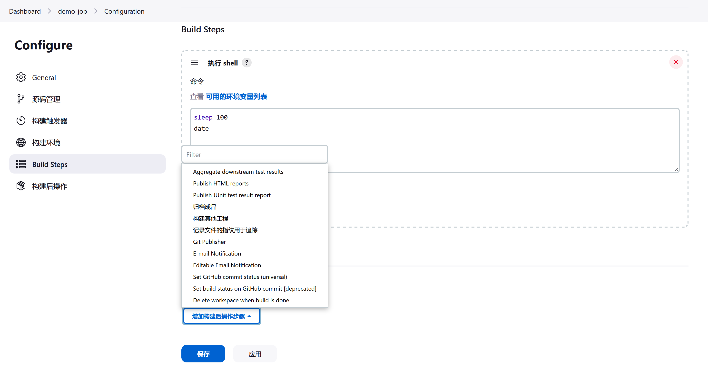
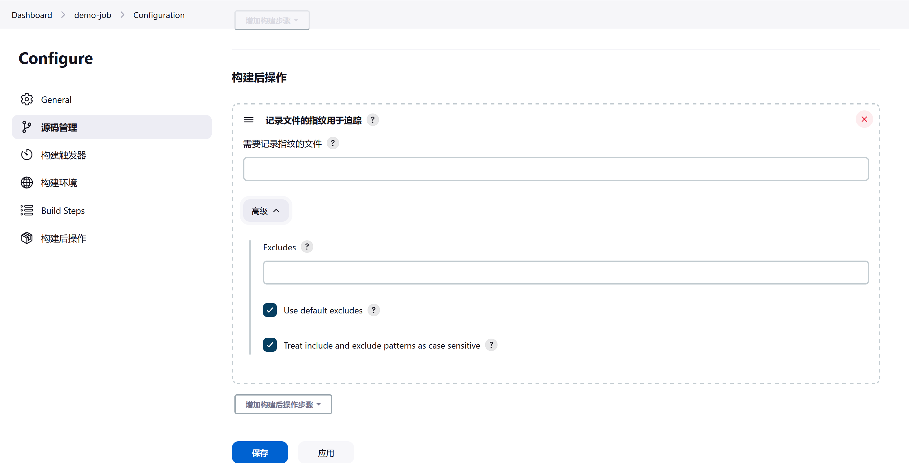
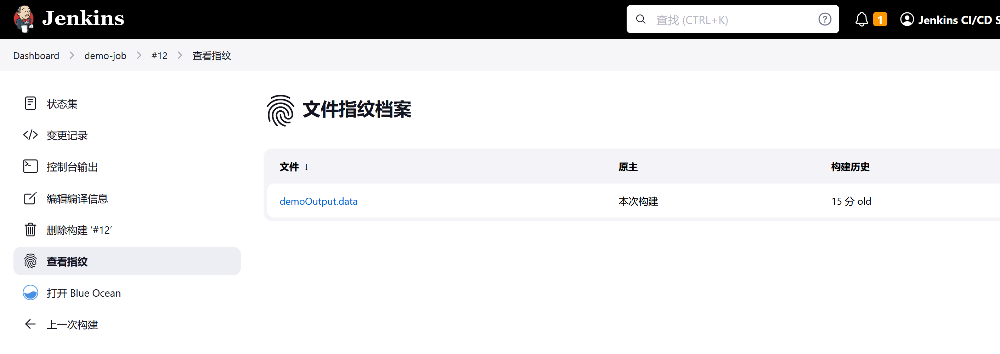

# 指纹

## 使用指纹跟踪整个 Jenkins 作业的文件使用情况

当咱们在 Jenkins 上有相互依赖的项目时，往往很难跟踪某个文件的哪个版本被哪个版本的对该文件的某个依赖所使用。Jenkins 支持 **文件指纹，file fingerprinting** 来记录依赖关系。

例如，假设咱们有一个 TOP 项目，他依赖于一个 MIDDLE 项目，而 MIDDLE 又依赖于一个 BOTTOM 项目。咱们正在进行 BOTTOM 项目的工作。TOP 团队报告说他们正在使用的 `bottom.jar` 导致了一个空指针异常（Null-Pointer Exception, NPE），而咱们（BOTTOM 团队的成员）认为咱们在 BOTTOM #32 中修复了这个问题。Jenkins 可以告诉咱们哪些 MIDDLE 构建和 TOP 构建正在使用（或不使用）咱们的 `bottom.jar` #32。


## 怎样设置文件指纹？

为了使其发挥作用，所有相关的项目，all the relevant projects，都需要被配置为 **记录 `.jar` 文件的指纹**（record fingerprints）（在上述案例中，即 `bottom.jar`）。

例如，如果咱们只想跟踪哪些 BOTTOM 的构建被哪些 TOP 的构建所使用，就要配置 TOP 和 BOTTOM 来记录 `bottom.jar` 的指纹。如果咱们还想知道哪些 MIDDLE 构建使用了哪些 `bottom.jar`，就也要配置 MIDDLE。

由于记录文件指纹是一种廉价的操作，所以最简单的事情就是盲录下以下所有的指纹：

- 咱们构建项目产生的 `.jar` 文件；

- 咱们构建项目所依赖的 `.jar` 文件。

相对于文件的大小或用到这些文件的构建数量，磁盘的使用更多的是受被指纹化文件的数量影响。因此，除非咱们有大量的磁盘空间，否则咱们不希望对 `**/*` 进行指纹识别。


## 配置作业以记录一个文件或一组文件的指纹

前往咱们的项目，点击左侧导航栏中的 **配置，Configure**，然后向下滚动到作业的 **构建后操作，Post-build Actions** 部分。

在那个按钮上点击，来添加一项 **构建后，Post-build** 操作。

选择 **记录文件的指纹用于追踪，Record fingerprints of files to track usage**。




构建后的行动配置字段为咱们提供了匹配咱们想要记录指纹文件的模式选项，以及几个复选框选择来完成咱们文件指纹识别。





Maven 作业类型会自动为其依赖项和工件执行此操作。


## 工作原理


文件的指纹只是一个 MD5 校验和。Jenkins 维护着一个 MD5 校验和的数据库，对于每个 MD5 校验和，Jenkins 记录了哪些项目的构建用到了他。这个数据库在每次构建运行和文件被打上指纹时都会更新。

为了避免过多的磁盘使用，Jenkins 并不存储实际的文件。相反，他只是存储 MD5 校验和和他们的使用情况。这些文件可以在

```bash
$JENKINS_HOME/fingerprints
```

中看到。插件可以在这些记录中存储其他信息。例如，[部署通知插件，Deployment Notification Plugin](https://plugins.jenkins.io/deployment-notification/) 会通过指纹记录经由 [chef](https://www.chef.io/)/[puppet](https://en.wikipedia.org/wiki/Puppet_(software)) 部署在服务器上的文件。


## 怎样使用指纹功能

以下是几个受益于这一特性的典型场景：

咱们开发了 BOTTOM 项目，咱们想知道谁在使用 BOTTOM #13，在哪些构建中使用。

1. 前往 BOTTOM #13 的构建页面；

2. 点击左侧导航栏中的 “查看指纹” 链接，就会看到 “文件指纹档案” 页面，点击所列出的某个文件；

3. 咱们会看到所有使用他的项目和构建。




咱们开发了 TOP 项目，咱们想知道咱们在 TOP #10 中使用的是 `bottom.jar` 和 `middle.jar` 的哪个构建。


1. 前往 TOP #10 的构建页面；

2. 点击左侧导航栏中的 “查看指纹”；

3. 咱们会看到 TOP #10 构建中打上了指纹的所有文件，以及他们的来源。


咱们有一个构建 `.jar` 的 TOP 项目。咱们还有一个 TOP-TEST 项目，其在 TOP 项目之后运行，对最新的 TOP 项目包（二进制）进行全面集成测试。咱们想知道 TOP #7 的测试结果。

1. 前往 TOP #7 的构建页面；

2. 点击构建工件，build artifacts，中 `top.jar` 的 “指纹，fingerprint” 图标；

3. 咱们会看到所有用到他的 TOP-TEST 构建；

4. 点击他，咱们就将被带到相应的 TOP-TEST 构建页面，这将显示测试报告；

5. 如果没有显示 TOP-TEST 构建，那就意味着 TOP-TEST 构建没有针对 TOP #7 运行。也许他跳过了 TOP #7（如果在很短的时间内有大量的 TOP 构建，这种情况可能发生），或者也许一个新的 TOP-TEST 构建正在进行。
