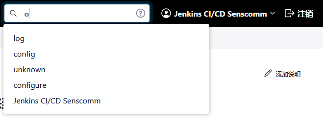
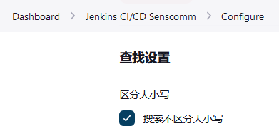
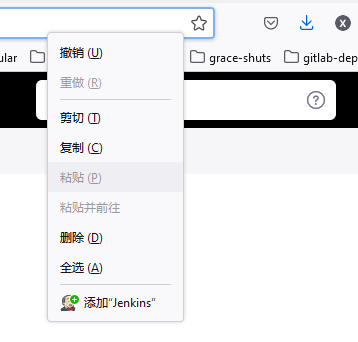

# 搜索框

Jenkins 中的每个页面右上方都有一个搜索框，让咱们快速到达目的地，而无需多次点击。

例如，如果咱们输入 "foo #53 console"，你会被带到作业 "foo" 的 #53 构建的控制台输出页面。如果咱们有视图 "XYZ"，那么只要输入 "XYZ" 就可以进入该视图。搜索框有自动补全功能来协助咱们。

搜索框还是上下文敏感的。如果咱们已经在作业 foo 的某个地方（也许咱们正在看另一个构建），那么咱们可以直接输入 "#53 console" 而不是 "foo #53 console"。如果咱们已经在 foo #53 的某个地方（也许咱们正在看测试报告），那么咱们可以直接输入 "console" 来进入同一个页面。

## 不区分大小写的搜索

如果咱们想让搜索框不区分大小写，请进入咱们的个人资料配置页面（ `/user/<your profile>/configure`）并激活不区分大小写的搜索选项。

请注意，不区分大小写的搜索对匿名（未登录）用户不适用。

## OpenSearch 的支持

这个搜索框功能还通过 [OpenSearch](http://en.wikipedia.org/wiki/OpenSearch) 暴露在浏览器中，所以咱们可以把这个搜索和自动补全功能安装到咱们的浏览器搜索框中。这将进一步减少咱们在 Jenkins 中访问特定页面的开销。

比如在 Firefox 中，咱们可以在地址输入框中点击鼠标右键，通过弹出的下拉菜单把 Jenkins 的搜索添加到咱们浏览器的搜索引擎。

## 希望得到反馈

在 Jenkins 如何将搜索词与实际页面联系起来方面，总是有改进的余地。我们希望得到你的反馈。
