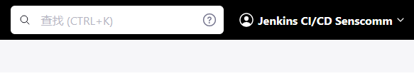
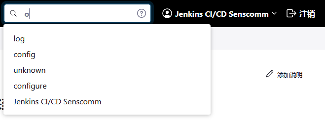
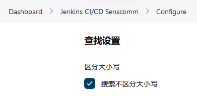

# 搜索框

Jenkins 中的每个页面右上方都有一个搜索框，让咱们快速到达目的地，而无需多次点击。

例如，如果咱们输入 "foo #53 console"，你会被带到作业 "foo" 的 #53 构建的控制台输出页面。如果咱们有视图 "XYZ"，那么只要输入 "XYZ" 就可以进入该视图。搜索框有自动补全功能来协助咱们。

搜索框还是上下文敏感的。如果咱们已经在作业 foo 的某个地方（也许咱们正在看另一个构建），那么咱们可以直接输入 "#53 console" 而不是 "foo #53 console"。如果咱们已经在 foo #53 的某个地方（也许咱们正在看测试报告），那么咱们可以直接输入 "console" 来进入同一个页面。

## 不区分大小写的搜索

如果咱们想让搜索框不区分大小写，请进入咱们的个人资料配置页面（ `/user/<your profile>/configure`）并激活不区分大小写的搜索选项。

