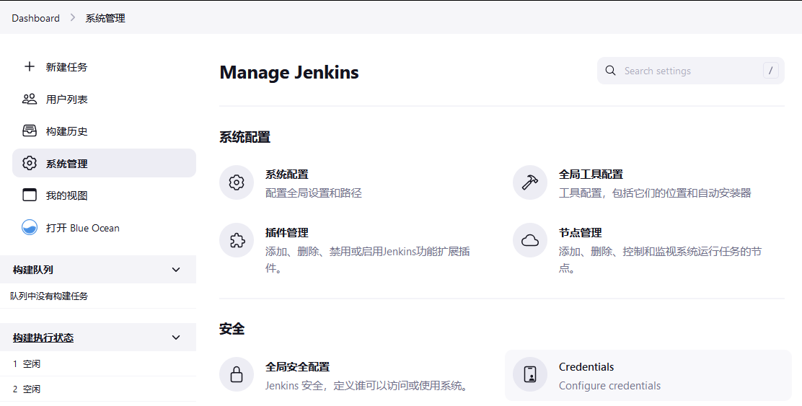
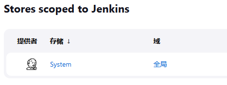
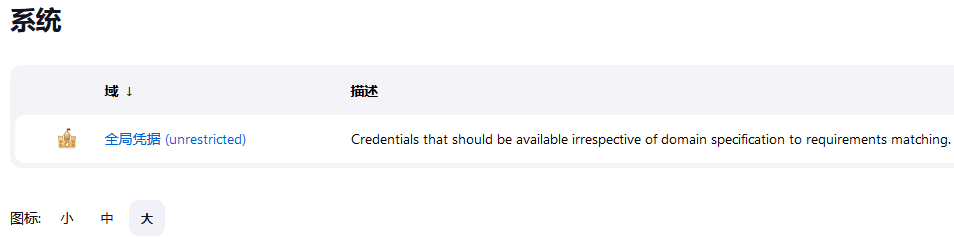
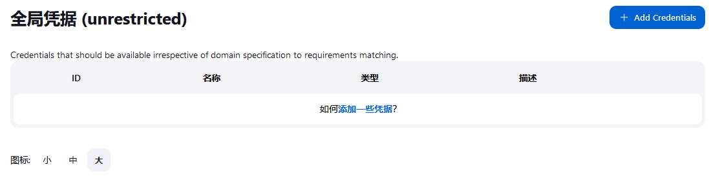
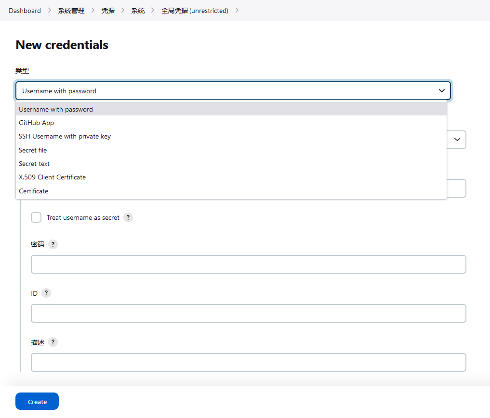

# 使用凭据

**Using Credentials**

有许多第三方网站和应用程序可以与 Jenkins 互动，例如，工件库（artiface repositories）、基于云的存储系统和服务等等。

此类应用程序的系统管理员可以在应用程序中配置凭据，以供 Jenkins 专门使用。这通常是为了 “锁定（lock down）” 应用程序中对 Jenkins 可用的功能区域，通常是通过对这些凭证应用访问控制实现的。一旦 Jenkins 管理员（即管理 Jenkins 站点的 Jenkins 用户）在 Jenkins 中添加/配置了这些凭证，这些凭证就可以被 Pipeline 项目用来与这些第三方应用程序交互。

**注意**：本页面和相关页面上描述的 Jenkins 凭据功能均是由 [凭证绑定插件](https://plugins.jenkins.io/credentials-binding) 提供的。

可以使用存储在 Jenkins 中的凭据的地方：

- 整个 Jenkins 中任何适用之处（即全局凭证）；

- 为某个特定的 Pipeline 项目/条目（在 [使用 `Jenkinsfile`](../pipeline/jenkinsfile.md) 的 [处理凭据](../pipeline/jenkinsfile.md#handling-credentials) 小节中阅读更多关于这一点）所使用；

- 由某名特定 Jenkins 用户（如 [在 Blue Ocean 中创建的管道项目](../blue_ocean/creating_pipelines.md)）所使用。

## 证书种类

Jenkins 可以存储以下类型的凭据：

- **密文，secret text** - 一个令牌，如 API 令牌（如 GitHub 的个人访问令牌）；

- **用户名与口令，username and password** - 可以作为独立的组件来处理，也可以作为一个冒号分隔的字符串来处理，其格式为 `username:password`（在[处理凭据](../pipeline/jenkinsfile.md#handling-credentials) 中阅读更多关于这个问题）;

- **秘密文件，secret file** - 这本质上是文件中的秘密内容；

- **带有私钥的 SSH 用户名，SSH Username with private key** - 一个 [SSH 公钥/私钥对](http://www.snailbook.com/protocols.html)；

- **证书，certificate** - 一个 [PKCS#12 证书文件](https://tools.ietf.org/html/rfc7292) 与可选的密码，或

- **X.509 客户端证书/Docker 主机证书认证，X.509 client certificate/Docker Host Certificate Authentication** 凭据。


## 凭据安全

为了最大限度地提高安全性，在 Jenkins 中配置的凭据以加密的形式存储在控制器 Jenkins 实例上（由 Jenkins 实例 ID 加密），并且只在 Pipeline 项目中通过其凭据 ID 处理。

这最大限度地减少了将具体凭据本身暴露给 Jenkins 用户的机会，并阻碍了将功能凭据从一个 Jenkins 实例复制到另一个的能力。


## 配置凭据

本节介绍在 Jenkins 中配置凭证的过程。

任何拥有 **Credentials > Create** 权限（通过 **基于 Matrix 的安全，Matrix-based security** 设置）的 Jenkins 用户都可以向 Jenkins 添加凭据。这些权限可以由具有管理员权限的 Jenkins 用户配置。请在 [“管理安全（Managing Security）”](../security/managing_security.md) 的 [“授权（Authorization）”](../security/managing_security.md#authorization) 部分阅读更多相关内容。

否则，如果咱们 Jenkins 实例的 **安全（Security）** 设置页面的 **授权（Authorization）** 设置被设置为默认的 **登录用户可以做任何事情（Logged-in users can do anything）** 设置或 **任何人可以做任何事情（Anyone can do anything）** 设置，那么任何 Jenkins 用户都可以添加和配置凭据。


### 添加新的全局凭据

要向咱们的 Jenkins 实例添加新的全局凭证：


1. 如果需要，请确保咱们已经登录到 Jenkins（作为一名具有 **Credentials > Create** 权限的用户）;

2. 从 Jenkins 主页（即 Jenkins 经典用户界面的仪表盘，Dashboard），点击 **管理 Jenkins > 管理凭据**；




3. 在右边的 **Store scoped to Jenkins** 下，点击 **Jenkins**；





4. 在 “系统” 下，点击 “全局凭据（unrestricted）” 链接，访问这个默认域；




5. 点击右侧的 “Add credentials”;

**注意**：如果这个默认域中没有凭证，咱们也可以点击 “添加一些凭据” 链接（这与点击 “Add credentials” 链接相同）。




6. 在 “种类（Kind）” 字段，选择要添加的 [凭据种类](#证书种类)；



7. 在 “范围（Scope）” 字段，选择以下二者之一：

    - **全局（Global）** - 若要添加的凭据是针对 Pipeline 项目/条目。选择此选项会将凭据的范围，应用到 Pipeline 项目/条目 “对象” 及其所有后代对象；

    - **系统（System）** - 如果要添加的凭证是用于 Jenkins 实例本身，用于系统管理功能，如电子邮件认证、代理 agent 连接等的交互。选择该选项会将凭证的范围只应用于单个对象。

8. 将凭据本身添加到咱们所选择凭据类型的相应字段中：

    - **密文，secret text** - 复制秘密文本并将其粘贴到 **Secret** 字段；

    - **用户名与口令，username and password** - 在各自的字段中指定凭据的 **用户名, Username** 和 **密码，Password**；

    - **秘密文件，secret file** - 点击 **File** 字段旁边的 **Browse** 按钮，选择要上传到 Jenkins 的秘密文件；

    - **带有私钥的 SSH 用户名** - 在相应字段中指定凭据的 **用户名，Username**、**私钥，Private Key** 和可选的 **密码锁，Passphrase**；

    **注意**：选择 **直接输入，Enter directly** 允许咱们复制私钥的文本并粘贴进入得到的 **密钥，Key** 文本框中。

    - **证书，certificate** - 指定 **证书，Certificate** 和可选的 **口令，Password**。选择 **上传 PKCS#12 证书, Upload PKCS#12 certificate** 允许咱们通过得到的 **Browse** 按钮将证书作为文件上传；

    - **X.509 客户端证书** - 将适当的详细信息复制并粘贴到 **客户端密钥，Client Key**、**客户端证书，Client Certificate** 和 **服务器 CA 证书，Server CA Certificate** 字段中。


9. 在 **ID** 字段中，请指定一个有意义的凭据 ID 值 - 例如，`jenkins-user-for-xyz-artifact-repository`。内置（默认）的凭据提供者可以使用大写或小写字母作为凭据 ID，以及任何有效的分隔符，其他凭据提供者则可能对允许的字符或长度有进一步限制。然而，为了咱们 Jenkins 实例上的所有用户的利益，最好是使用单一的、一致的惯例来指定凭据 ID；

**注意**：该字段是可选的。如果咱们没有指定他的值，Jenkins 会为凭据 ID 分配一个全局唯一 ID (GUID) 值。请记住，一旦设置了凭据 ID，其就无法再更改。

10. 为凭据指定一个可选的 **描述，Description**;

11. 点击 **Create** 按钮保存凭据。


## 在结合 `withCredentials` 与 `ssh-steps` 使用凭据时的一个问题


开始使用 `ssh_ed25519` 的凭据时，`sshCommand` 报出了 `invalid private key` 问题，后调查发现，Java 环境下，`JSch` 等 SSH 客户端，不支持常规的 SSH 密钥，应使用命令：


```bash
ssh-keygen -m PEM -t rsa -b 2048
```

创建出 `id_rsa_pem` 及 `id_rsa_pem.pub` 密钥对，并将私钥添加到 Jenkins 的凭据管理中，随后在 `ssh-steps` 中调用私钥。
