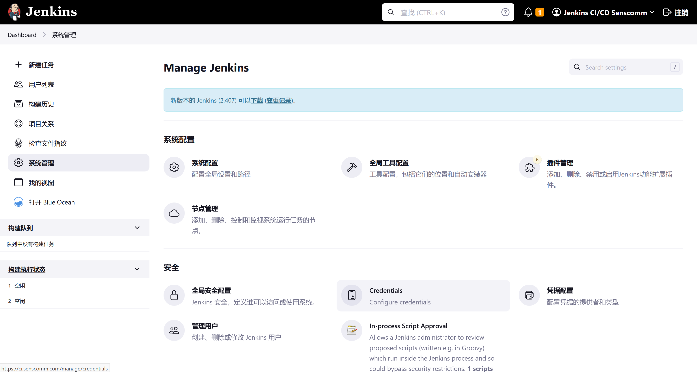
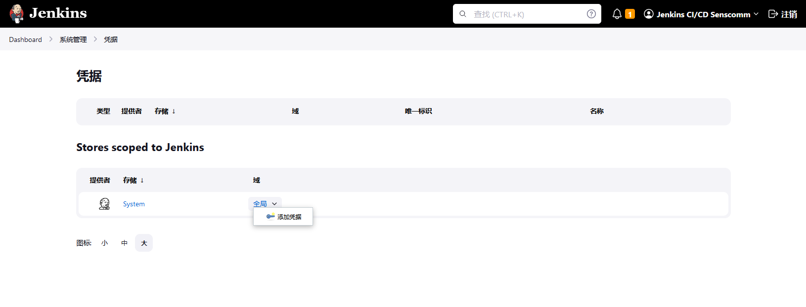
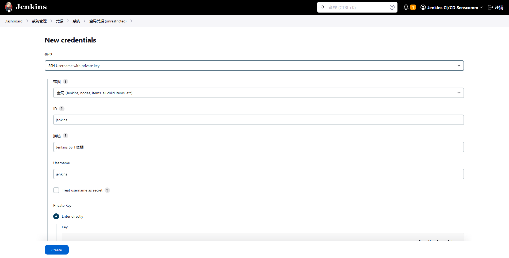
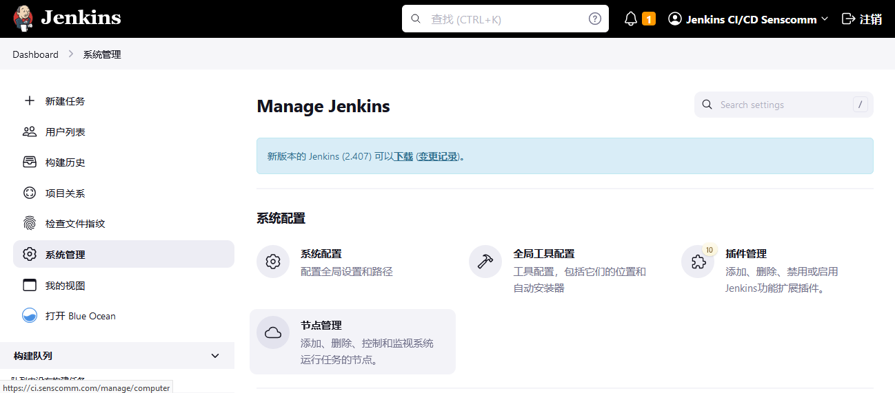
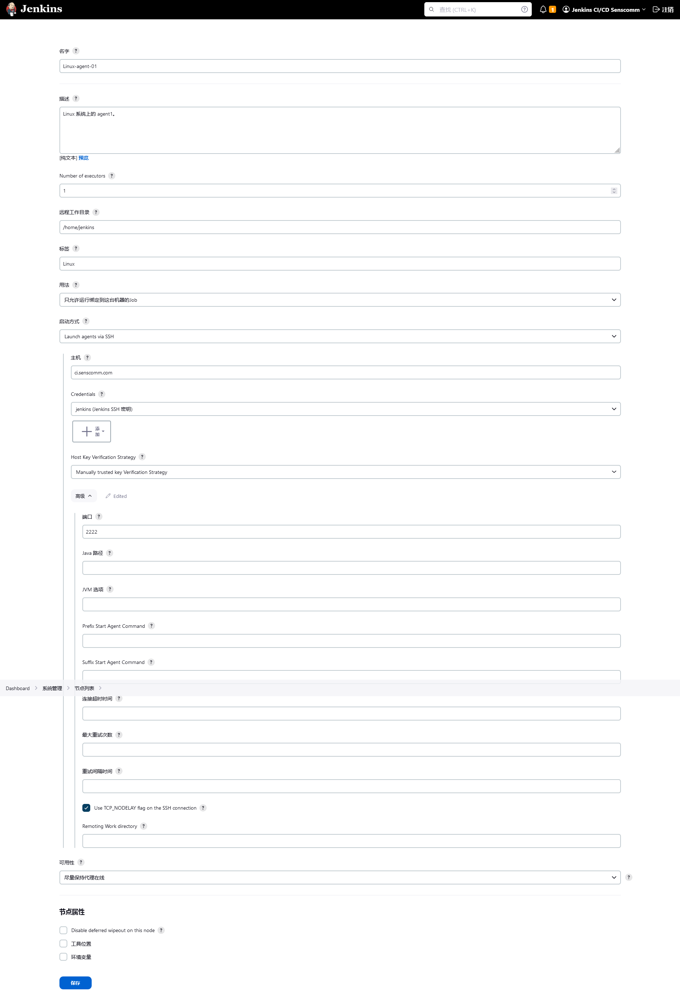
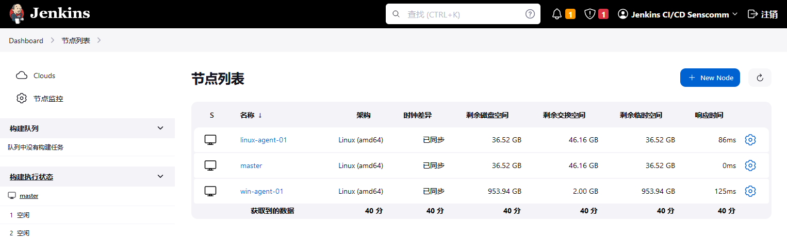
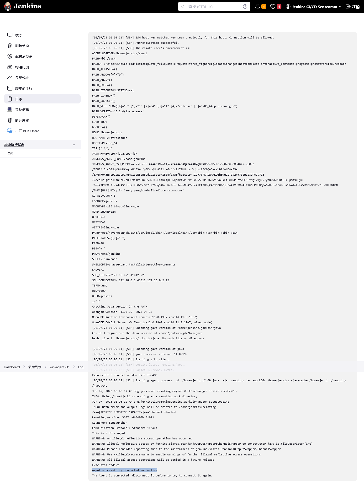
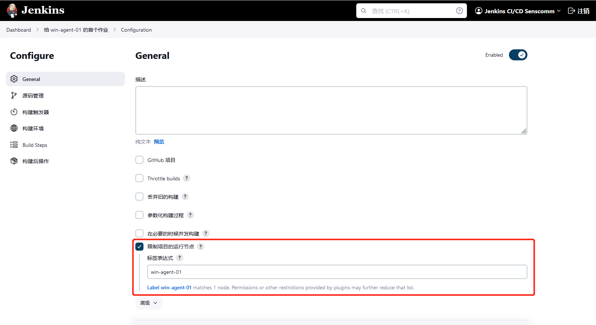
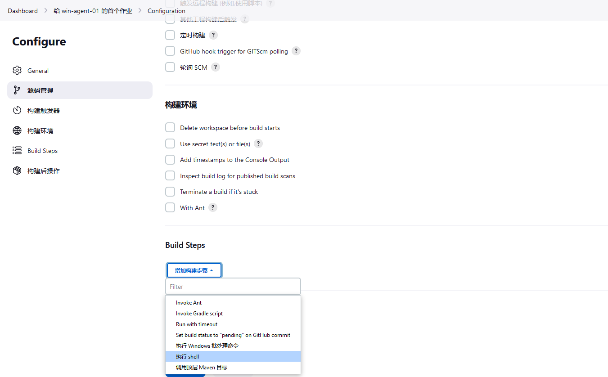
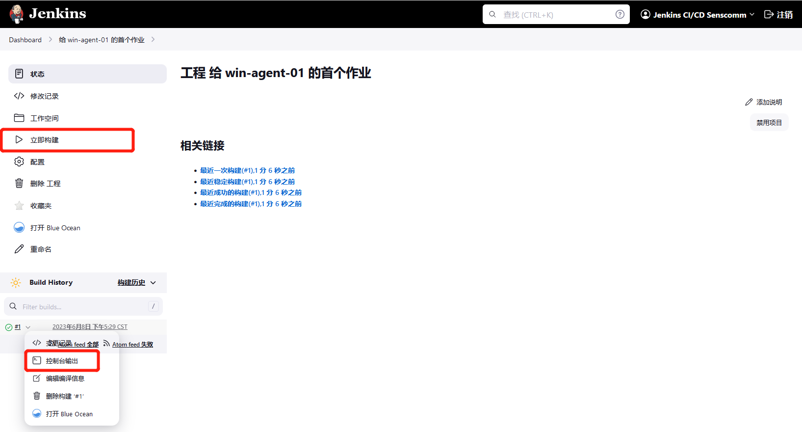

# 使用 Jenkins 代理

Jenkins 的架构是为分布式的构建环境设计的。他允许我们为每个构建项目使用不同的环境，在并行运行作业的多个代理之间平衡工作负荷。

Jenkins 控制器是 Jenkins 安装中的原始节点，the original node。Jenkins 控制器管理 Jenkins 代理并协调他们的工作，包括在代理上调度作业与监控代理。代理可以是使用本地或云计算机连接到 Jenkins 控制器。

代理需要 Java 安装并与 Jenkins 控制器建立网络连接。请观看下面 3 分钟的视频，了解 Jenkins 代理的简要说明。


*什么是 Jenkins 代理*

[](https://www.youtube.com/watch?v=4KghHJEz5no)


## 使用 Docker 配置代理

Jenkins 代理可以在物理机 physical machines、虚拟机 virtual machines、Kubernetes 集群和 Docker 镜像中启动。这个小节使用 SSH 将 Docker 的代理连接到 Jenkins（控制器）。


### 环境

要运行本指南，咱们需要一台具有以下功能的机器：

- Java 安装；

- Jenkins 的安装；

- Docker 的安装；

- SSH 密钥对。

> 如果您在安装 Java、Jenkins 和 Docker 方面需要帮助，请访问 [安装 Jenkins](../installation/docker.md) 小节。


### 生成 SSH 密钥对

要生成 SSH 密钥对，咱们必须在咱们能访问的机器上执行一个名为 `ssh-keygen` 的命令行工具。机器可以是：

- 咱们 Jenkins 控制器所运行的机器；

- 宿主机（在使用容器时）；

- 某台咱们运行着代理的机器；

- 甚至咱们的开发机器。


> SSH 密钥对的生成可以在任何操作系统上完成：
>
> - 在 Windows 上，您可以使用任何的 OpenSSH 安装，例如 [Windows OpenSSH](https://docs.microsoft.com/en-us/windows-server/administration/openssh/openssh_install_firstuse)、`ssh-keygen` 在 [用于 Windows 的 git](https://gitforwindows.org/)， 或 [Cygwin](https://cygwin.com/) 中均有包含；
> - 在 Unix（Linux、macOS、BSD 等）上，咱们也可以使用任何与咱们系统打包的 OpenSSH 安装。

> 请注意，咱们必须要能够在事后将密钥值复制到咱们的控制器和代理，所以请检查咱们是否能够事先将文件内容复制到剪贴板中。

1. 请在某个终端窗口中运行命令：`ssh-keygen -f ~/.ssh/jenkins_agent_key`；

2. 提供一个与密钥一起使用的口令（可以是空的）；

3. 确认输出看起来像这样：


```bash
$ ssh-keygen -f ~/.ssh/jenkins_agent_key
Generating public/private rsa key pair.
Enter passphrase (empty for no passphrase):
Enter same passphrase again:
Your identification has been saved in /home/lenny.peng/.ssh/jenkins_agent_key
Your public key has been saved in /home/lenny.peng/.ssh/jenkins_agent_key.pub
The key fingerprint is:
SHA256:1tae8bKe1mcQ38cKPcGj900LgTRyQ9CnDW1oJ8YkDgY lenny.peng@sw-build-01.xfoss.com
The key's randomart image is:
+---[RSA 3072]----+
|     E.o o*oo    |
|      . o..& =   |
|         .* %.   |
|         . + o=  |
|        S o oo.*.|
|       . . .o== *|
|            ++o*+|
|            .+o.=|
|           o+  o |
+----[SHA256]-----+
```


#### 创建一个 Jenkins SSH 凭证

1. 前往咱们的 Jenkins 配置面板；

2. 前往主菜单中的 “系统管理” 选项，并点击 “Credentials” 按钮；



3. 选择全局项目中的下拉选项 "添加凭据"；




4. 在表单中填入：

- 类型 Kind：带有私钥的 SSH 用户名 SSH Username with private key；

- id: Jenkins；

- 描述 description：Jenkins SSH 密钥；

- 用户名：`jenkins`；

- 私钥 private key：选择 `Enter directly` 并按下 “Add” 按钮，插入位于 `~/.ssh/jenkins_agent_key` 处私钥文件的内容；

- 口令：填写用于生成 SSH 密钥对的口令（如果咱们在上一步没有使用口令，则留空），然后按 `Create` 按钮。





### 创建咱们的 Docker 代理


#### 在 Linux 系统上


这里我们将使用 [docker-ssh-agent 镜像](https://github.com/jenkinsci/docker-ssh-agent) 来创建代理容器。

1. 请运行下面的命令启动咱们的首个代理：

```bash
docker run -d --rm --name=agent1 -p 2222:22 \
-e "JENKINS_AGENT_SSH_PUBKEY=[your-public-key]" \
jenkins/ssh-agent:alpine
```

> - 请记住将标记 `[your-public-key]` 替换为咱们自己的 SSH **公钥**；
> - 本例中咱们的公钥值可以通过在咱们创建公钥的机器上执行：`cat ~/.ssh/jenkins_agent_key.pub` 找到。请不要在密钥值周围添加方括号`[]`；
##### SSH 端口转发
> - 如果咱们的机器已经有一个运行在 `22` 端口的 `ssh` 服务器（如果咱们通过 `ssh` 命令登录到这台机器上，就是这种情况），那么咱们应该为 `docker` 命令使用另一个端口，例如 `-p 4444:22`。

2. 现在容器 `agent1` 便在运行了。

提示：可以使用 `docker ps` 命令来检查容器是否按预期运行。


#### 在 Windows 上

这里我们将使用 [docker-ssh-agent 镜像](https://github.com/jenkinsci/docker-ssh-agent) 来创建代理容器。

1. 运行以下命令来启动咱们的首个代理：

```powershell
docker run -d --rm --name=agent1 --network jenkins -p 2222:22 `
  -e "JENKINS_AGENT_SSH_PUBKEY=[your-public-key]" `
  jenkins/ssh-agent:jdk11
```

**注意**：在运行这个命令前，仍需运行 `docker network create jenkins` 创建出 `jenkins` 网络。否则会报出错误：

```powershell
96a3fca1ba4f65b6a9bc7b7b6ed42bfce82ae69bea7f57eca9a00698fc224fa3
docker: Error response from daemon: network jenkins not found.
```

> - 记得把标记 `[your-public-key]` 替换成咱们自己的 SSH 公钥；
> - 这个示例中咱们的公钥为：`Get-Content $Env:USERPROFILE\.ssh\jenkins_agent_key.pub`。

2. 现在容器 `agent1` 就在运行了。

提示：可以使用命令 `docker ps` 来检查容器是否按照预期运行。此外，命令 `docker container inspect agent1 | Select-String -Pattern '"IPAddress"： "\d+\.\d+\.\d+\.\d+"'` 可以用来查看要在 Jenkins 中为该代理设置的 **主机，Host**。


### 在 Jenkins 上设置 `agent1`

1. 前往咱们的 Jenkins 仪表盘；

2. 前往左侧主菜单中的 “系统管理” 选项；

3. 前往 “节点管理” 项；



4. 前往 “节点管理” 页面中的 “New Node” 选项；

5. 填入节点/代理名字并选择类型；（比如，名字：`agent1`，类型：`固定节点Permanent Agent`）

6. 现在填入以下字段：

    - 远端根目录 remote root directory；（比如：`/home/jenkins`）

    - 标签 label；（比如：`linux-agent-01`）

    - 用法 usage；（比如：只构建带有标签表达式的作业......）

    + 启动方式；（比如：通过 SSH 启动代理）
        - 主机；（比如：`localhost` 或咱们的 IP 地址）
        - 凭据；（比如：`jenkins`）
        - 主机关键验证策略；（比如：“手动地受信任密钥验证 Manually trusted key verification”......）




> **注意**：除了 “Dashboard” -> “系统管理” -> “全局安全设置” - > "Git Host Key Verification Configuration" 下，有 "Host Key Verification Strategy" 设置外，每个 Jenkins 代理下，也有此设置。如遇到连接不上代理节点，就需要将这个主机密钥验证策略，设置为 “Manually trusted key Verification Strategy”。

7. 按 “保存”按钮，`linux-agent-01` 将被注册，但暂时处于离线状态。点击他;



8. 咱们现在应该看到 `This node is being launched.`。如果不是这样，咱们现在可以按下 `Launch agent` 按钮，并等待几秒钟。咱们现在可以点击左边的 `日志` 按钮，然后咱们应收到消息：`Agent successfully connected and online`。



如果咱们的 Jenkins 控制器没有通过 `ssh` 启动代理，请检查咱们在代理上 [配置的](#ssh-端口转发) 端口。复制他，然后点击 `高级` 按钮。然后咱们就可以把端口号粘贴到 `端口` 文本字段中。


### 将首个作业委托给 `agent1`

1. 前往 Jenkins 仪表板 dashboard；

2. 选择侧边菜单上的 “新建任务 New Item”;

3. 输入一个名字；（比如：“给 win-agent-01 的首个作业”）

4. 选择 `构建一个自由风格的软件项目 Freestyle project` 并点击 “确定 OK”；

5. 勾选 “限制项目的运行节点 Restrict where this project can be run”；

6. 在那个字段填入：带有 `win-agent-01` 的标签；（比如：`win-agent-01`）



> 要当心标签前后的空格。

7. 现在选择 “Build Steps” 处的 `执行 shell` 选项；



8. 在 `执行 shell` 步骤的 `命令` 字段中添加命令：`echo $NODE_NAME`，当此作业运行时，代理的名称将被打印在日志中；

9. 按下 “保存” 按钮，并随后选择 `立即构建 Build Now` 选项；

10. 等待数秒然后前往 `控制台输出 Console Output` 页面；



11. 咱们应收到类似于下面的输出：

```console
Started by user Jenkins CI/CD Senscomm
Running as SYSTEM
Building remotely on win-agent-01 (ms-win) in workspace /home/jenkins/workspace/给 win-agent-01 的首个作业
[给 win-agent-01 的首个作业] $ /bin/sh -xe /tmp/jenkins14625171737496999372.sh
+ echo win-agent-01
win-agent-01
Finished: SUCCESS
```

## 重启某个 Jenkins 代理


下面这个视频提供了如何使用各种方法重启 Jenkins 代理的说明。


[](https://www.youtube.com/watch?v=MTLgbp0GH8w)
