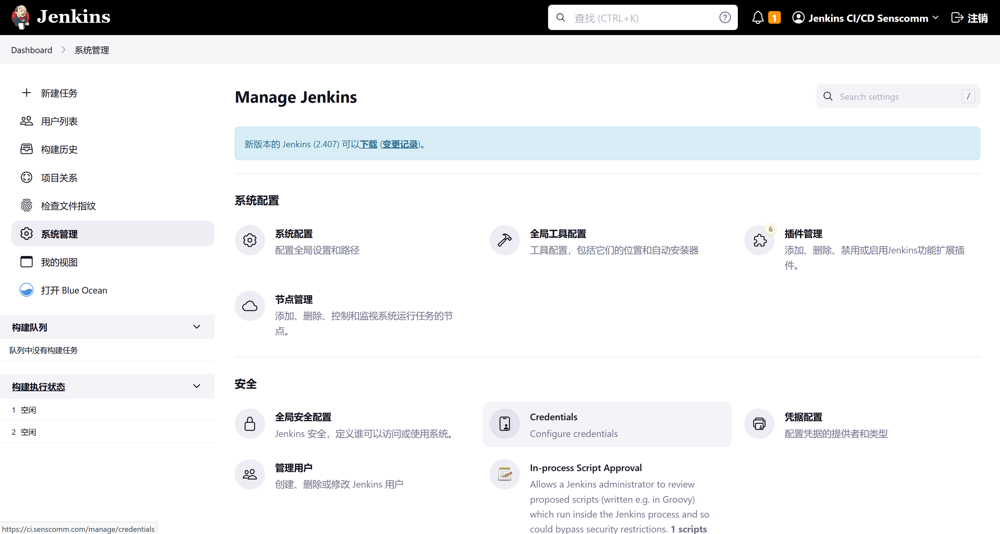
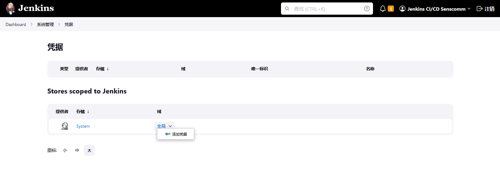
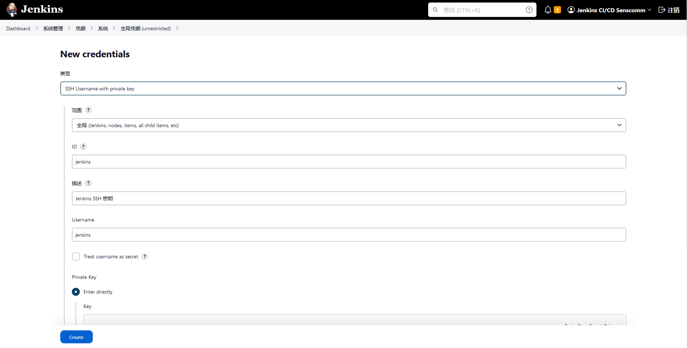
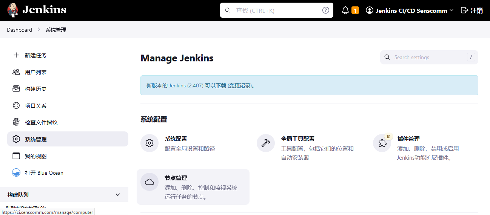
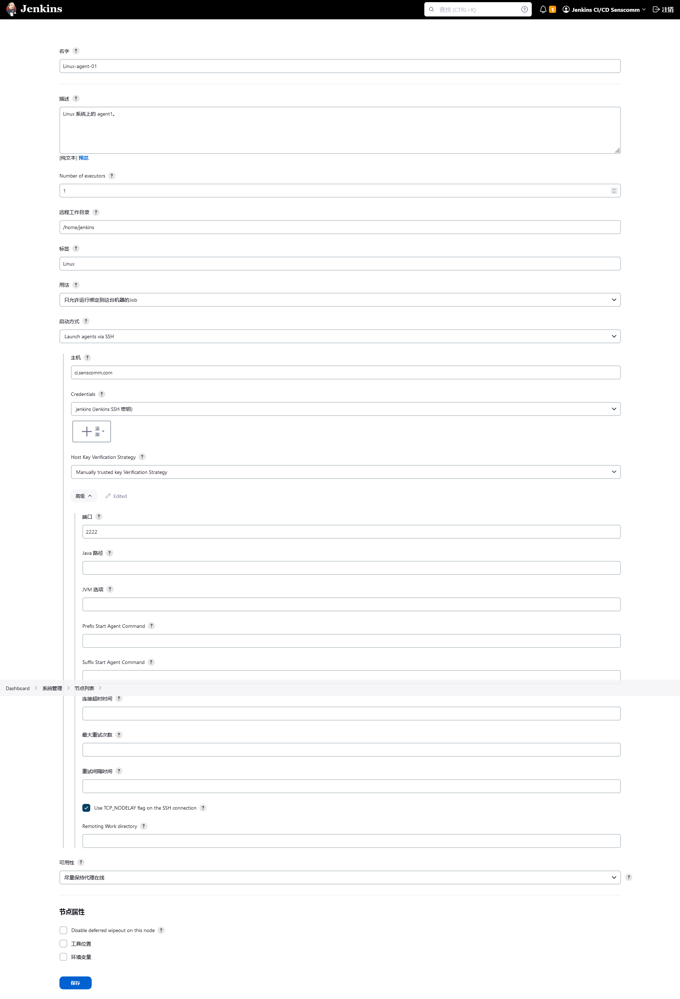
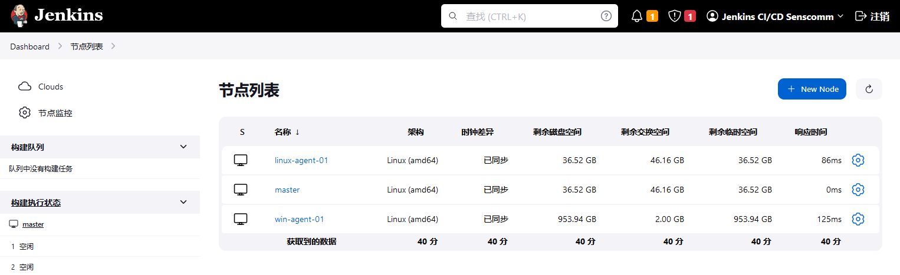
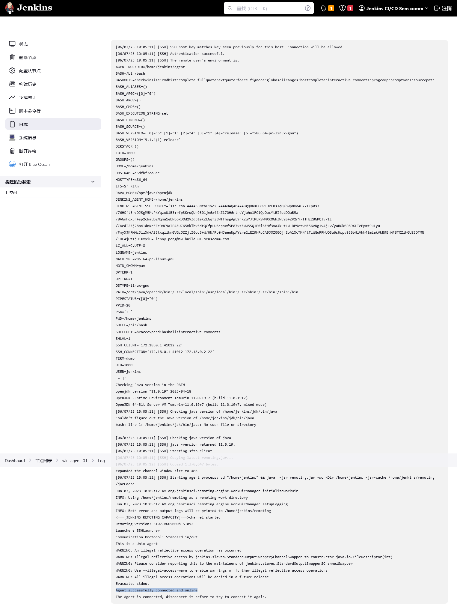
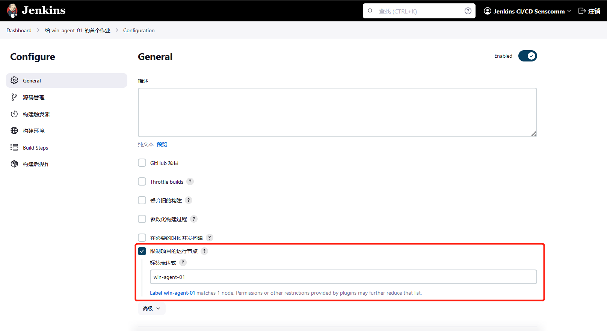
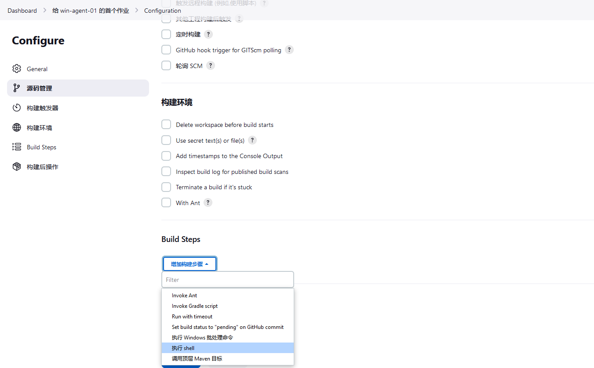
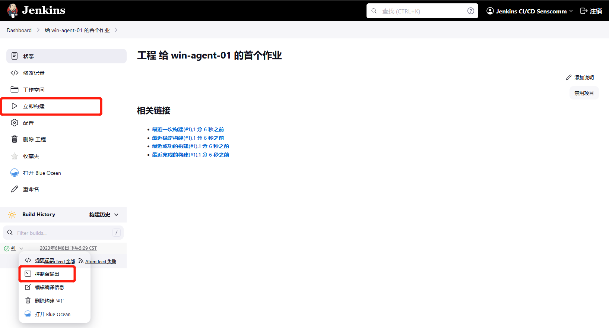

# 使用 Jenkins 代理

Jenkins 的架构是为分布式的构建环境设计的。他允许我们为每个构建项目使用不同的环境，在并行运行作业的多个代理之间平衡工作负荷。

Jenkins 控制器是 Jenkins 安装中的原始节点，the original node。Jenkins 控制器管理 Jenkins 代理并协调他们的工作，包括在代理上调度作业与监控代理。代理可以是使用本地或云计算机连接到 Jenkins 控制器。

代理需要 Java 安装并与 Jenkins 控制器建立网络连接。请观看下面 3 分钟的视频，了解 Jenkins 代理的简要说明。

（这里仅提供该视频的字幕中文翻译。）

*什么是 Jenkins 代理*


```txt
在今天的视频中，我们将

讨论什么是 Jenkins 代理

[音乐]

如果你是新来的，欢迎你，

如果你是新来的，你不知道我是谁，


我的名字是 Darin Pope，我是

cloudbees 的开发者倡导者，您可能

对整个 Jenkins 世界都不熟悉，

并且您已经听过一些短语，

也许是 Jenkins 控制器

和 Jenkins 代理，

现在 Jenkins 代理的目的是什么，

通常代理要么是一台机器，

要么是一台机器 虚拟

机，甚至可能是裸机，或者

你最喜欢的树莓派，

或者它甚至可能只是一个

连接到 Jenkins 控制器

并按照控制器的指示执行任务的容器，


Jenkins 控制器的目的是

管理连接，甚至

可能是 这些代理的工具


有时

正如我们之前所说，代理可以是

裸机或虚拟化的，它甚至可以

是云，

比如 ec2

，甚至可以是 azure

这些类型的实例可以

动态配置并连接到

Jenkins 控制器，基本上

任何类型的机器都可以 运行 java

可以是

Jenkins 控制器的代理 你可能会问

自己为什么我需要一个代理

我有我的 jeekins 控制器我可以

直接在控制器上运行作业

从安全

角度和潜在的

性能角度来看都是一种很好的做法


最好使用代理来完成您的所有

工作，而不是

直接在您的控制器上进行任何类型的构建，因此无论

您实际上是使用 Jenkins

为您的部门

还是为您的整个公司构建应用程序，

总是在以下情况下使用代理 构建你的

工作

如果你有任何问题或意见，

你可以在 cloudbeesdevs 的 twitter 上与我们联系 点击


订阅

按钮，然后按铃，

您会

在 cloudbeast 电视上有新内容时随时收到通知，

感谢收看，我们将

在下一个视频中见到您

```


## 使用 Docker 配置代理

Jenkins 代理可以在物理机 physical machines、虚拟机 virtual machines、Kubernetes 集群和 Docker 镜像中启动。这个小节使用 SSH 将 Docker 的代理连接到 Jenkins（控制器）。


### 环境

要运行本指南，咱们需要一台具有以下功能的机器：

- Java 安装；

- Jenkins 的安装；

- Docker 的安装；

- SSH 密钥对。

> 如果您在安装 Java、Jenkins 和 Docker 方面需要帮助，请访问 [安装 Jenkins](../installation/docker.md) 小节。


### 生成 SSH 密钥对

要生成 SSH 密钥对，咱们必须在咱们能访问的机器上执行一个名为 `ssh-keygen` 的命令行工具。机器可以是：

- 咱们 Jenkins 控制器所运行的机器；

- 宿主机（在使用容器时）；

- 某台咱们运行着代理的机器；

- 甚至咱们的开发机器。


> SSH 密钥对的生成可以在任何操作系统上完成：
>
> - 在 Windows 上，您可以使用任何的 OpenSSH 安装，例如 [Windows OpenSSH](https://docs.microsoft.com/en-us/windows-server/administration/openssh/openssh_install_firstuse)、`ssh-keygen` 在 [用于 Windows 的 git](https://gitforwindows.org/)， 或 [Cygwin](https://cygwin.com/) 中均有包含；
> - 在 Unix（Linux、macOS、BSD 等）上，咱们也可以使用任何与咱们系统打包的 OpenSSH 安装。

> 请注意，咱们必须要能够在事后将密钥值复制到咱们的控制器和代理，所以请检查咱们是否能够事先将文件内容复制到剪贴板中。

1. 请在某个终端窗口中运行命令：`ssh-keygen -f ~/.ssh/jenkins_agent_key`；

2. 提供一个与密钥一起使用的口令（可以是空的）；

3. 确认输出看起来像这样：


```bash
$ ssh-keygen -f ~/.ssh/jenkins_agent_key
Generating public/private rsa key pair.
Enter passphrase (empty for no passphrase):
Enter same passphrase again:
Your identification has been saved in /home/lenny.peng/.ssh/jenkins_agent_key
Your public key has been saved in /home/lenny.peng/.ssh/jenkins_agent_key.pub
The key fingerprint is:
SHA256:1tae8bKe1mcQ38cKPcGj900LgTRyQ9CnDW1oJ8YkDgY lenny.peng@sw-build-01.senscomm.com
The key's randomart image is:
+---[RSA 3072]----+
|     E.o o*oo    |
|      . o..& =   |
|         .* %.   |
|         . + o=  |
|        S o oo.*.|
|       . . .o== *|
|            ++o*+|
|            .+o.=|
|           o+  o |
+----[SHA256]-----+
```


#### 创建一个 Jenkins SSH 凭证

1. 前往咱们的 Jenkins 配置面板；

2. 前往主菜单中的 “系统管理” 选项，并点击 “Credentials” 按钮；



3. 选择全局项目中的下拉选项 "添加凭据"；




4. 在表单中填入：

- 类型 Kind：带有私钥的 SSH 用户名 SSH Username with private key；

- id: Jenkins；

- 描述 description：Jenkins SSH 密钥；

- 用户名：`jenkins`；

- 私钥 private key：选择 `Enter directly` 并按下 “Add” 按钮，插入位于 `~/.ssh/jenkins_agent_key` 处私钥文件的内容；

- 口令：填写用于生成 SSH 密钥对的口令（如果咱们在上一步没有使用口令，则留空），然后按 `Create` 按钮。





### 创建咱们的 Docker 代理


#### 在 Linux 系统上


这里我们将使用 [docker-ssh-agent 镜像](https://github.com/jenkinsci/docker-ssh-agent) 来创建代理容器。

1. 请运行下面的命令启动咱们的首个代理：

```bash
docker run -d --rm --name=agent1 -p 2222:22 \
-e "JENKINS_AGENT_SSH_PUBKEY=[your-public-key]" \
jenkins/ssh-agent:alpine
```

> - 请记住将标记 `[your-public-key]` 替换为咱们自己的 SSH **公钥**；
> - 本例中咱们的公钥值可以通过在咱们创建公钥的机器上执行：`cat ~/.ssh/jenkins_agent_key.pub` 找到。请不要在密钥值周围添加方括号`[]`；
##### SSH 端口转发
> - 如果咱们的机器已经有一个运行在 `22` 端口的 `ssh` 服务器（如果咱们通过 `ssh` 命令登录到这台机器上，就是这种情况），那么咱们应该为 `docker` 命令使用另一个端口，例如 `-p 4444:22`。

2. 现在容器 `agent1` 便在运行了。

提示：可以使用 `docker ps` 命令来检查容器是否按预期运行。


#### 在 Windows 上

这里我们将使用 [docker-ssh-agent 镜像](https://github.com/jenkinsci/docker-ssh-agent) 来创建代理容器。

1. 运行以下命令来启动咱们的首个代理：

```powershell
docker run -d --rm --name=agent1 --network jenkins -p 2222:22 `
  -e "JENKINS_AGENT_SSH_PUBKEY=[your-public-key]" `
  jenkins/ssh-agent:jdk11
```

**注意**：在运行这个命令前，仍需运行 `docker network create jenkins` 创建出 `jenkins` 网络。否则会报出错误：

```powershell
96a3fca1ba4f65b6a9bc7b7b6ed42bfce82ae69bea7f57eca9a00698fc224fa3
docker: Error response from daemon: network jenkins not found.
```

> - 记得把标记 `[your-public-key]` 替换成咱们自己的 SSH 公钥；
> - 这个示例中咱们的公钥为：`Get-Content $Env:USERPROFILE\.ssh\jenkins_agent_key.pub`。

2. 现在容器 `agent1` 就在运行了。

提示：可以使用命令 `docker ps` 来检查容器是否按照预期运行。此外，命令 `docker container inspect agent1 | Select-String -Pattern '"IPAddress"： "\d+\.\d+\.\d+\.\d+"'` 可以用来查看要在 Jenkins 中为该代理设置的 **主机，Host**。


### 在 Jenkins 上设置 `agent1`

1. 前往咱们的 Jenkins 仪表盘；

2. 前往左侧主菜单中的 “系统管理” 选项；

3. 前往 “节点管理” 项；



4. 前往 “节点管理” 页面中的 “New Node” 选项；

5. 填入节点/代理名字并选择类型；（比如，名字：`agent1`，类型：`固定节点Permanent Agent`）

6. 现在填入以下字段：

    - 远端根目录 remote root directory；（比如：`/home/jenkins`）

    - 标签 label；（比如：`linux-agent-01`）

    - 用法 usage；（比如：只构建带有标签表达式的作业......）

    + 启动方式；（比如：通过 SSH 启动代理）
        - 主机；（比如：`localhost` 或咱们的 IP 地址）
        - 凭据；（比如：`jenkins`）
        - 主机关键验证策略；（比如：“手动地受信任密钥验证 Manually trusted key verification”......）



7. 按 “保存”按钮，`linux-agent-01` 将被注册，但暂时处于离线状态。点击他;



8. 咱们现在应该看到 `This node is being launched.`。如果不是这样，咱们现在可以按下 `Launch agent` 按钮，并等待几秒钟。咱们现在可以点击左边的 `日志` 按钮，然后咱们应收到消息：`Agent successfully connected and online`。



如果咱们的 Jenkins 控制器没有通过 `ssh` 启动代理，请检查咱们在代理上 [配置的](#ssh-端口转发) 端口。复制他，然后点击 `高级` 按钮。然后咱们就可以把端口号粘贴到 `端口` 文本字段中。


### 将首个作业委托给 `agent1`

1. 前往 Jenkins 仪表板 dashboard；

2. 选择侧边菜单上的 “新建任务 New Item”;

3. 输入一个名字；（比如：“给 win-agent-01 的首个作业”）

4. 选择 `构建一个自由风格的软件项目 Freestyle project` 并点击 “确定 OK”；

5. 勾选 “限制项目的运行节点 Restrict where this project can be run”；

6. 在那个字段填入：带有 `win-agent-01` 的标签；（比如：`win-agent-01`）



> 要当心标签前后的空格。

7. 现在选择 “Build Steps” 处的 `执行 shell` 选项；



8. 在 `执行 shell` 步骤的 `命令` 字段中添加命令：`echo $NODE_NAME`，当此作业运行时，代理的名称将被打印在日志中；

9. 按下 “保存” 按钮，并随后选择 `立即构建 Build Now` 选项；

10. 等待数秒然后前往 `控制台输出 Console Output` 页面；



11. 咱们应收到类似于下面的输出：

```console
Started by user Jenkins CI/CD Senscomm
Running as SYSTEM
Building remotely on win-agent-01 (ms-win) in workspace /home/jenkins/workspace/给 win-agent-01 的首个作业
[给 win-agent-01 的首个作业] $ /bin/sh -xe /tmp/jenkins14625171737496999372.sh
+ echo win-agent-01
win-agent-01
Finished: SUCCESS
```

## 重启某个 Jenkins 代理


下面这个视频提供了如何使用各种方法重启 Jenkins 代理的说明。

（这里仅提供该视频的字幕中文翻译。）

```console
如何重新启动 Jenkins 代理

[音乐]

当你失去 Jenkins 控制器和代理之间的连接时会发生什么


基本上你

要做的是通过一个过程将

控制器重新连接到代理

在这个视频中

我们是 看看

可以重新建立连接的几种不同方法这是


今天的起点我有一个 jenkins

lts 控制器版本 2.303.3

并连接到这个控制器我有一个

基于 linux 的代理

在这个视频的描述中是

一个 链接到包含

我们在本视频中看到的所有命令和文档的 gist


一种我们可以将代理重新连接

到控制器的方法非常简单我们只

需要手动重新连接它

所以在我们的例子中让我们转到代理一和

让我们断开代理所以如果我们说

断开计算机代理是

绝对我们可以看到我们

被管理员断开连接如果我们

看一下节点我们可以看到

现在它显示一个红色的 x 而且

它也显示了 这里的构建

执行器处于离线状态，

所以为了简单地将其恢复在线，

我们只说启动代理

，片刻之后代理将

重新连接并准备好再次工作，

因此在第一个示例中，我们手动

断开代理，然后

重新连接代理

但是如果代理

已经重新启动或者其他一些进程已经很好地

断开了代理的连接会发生什么

如果我们过去看看

我们的代理

如果我们看一下

我们这里的进程

whoops


是一个进程 在我的例子中，一个 bash 进程

正在启动代理

进程，让我们继续并杀死

4123，

因此 kill -9 4123。

您还会注意到还有一个

4132，所以

当我们杀死 4123 时，这两个进程应该消失。

所以有 4123 让我们再次进行进程

检查

，我们可以看到，


如果我们回到我们的控制器

并首先查看节点，那么现在这两个进程已经消失，因为

我们从未离开过它，我们看到

连接已终止，如果我们 看

一下节点，我们现在看到代理一

处于离线状态，

此时再次将此控制器重新联机，我们

将返回并单击启动

代理，因此我们单击启动代理

，然后我们在这里看到代理重新

启动 启动并成功

连接并在线，如果我们查看

节点，


此时此代理上的一切看起来都很好，所以到目前为止，我们已经查看了两种

不同的选项，用于手动将

代理重新联机，

即使它确实是一样的 方法

启动代理

但是如果我需要

暂时让代理离线会发生什么

假设我正在维护那个代理

我们刚刚看到的例子是如果

代理因为任何原因被踢掉

或者我失去了对那个

代理的控制并且它在

我不知情或无法控制的情况下被离线但是如果我

知道我要让代理

离线我能做的是如果我去

agent1

我可以将这个节点暂时标记为离线

所以如果我 将其标记为离线 将要

发生的事情是它已断开连接

，唯一可以恢复的方法是

注意到我们看到

离线但它实际上是黄色的

我不会再

启动代理因为实际上

代理进程仍然连接但

它是 不再接受

工作，

所以当我准备好让代理

重新联机时，我会说让这个节点

重新联机，

从那时起我们可以看到我们的

代理现在空闲并准备好接受

工作，但所有这三个

例子都是 我们已经查看了我是否

进入并断开代理然后

再次启动代理，

或者如果我手动终止进程

我仍然必须返回

控制器并单击启动代理或者

我是否暂时标记了一个代理

离线我必须返回到

控制台并单击将其重新

联机如果我想自动化所有这些


而在那个 gist 中有一个链接

指向 jenkins.io 站点上的文档，

该站点具有我们可以运行的脚本

我已经冒昧地把

那个脚本拉进来了，

至少目前我们这样做的方式是

进入脚本控制台比方说我

连接了很多代理，所有这些

代理都被离线以进行周末

维护 或者不管是什么情况，

我只想能够运行这个

脚本并让它们全部重新联机，

这样我就不必进入并

单击启动代理、启动代理、启动代理......

这样我们就会这样做 是

manage jenkins，

我们会到这里到脚本

控制台

，让我去获取我的这个脚本版本，


这样 gist 中的脚本链接


也允许你发送电子邮件，就我而言，

现在我没有设置电子邮件 向上，

所以我抽出了所有电子邮件

示例，

如果你想使用电子邮件，那很好，如果

不是，你可以使用我在

要点中也完全了解的示例，

所以如果我将其粘贴到我们将在

这里看到的内容中 我们

在这里完成了一点，它会遍历

连接到

我们控制器的代理

，它会检查

它是离线还是在线，或者它是否

暂时标记为离线，因为如果

它暂时标记为离线，我

不会 想把它重新联机，

因为它是故意脱机的，

所以从

自动化的角度来看，我不想让那个标记为

暂时脱机的那个

现在你可以在这里进行更改，这是

你可以用它做你想做的事的脚本

但是 在我们的例子中，这是我们的脚本，

让我回到这里，

我应该已经脱机的 agent1 让我们


再次回到这里，我要

断开与这个代理的连接，

现在这个代理被标记为

离线，让我们回去管理

Jenkins

脚本控制台

粘贴到我们的脚本中，让我们点击

运行

，当我们点击运行时，我们将在

这里看到的是我们无法

从 agent1 获得路径，这很好，离线是

真实的

离线节点数是 1 个

nodes 是 1 但现在我们可以在

左侧导航中看到 agent1 已

重新连接，因此脚本完全按照

我们的要求进行操作，但到目前为止的所有内容都

要求我作为

jenkins 管理员登录到

jenkins 控制器并单击 按钮

运行脚本按照这些行做一些事情


如果我们能够采用这个脚本

并安排它针对我们的控制器运行


我们可以使用 jenkins-cli 来做到这一点

那么我们如何做到

这里

我们将需要什么 要做的

是首先在我的示例中获取我们的 jenkins-cli，

我将向您展示

我将在我的 jenkins 控制器上进行工作，


因此让 cron

在我的 Jenkins 控制器上对

自身运行

是可以的，

但它可能 最好继续让

那个 cron 作业在你可以有 jenkins-cli 的其他地方运行

他会触及并

运行这个命令，并以任何一种方式

远程对控制器运行这个检查

可能没问题，

我更愿意远程进行，但是 我

在机器上有这个所以现在没问题


所以我们要做的第一件事

是我们需要创建

一个令牌与将要运行这个脚本的用户相关联


所以让我们开始吧 到管理员

和配置，让我们去创建一个

令牌

我要说这将是

cron

我要点击生成

我要复制

这个令牌

所以我要粘贴 这个在这里，

所以我不会丢失它，


如果我要再次查看它，


我将单击保存 做的是做

一些人为的事情，

但我要在控制器上做，

所以我在我的 Jenkins 控制器上，我

要创建

一个名为的文件夹结构

，我已经在

这里为自己准备了这个，这将 在

要点中，所以如果你愿意，你可以跟着做


所以我要做的是我要做

一个 make dir 将

它粘贴到我要创建一个 cron

作业目录，然后在 cron

作业中 目录我将创建一个

重新连接代理目录，这样

我就可以将所有内容保存在一个地方，

然后我将进入该

目录，最后我需要

做的是我需要去获取

jenkins-cli  jar 文件并将其放在此目录中，


如果您不熟悉获取

jenkins-cli 如果我们返回

仪表板管理 jenkins

如果您在此处向下滚动到 jenkins-cli 则

有一个指向 jeek 和 cli jar 的链接

来自 这个特定的

控制器，你总是想使用

你的控制器可用的 cli，这


意味着你想保持

你的 jenkins-cli 版本与

你的 Jenkins 控制器匹配，

所以在我的情况下，我这里有一个

小脚本，我可以运行一个 wget

命令将 jenkins-cli 下载

到这个目录，所以如果我看一下

这个目录，我现在有我的 jenkins

cli jar 坐在那里，我

将创建

一个名为 reconnect dot groovy 的文件


，这个文件的内容是

成为我们

在脚本控制台中粘贴的内容，

所以我只是将其复制并粘贴

到此处

并保存，

现在我们已经创建了 groovy 文件，

实际上我们还需要做三件事


我们需要 创建一个 shell 脚本

来使用 jeacon-cli 运行 groovy 文件


我们需要创建一个

我们将在

shell 脚本中使用的凭据文件 最后我们

将创建一个 cron 条目

所以接下来让我们继续创建我们的


我正在调用 reconnect.sh 的 shell 脚本，

然后在其中我们将

拥有


一个 java dash jar

并指定我们的 jenkins-cli 的完全合格地址，Fully Qualified to the location


dash jenkins 8080，这是我们

的 Jenkins 控制器的位置

指定 websocket

然后现在

在这里关闭我可以使用管理员冒号和

我们生成的令牌

但是如果我们在将要运行

它的用户的主目录中指定一个文件会更安全


所以我们将创建这个文件 dot

jenkins-cli 它将包含

我们的

用户名和令牌的内容

然后从这里我们将运行

groovy 脚本

并且我们将从 reconnect.groovy 传递它


所以让我们继续并保存它

然后 让我们继续创建

我们的

jenkins-cli 所以我说在我的主

目录中创建这个 jenkins-cli 文件

并且在这个里面我要说 admin

冒号

和

我们刚才创建的令牌

所以那是另一件事 我们

需要做的是在我们的 shell 脚本上设置执行位，


所以现在如果我们看一下

重新连接代理，我们有三个文件，我们

有重新连接 groovy

重新连接 sh 和 jenkinscelli.jar

如果我们仔细检查我们的

jenkins-cli

文件，该文件现在存在于 主

目录，因此

从我们的 shell 脚本中引用该文件应该没问题

现在我们终于需要创建我们的 crontab，

所以我们要说 crontab dash e

我要插入我的 cron 选项卡以及

它说的内容

是每分钟五颗星，每

分钟

我们将运行重新连接 sh 文件，

然后我们只是传出

标准错误，没有

任何内容被记录下来，所以这就是

/dev/null 2>&1 最后的内容，

所以每个 分钟此重新连接 sh 将要

运行所以让我们继续并保存

我们的 cron

如果我们看一下它 crontab dash l

我们可以看到它已被安排并且

应该准备好

所以现在让我们回到我们的

控制器

点击 仪表板点击代理一，

让我们断开这个代理，

我们将点击是，

所以现在当我们回到这个时它已经断开连接，


cron 已经运行所以

如果我们看一下代理已经重新连接

在日志中

我们可以看到它在几秒钟前在这里重新启动


，最后只是为了证明这

在另一种情况下是有效的，

代理刚刚在

我们的控制之外脱机

让我们回到这里 我们的代理

让我们寻找我们的 bash c，它就是

这个，所以我们要说

kill -9 4675

所以现在它

已经离线，如果我们看

一下我们的控制器，我们可以看到它

处于离线状态，并且在这个代理的一分钟内

将重新联机，

我们现在可以在左侧看到

该代理已重新连接，我们

查看节点，一切都恢复正常

运行，

如果您有任何问题或意见，

可以在 cloudbees 上通过 twitter 与我们联系，

如果 该视频对

您很有帮助，请给我们一个大拇指，如果您

还没有订阅 cloudbees 电视，

为什么不花点时间点击该

订阅按钮，然后按铃

，您将

在 cloudbees 上有新内容时随时收到通知 tv

感谢收看，我们将

在下一个视频中见到

你


```
