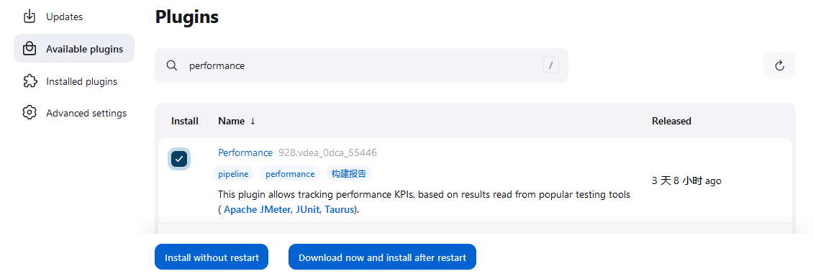
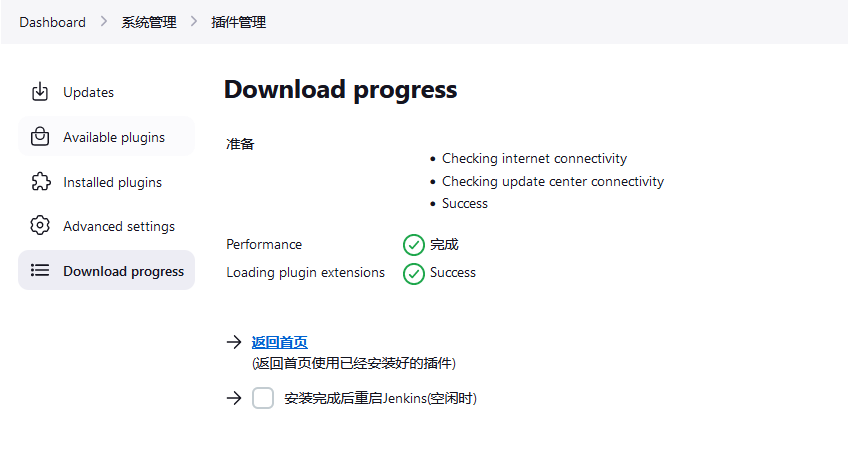

# 在 Jenkins 中使用 JMeter

将 JMeter 和 Jenkins 一起使用有几个好处。持续集成和测试自动化已经成为 DevOps 业界标准，但性能水平和系统复杂性在不断提高。

通过 Jenkins，咱们可以在咱们的管道流程，pipeline process，中整合所有 JMeter 测试，并更好地了解咱们应用程序的细节。

在 Jenkins 中使用 JMeter 的一些主要好处是：

- 对每个系统进行无人值守的测试执行；

- 构建失败日志及恢复步骤，build failure logs and recovery steps；

- 安全和方便地访问每个构建的测试报告;

- 日常工作的自动化。


> 本页概述了怎样在 Jenkins 中使用 Apache JMeter。教程有意通过在 Jenkins 控制器上运行 Apache JMeter 来完成。在 Jenkins 生产环境中的 Apache JMeter 应在 Jenkins 代理上运行，而不是在 Jenkins 控制器上。要了解更多关于 Jenkins 代理的信息，请参考 [使用 Jenkins 代理](./using_jenkins_agents.md) 页面。

## 关于 Apache JMeter

Apache JMeter 可用于测试静态网站、动态网站和完整 Web 应用程序的性能。他还可以用来模拟服务器、服务器组、网络或对象上重度负载，允许在不同负载类型下进行强度测试或整体性能分析。


## Jenkins 的安装

Jenkins 文档中有一个页面可以帮助完成 [Jenkins 的安装过程](../Ch01_Installing_Jenkins.md)。本指南使用 `.jar` 文件安装。如果你也想使用 `.jar`，请参考 [导览页面](../guided_tour.md)。两种安装方法产生的结果是一样的。


## 安装性能插件

为在 Jenkins 中集成 JMeter，咱们将使用 [性能插件](https://plugins.jenkins.io/performance)。


按照以下步骤安装他：

1. 从咱们的 Jnekins 仪表板页面，前往：**系统管理**；

2. 前往 **插件管理** 页面；

3. 选择左侧菜单中的 **Available plugins**，并在搜索字段中输入 “performance”；

4. 勾选 Install 复选框，并选择 **Install without restart**；



如果一切成功，咱们将收到下面这个确认屏幕：




## JMeter 的安装

要安装 JMeter，请依照下面这些步骤：

1. 请参考 [Apache JMeter 下载页面](https://jmeter.apache.org/download_jmeter.cgi)；

2. 根据你的系统选择你的下载选项：Windows 的 `.zip` 或 Linux 的 `.tgz`。本教程是在 Linux 上完成的，所以显示的是 `.tgz` 选项;

3. 将下载的文件解压到咱们偏好的位置，例如 `/opt/jmeter`；

4. 编辑文件： `<YOUR-JMETER-PATH>>/bin/user.properties`。例如，`/opt/jmeter/bin` 便是这里使用的文件路径；

5. 在文件的最后一行添加这条命令：`jmeter.save.saveservice.output_format=xml`。保存并关闭该文件，以确保改变生效。

```properties
# Type of keystore : JKS
#
#server.rmi.ssl.keystore.type=JKS
#
# Keystore file that contains private key
#
#server.rmi.ssl.keystore.file=rmi_keystore.jks
#
# Password of keystore
#
#server.rmi.ssl.keystore.password=changeit
#
# Key alias
#
#server.rmi.ssl.keystore.alias=rmi
#
# Type of truststore : JKS
#
#server.rmi.ssl.truststore.type=JKS
#
# Keystore file that contains certificate
#
#server.rmi.ssl.truststore.file=rmi_keystore.jks
#
# Password of Trust store
#
#server.rmi.ssl.truststore.password=changeit
#
# Set this if you don't want to use SSL for RMI
#
#server.rmi.ssl.disable=false
jmeter.save.saveservice.output_format=xml
```

这个命令会将 JMeter 的输出整合到 Jenkins 中。现在我们来创建我们的 JMeter 测试计划，JMeter test plan。


