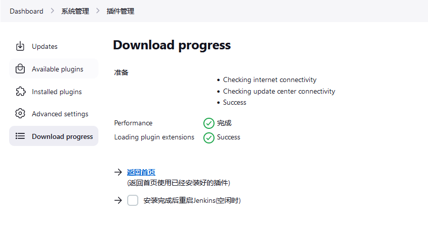
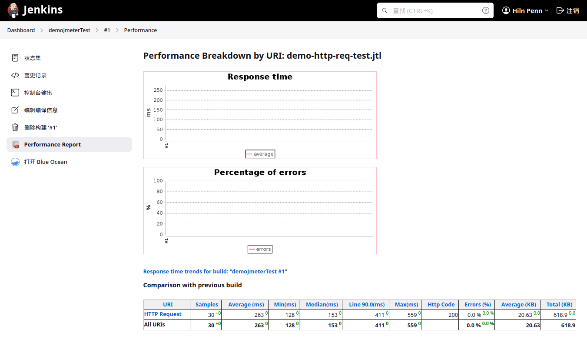

# 在 Jenkins 中使用 JMeter

将 JMeter 和 Jenkins 一起使用有几个好处。持续集成和测试自动化已经成为 DevOps 业界标准，但性能水平和系统复杂性在不断提高。

通过 Jenkins，咱们可以在咱们的管道流程，pipeline process，中整合所有 JMeter 测试，并更好地了解咱们应用程序的细节。

在 Jenkins 中使用 JMeter 的一些主要好处是：

- 对每个系统进行无人值守的测试执行；

- 构建失败日志及恢复步骤，build failure logs and recovery steps；

- 安全和方便地访问每个构建的测试报告;

- 日常工作的自动化。


> 本页概述了怎样在 Jenkins 中使用 Apache JMeter。教程有意通过在 Jenkins 控制器上运行 Apache JMeter 来完成。在 Jenkins 生产环境中的 Apache JMeter 应在 Jenkins 代理上运行，而不是在 Jenkins 控制器上。要了解更多关于 Jenkins 代理的信息，请参考 [使用 Jenkins 代理](./using_jenkins_agents.md) 页面。

## 关于 Apache JMeter

Apache JMeter 可用于测试静态网站、动态网站和完整 Web 应用程序的性能。他还可以用来模拟服务器、服务器组、网络或对象上重度负载，允许在不同负载类型下进行强度测试或整体性能分析。


## Jenkins 的安装

Jenkins 文档中有一个页面可以帮助完成 [Jenkins 的安装过程](../Ch01_Installing_Jenkins.md)。本指南使用 `.jar` 文件安装。如果你也想使用 `.jar`，请参考 [导览页面](../guided_tour.md)。两种安装方法产生的结果是一样的。


## 安装性能插件

为在 Jenkins 中集成 JMeter，咱们将使用 [性能插件](https://plugins.jenkins.io/performance)。


按照以下步骤安装他：

1. 从咱们的 Jnekins 仪表板页面，前往：**系统管理**；

2. 前往 **插件管理** 页面；

3. 选择左侧菜单中的 **Available plugins**，并在搜索字段中输入 “performance”；

4. 勾选 Install 复选框，并选择 **Install without restart**；


如果一切成功，咱们将收到下面这个确认屏幕：




## JMeter 的安装

要安装 JMeter，请依照下面这些步骤：

1. 请参考 [Apache JMeter 下载页面](https://jmeter.apache.org/download_jmeter.cgi)；

2. 根据你的系统选择你的下载选项：Windows 的 `.zip` 或 Linux 的 `.tgz`。本教程是在 Linux 上完成的，所以显示的是 `.tgz` 选项;

3. 将下载的文件解压到咱们偏好的位置，例如 `/opt/jmeter`；

4. 编辑文件： `<YOUR-JMETER-PATH>>/bin/user.properties`。例如，`/opt/jmeter/bin` 便是这里使用的文件路径；

5. 在文件的最后一行添加这条命令：`jmeter.save.saveservice.output_format=xml`。保存并关闭该文件，以确保改变生效。

```properties
# Type of keystore : JKS
#
#server.rmi.ssl.keystore.type=JKS
#
# Keystore file that contains private key
#
#server.rmi.ssl.keystore.file=rmi_keystore.jks
#
# Password of keystore
#
#server.rmi.ssl.keystore.password=changeit
#
# Key alias
#
#server.rmi.ssl.keystore.alias=rmi
#
# Type of truststore : JKS
#
#server.rmi.ssl.truststore.type=JKS
#
# Keystore file that contains certificate
#
#server.rmi.ssl.truststore.file=rmi_keystore.jks
#
# Password of Trust store
#
#server.rmi.ssl.truststore.password=changeit
#
# Set this if you don't want to use SSL for RMI
#
#server.rmi.ssl.disable=false
jmeter.save.saveservice.output_format=xml
```

这个命令会将 JMeter 的输出整合到 Jenkins 中。现在我们来创建我们的 JMeter 测试计划，JMeter test plan。


### 使用 GUI 的首个 JMeter 测试计划

JMeter 使用测试计划，test plans，来组织每个测试。一旦配置好，Jenkins 就会调用管道，pipeline，中定义的所有测试计划，然后在构建报告中显示结果。这意味着必须先在 JMeter 上配置所有测试计划。完成后，在 Jenkins 中输入信息，以便他知道需要调用哪些测试。

请安装以下步骤创建一个测试计划：

1. 请运行这个文件： `<YOUR-JMETER-PATH>>/bin/jmeter.sh` 来打开 JMeter GUI。例如，在这个例子中，将使用 `/opt/jmeter/bin/jmeter.sh`。在某个确定安装中，咱们可以将这些命令设置到咱们的 `path` 系统或系统变量（即在 `/etc/bashrc` 或 `~/.bashrc` 中设置 `PATH`）；

> 对于 Windows 用户该文件将是 `jmeter.bat`。
>
> **注意**：启动 JMeter GUI 时，会看到如下一段提示信息：

```console
> /opt/jmeter/bin/jmeter
Jun 10, 2023 9:53:22 PM java.util.prefs.FileSystemPreferences$1 run
INFO: Created user preferences directory.
================================================================================
Don't use GUI mode for load testing !, only for Test creation and Test debugging.
For load testing, use CLI Mode (was NON GUI):
   jmeter -n -t [jmx file] -l [results file] -e -o [Path to web report folder]
& increase Java Heap to meet your test requirements:
   Modify current env variable HEAP="-Xms1g -Xmx1g -XX:MaxMetaspaceSize=256m" in the jmeter batch file
Check : https://jmeter.apache.org/usermanual/best-practices.html
================================================================================
```

> 表示只有在创建测试与调试测试时才使用 GUI，加载测试时不要使用 GUI！加载测试要使用 CLI 模式，并要通过命令行参数，提升 Java 内存堆大小，来满足咱们测试的需要。

2. 在 JMeter GUI 中，前往 **File**，并选择 **New**;

3. 输入咱们测试计划的名字；

4. 在屏幕左侧，使用咱们鼠标右键或辅助键，选中咱们的测试计划。按照这样的路径：**Add** > **Thread(Users)** > **Thread Group**，并选中他；


5. 在 `Thread Group` 中，把 **Number of Threads(users)** 增加到五，并把 **Loop Count** 增加到二；

6. 在屏幕左侧，用鼠标右键或辅助键选择 **Threap Group**，然后按照这个路径：**Add** > **Sampler** > **HTTP Request**，并选择这个 **HTTP Request** 选项；


7. 在 **HTTP Request** 中，输入咱们测试的 **Name**、**Server Name or IP**, 以及 **Path** 上下文。比如，这里咱们讲使用 `Installing`、`www.jenkins.io` 与 `/doc/book/installing`；


8. 对不同的上下文/页面再重复步骤六和七两次。例如，我们将使用 `www.jenkins.io/node`。现在我们的（测试）计划要测试三件事；

9. 要添加可视化报告，请点击右键或辅助键，选择咱们的 `Thread Group`，然后按照以下路径： **Add** > **Listener** > **View results in table**。选择那个 **View Results in Table** 选项；


10. 要保存测试计划，请选择屏幕左上方的 `Save(disk)` 图标或前往 **File** > **Save**，为测试计划输入一个以 `.jmx` 为扩展名的名字。例如：`jenkins.io.jmx`。

运行这个测试，并查看表格结果。


### 首个使用终端命令的 JMeter 测试计划

咱们的测试在图形用户界面中运行良好，但为了与 Jenkins 集成，需要从命令行运行。

要使用命令行运行测试计划，请遵循以下步骤：

1. 从终端运行以下命令：


```powershell
$env:OUT='jmeter.save.saveservice.output_format'
$env:JMX = 'C:\Users\Lenny.Peng\Documents\jenkins.io test plan.jmx'
$env:JTL = 'C:\Users\Lenny.Peng\Documents\jenkins.io.report.jtl'
C:\ProgramData\chocolatey\bin\jmeter.cmd -j $env:OUT=xml -n -t $env:JMX -l $env:JTL
```

> 这是在 Windows 10 系统上，于 Powershell 终端窗口中运行这个测试的方式。


2. 如果一切正常，将在 `-l` 参数指定的位置创建报告文件。


而要在 Jenkins 代理上，使用终端运行 JMeter 测试计划，则需在每个 Jenkins 代理上安装 JMeter, 然后使用 `scp` 命令将准备好的 `.jmx` 测试文件上传到代理上，并通过 `ssh` 登录到代理机器，运行下面这样的命令，就可以在代理上运行测试计划了。

```console
/opt/jmeter/bin/jmeter -n -t /home/jenkins/demo-http-req-test.jmx -l /home/jenkins/demo-http-req-test.jtl
```


## Jenkins 和 JMeter 一起运行

在从命令行运行 Jmeter 后，我们现在就拥有了从 Jenkins 执行 JMeter 所需的一切。

要从 Jenins 执行 JMeter，请遵循以下步骤：

1. 从 Jenkins 仪表板上，选择 **新建任务**；

2. 输入项目名称，例如 `demoJmeterTest`，选择 “构建一个自由风格的软件项目”，然后选择 **确定**；

3. 前往 **Build Steps** 选项卡，选择 **增加构建步骤**，并选择 **执行 shell**；

4. 输入我们在上一节用于运行 JMeter 的相同代码：


5. 前往 **构建后操作** 标签，选择 **增加构建后操作步骤**，然后选择 **Publish Performance test result report**；

> 这个选项来自性能插件。如果他不可用，请检查前面的部分，并确保咱们已经安装了该插件。

6. 填入这些报告的来源；


7. 保存该构建项目，然后选择 `demoJmeterTest` 页面中的 **立即构建**；

8. 作业完成后，请导航到 **控制台输出**，查看执行细节;


> **注意**：Jenkins 会自动将 `.jtl` 文件从代理 agent 机器上，拷贝到主控 master 机器上。

9. 从这个 **控制台输出** 视图，咱们可以访问 **Performance Report**，并可以查看 JMeter 的报告数据。



咱们现在已经在 Jenkins 中运行了 JMeter，并且可以使用其所提供的数据。
